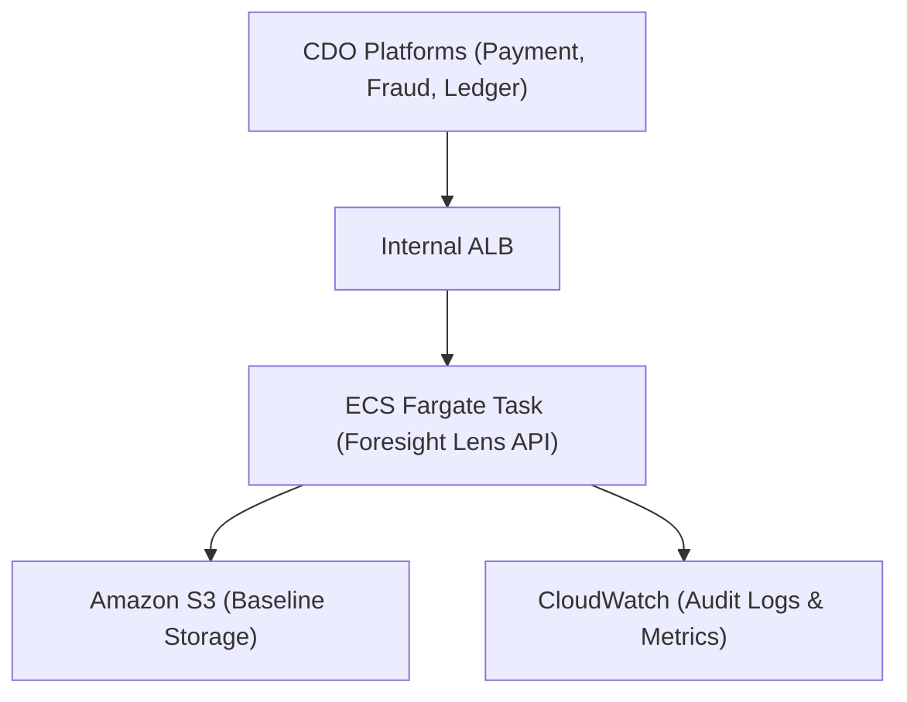

# Deployment Contract - Task force 4

<!-- Owner: AIO-03
     Signed by: AI Lead + CDO Leads × 2-3 + Reviewer panel
     Date signed: 2026-06-25 (W11 T5)
     🔒 FREEZE - no change without formal change request -->

## Mục đích

Định nghĩa **AI Engine deploy như thế nào** - compute target, scale, secrets, network, rollback. CDO platform cần thông tin này để config infra connect.

## Key principle

**CDO tự host AI Engine trên platform của mình.** File contract này là tài liệu thiết kế (Blueprint/Spec) về: Compute, Scale, Secrets, Network, và Rollback. Mỗi CDO (3 nhóm trong TF4) sẽ dựa vào spec này để viết IaC và deploy Engine lên hạ tầng riêng của họ. Nhóm AI **không** tự host endpoint tập trung.

---

## Compute

| Aspect | Configuration |
|---|---|
| **Target** | ECS Fargate task (Stateless FastAPI) |
| **Cluster** | `tf-4-aiops-cluster` |
| **Service name** | `foresight-lens-engine` |
| **Image source** | ECR repo URI + image tag |
| **CPU per task** | 512 (0.5 vCPU) |
| **Memory per task** | 1024 MB |

## FinOps & Cost Circuit Breaker

Để đảm bảo tuyệt đối không vượt ngân sách $200/tháng theo yêu cầu của Client:
- **Cost Alerting**: Cấu hình AWS Budgets gửi cảnh báo khi chi phí đạt 80% ($160).
- **Circuit Breaker**: Khi chi phí đạt 100% ($200), tự động trigger AWS Lambda để gỡ toàn bộ Auto Scaling Group và ép `Desired_Count = 0` (Scale to Zero) cho ECS Fargate cluster nhằm chặn đứng mọi chi phí phát sinh thêm.
  - *Thứ tự ưu tiên (có chủ đích):* ràng buộc ngân sách $200 là **hard requirement của Client** nên được ưu tiên **cao hơn** SLA availability 99.5%. Đây là **fail-open**: khi engine scale-to-zero, CDO tự fallback về rule-based alert (xem Failure modes) nên monitoring KHÔNG gián đoạn. Thực tế cost đo ~$36/tháng nên CB gần như không bao giờ kích hoạt — đây là van an toàn cho kịch bản cực đoan, không phải chế độ vận hành thường.

## Scaling

| Aspect | Value |
|---|---|
| **Replicas** | min 2, max 4 |
| **Autoscale trigger 1** | Target CPU 70% |
| **Autoscale trigger 2** | Target request count 80 RPS per task |
| **Scale-up cooldown** | 60 giây |
| **Scale-down cooldown** | 300 giây |

## Secrets

> Hệ thống sử dụng thuật toán Time-series Anomaly Detection (Thuần Thống kê học), KHÔNG dùng Bedrock LLM. Do đó, KHÔNG yêu cầu API Key của Bedrock. Việc chọn thuật toán cụ thể sẽ được ghi nhận trong ADR (Architecture Decision Record) sau khi audit dữ liệu từ CDO.

| Config / Secret | Source | Note |
|---|---|---|
| `AWS_REGION` | env var | us-east-1 (mặc định; engine region-agnostic, theo region CDO deploy) |
| `BASELINE_BACKEND` | env var | `s3` (prod) / `local` (dev fallback) |
| `BASELINE_S3_BUCKET` | env var | bucket chứa per-service baseline JSON |
| `BASELINE_S3_PREFIX` | env var | mặc định `baselines/` |
| `AUDIT_BACKEND` / `AUDIT_S3_BUCKET` / `AUDIT_KMS_KEY_ID` | env var | audit log → S3 mã hóa KMS (prod) |

## Storage & State (TF4 Requirement)

| Aspect | Configuration |
|---|---|
| **Baseline Storage** | Amazon S3 (bucket được mã hóa KMS) |
| **State** | Stateless engine. Mỗi request tự fetch baseline của service từ S3 (hoặc cache in-memory 5 phút). Nếu task restart, baseline không bị mất. |
| **Baseline Refresh** | Manual upload file baseline mới vào S3 (1 lần/tuần). |

## Networking

| Aspect | Configuration |
|---|---|
| **Subnet type** | private |
| **ALB** | internal only (không public-facing) |
| **Security group** | `tf-4-ai-engine-sg` |
| **Ingress rules** | chỉ allow từ CDO platforms trong cùng task force (SG-to-SG reference) |
| **Egress rules** | Cần egress tới AWS Services (CloudWatch ghi log, S3 đọc baseline) thông qua VPC Endpoint hoặc NAT Gateway. Không cần egress ra Internet public. |
| **DNS** | resolve được trong VPC (route 53 private hosted zone) |

## Deployment topology diagram

## Model Training Topology (Design-only)

Do tính chất bài toán TF4, kiến trúc triển khai bắt buộc chia làm hai ranh giới. CDO **chỉ chịu trách nhiệm host phần Model Serving** (FastAPI phía trên). 
Quá trình **Model Training** (Học baseline cho từng service) sẽ được thiết kế trên giấy: chạy batch job qua AWS SageMaker hoặc AWS Batch 1 lần/tuần.
*Ghi chú:* **ADR (Architecture Decision Record)** sẽ định nghĩa chi tiết Logic Trigger tự động (Retrain trigger logic) khi model bị drift theo đúng yêu cầu của Mentor. Nhóm CDO không cần setup hạ tầng training này.

### Baseline lifecycle (Design-only)

Vòng đời của per-service STL baseline (seasonal profile + residual σ). Đây là thiết kế trên giấy, KHÔNG yêu cầu CDO implement:

| Aspect | Configuration |
|---|---|
| **Retrain trigger** | (1) Định kỳ Thứ Hai hàng tuần (lấy 7 ngày gần nhất); (2) Drift-triggered khi FP-rate/Brier vượt ngưỡng trong 24h. Chi tiết: `docs/05_adrs.md` ADR-005. |
| **Registry** | Baseline versioned trên S3 — prefix `{BASELINE_S3_PREFIX}{version}/` (vd `baselines/v2/`); giữ ≥ 2 version gần nhất để rollback. |
| **Promotion gate** | Baseline mới chỉ được swap vào serving khi **pass holdout gate** (recall ≥ 80%, FP ≤ 12%) đo bằng `tf4-evidence/eval_engine.py` (ADR-004). Promote = trỏ env var `BASELINE_S3_PREFIX`/version sang bản mới; fail gate → giữ bản cũ. |

## Per-CDO platform pointer

Do mỗi CDO tự deploy engine lên hạ tầng riêng, URL sẽ thuộc về domain của từng CDO:

| CDO platform | Endpoint URL | Auth |
|---|---|---|
| CDO-Payment | `https://ai-engine.payment.cdo-1.internal/` | IAM SigV4 |
| CDO-Fraud | `https://ai-engine.fraud.cdo-2.internal/` | IAM SigV4 |
| CDO-Ledger | `https://ai-engine.ledger.cdo-3.internal/` | IAM SigV4 |

## Rollout strategy: Canary

| Step | Traffic | Interval |
|---|---|---|
| 1 | 10% | 5 phút |
| 2 | 50% | 5 phút |
| 3 | 100% | - |

**Abort criteria** (bất kỳ điều kiện trigger → auto rollback ngay):
- Error rate > 1%
- P99 latency > 800 ms
- Cảnh báo "Capacity Exhaustion" sai lệch > 15% (Custom cho TF4)

## Rollback

| Aspect | Value |
|---|---|
| **Primary method** | AWS CodeDeploy rollback to previous Task Definition |
| **Secondary method** | ECS service revert (manual) |
| **Target RTO** | < 60 giây |
| **Auto-trigger** | Yes (khi abort criteria met trong canary rollout) |

## Health check

| Field | Value |
|---|---|
| **Path** | `/health` |
| **Port** | 8080 |
| **Interval** | 30 giây |
| **Healthy threshold** | 2 consecutive 200 |
| **Unhealthy threshold** | 3 consecutive non-200 |

## Observability

| Aspect | Configuration |
|---|---|
| **OTel endpoint** | collector URL per CDO platform (config qua env var) |
| **App Log destination** | CloudWatch Logs (retention 14 ngày) cho debug/info |
| **Audit Log destination** | CloudWatch Logs (retention 1 năm = 365 ngày, mã hóa KMS) cho Audit prediction calls; archive dài hạn → S3 + Glacier lifecycle |
| **Metrics** | Đẩy qua CloudWatch |
| **Traces** | OpenTelemetry → AWS X-Ray |

## Failure modes & response

| Failure | Detection | Response |
|---|---|---|
| Task crash | ECS health check | Auto-restart |
| Region outage | CloudWatch alarm | Failover secondary region (Design-only, không setup thật) |
| Throttling | Mã lỗi HTTP 5xx hoặc 429 | CDO fallback về Rule-based Alert |
| Memory leak | Memory > 90% | Rolling restart ECS task |
