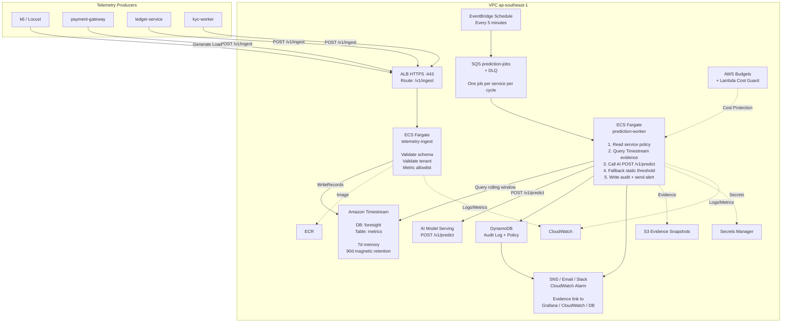

# Infrastructure Design - Task force <N> · CDO <M>

**Doc owner:** CDO-04
**Status:** Draft
**Project:** TF4 Foresight Lens  
**Angle:** Nền tảng prediction decision theo hướng TSDB-centric  
**Core:** ECS Fargate + Amazon Timestream + DynamoDB audit log
**Budget:** `$200/tháng`

## 1. Architecture diagram



**Chú thích:** Metric từ 3 service demo tier-1 được ingest vào Timestream vì workload là dữ liệu time-series khối lượng cao. EventBridge tạo prediction job mỗi 5 phút, SQS hấp thụ retry và các burst lỗi, còn `prediction-worker` gọi contract `/v1/predict` của nhóm AI. Platform không build dashboard mới và không làm auto-remediation; nhiệm vụ chính là biến metric window thành risk decision có recommendation, evidence, audit log, alerting và fail-open fallback khi AI serving bị down.

## 2. Component table

| Thành phần                  | AWS Service                           | Lý do chọn                                                                                                                                | Ghi chú chi phí |
| --------------------------- | ------------------------------------- | ----------------------------------------------------------------------------------------------------------------------------------------- | --------------- |
| Compute - telemetry ingest  | ECS Fargate                           | Service stateless để validate schema và ghi vào Timestream. Fargate bám sát môi trường ECS của client và giảm vận hành EC2.               | ~$15/tháng      |
| Compute - prediction worker | ECS Fargate                           | Worker có thể chạy lâu hơn để query TSDB, gọi AI endpoint, đánh giá fallback, ghi audit và gửi alert với latency ổn định.                 | ~$20/tháng      |
| API entry                   | ALB                                   | Terminate HTTPS và route đơn giản cho `/v1/ingest`; phù hợp và tiết kiệm hơn API Gateway ở mức traffic demo.                              | ~$20/tháng      |
| Time-series database        | Amazon Timestream                     | Metric store chính cho query theo `tenant_id`, `service_id`, `metric_type`, `timestamp`. Phù hợp hơn raw S3 cho prediction gần real-time. | ~$40/tháng      |
| Audit / policy database     | DynamoDB On-Demand                    | Lưu audit log dạng append-only cho mọi prediction call; đồng thời lưu service fallback policy. Có encryption at rest và serverless.       | ~$10/tháng      |
| Storage                     | S3 Standard                           | Lưu evidence snapshot, optional raw ingest backup, reference metadata cho AI/model. Không phải prediction store chính.                    | ~$5/tháng       |
| Event bus / queue           | EventBridge + SQS + DLQ               | EventBridge chạy lịch 5 phút; SQS tách scheduler khỏi worker và hỗ trợ retry/DLQ.                                                         | ~$2/tháng       |
| Alerting                    | SNS + Email/Slack webhook             | Gửi high-risk warning cho SRE kèm evidence link.                                                                                          | ~$2/tháng       |
| Observability               | CloudWatch + Grafana hiện có          | ECS logs, alarms, queue age, Timestream errors, tín hiệu cost guard. Grafana chỉ dùng làm evidence overlay, không phải UI mới.            | ~$10/tháng      |
| Secrets                     | Secrets Manager                       | Lưu AI endpoint token, Slack webhook, API keys.                                                                                           | ~$3/tháng       |
| Container registry          | ECR                                   | Private image cho ingest service và worker service.                                                                                       | ~$1/tháng       |
| Networking                  | VPC + private subnets + VPC endpoints | ECS task chạy private và giảm phụ thuộc NAT cho AWS services.                                                                             | ~$15/tháng      |
| Cost guard                  | AWS Budgets + Lambda                  | Cảnh báo ngân sách ở `$180`; giảm workload không quan trọng trước khi chạm `$200`.                                                        | ~$1/tháng       |
| **Tổng**                    |                                       |                                                                                                                                           | **~$144/tháng** |

## 3. Differentiation angle deep-dive

### 3.1 Why this angle?

Angle này là TSDB-centric, nhưng không dừng ở TSDB-only. Pain chính của client không phải thiếu dashboard; client đã có Grafana, CloudWatch và Datadog trial. Pain thật sự là capacity drift diễn ra âm thầm, alert đến muộn, và recommendation chưa đủ actionable.

Platform dùng Timestream làm metric evidence backbone, sau đó điều phối prediction decision xung quanh nó:

- Ingest infra metric khối lượng cao từ 3 service.
- Query rolling window hiệu quả theo service và metric.
- Gọi AI `/v1/predict` để lấy drift/risk và capacity recommendation.
- Lưu mọi decision vào DynamoDB audit log.
- Chỉ alert SRE khi risk có ý nghĩa.
- Fallback sang static threshold theo từng service khi AI unavailable.

Thông điệp chính: đây không phải another dashboard. Đây là prediction decision platform có recommendation, evidence, audit log và fail-open fallback.

### 3.2 Vượt trội ở đâu (số liệu)

| Trục so sánh              |                Số của thiết kế này |                   Ước lượng angle cạnh tranh |
| ------------------------- | ---------------------------------: | -------------------------------------------: |
| Cost / tenant / tháng     |            ~$48 với 3 demo service |     Datadog-heavy: ~$70-$120 tùy host/metric |
| P99 ingest latency        |   ~50-100ms app + Timestream write |     Lakehouse/S3 path: vài giây đến vài phút |
| Prediction query latency  |       ~100-300ms cho window 30m-2h |                      Athena cold scan: ~3-8s |
| Ops overhead              |                        ~2 giờ/tuần | Self-managed Prometheus/Influx: ~5+ giờ/tuần |
| Thời gian onboard service |     ~15-30 phút với service policy |      Lakehouse schema/crawler path: ~1-2 giờ |
| Hành vi khi lỗi           | AI down vẫn cảnh báo bằng fallback |          AI-only serving path có thể im lặng |

### 3.3 Weakness chấp nhận

| Điểm yếu                                                  | Cách giảm rủi ro                                                                                 |
| --------------------------------------------------------- | ------------------------------------------------------------------------------------------------ |
| Chi phí Timestream có thể tăng nếu ingest/query quá nhiều | Balanced mode: 3 service, 3-5 metric/service, prediction mỗi 5 phút, budget alarm ở `$180`.      |
| Timestream không phải relational DB                       | Lưu audit và service policy trong DynamoDB; không join metric và audit data trong TSDB.          |
| Static fallback có thể tạo false positive                 | Chỉ dùng fallback khi AI unavailable/invalid; audit ghi rõ `static_threshold_fallback`.          |
| CDO phụ thuộc vào AI API contract                         | Freeze contract trước W11 T5; validate response schema; dùng mock endpoint nếu AI chưa sẵn sàng. |
| Không build dashboard mới có thể kém trực quan            | Dùng evidence link và annotation trên Grafana/CloudWatch hiện có để demo.                        |

## 4. Multi-tenant approach

### 4.1 Tenant model

```text
Định dạng Tenant ID : UUID v4 hoặc stable demo tenant key
Header              : X-Tenant-Id bắt buộc cho mọi API call
Demo services       : payment-gateway, ledger-service, kyc-worker
Tiers               : basic / pro / enterprise
```

Ảnh hưởng theo tier:

| Tier       |      Ingest quota | Prediction interval | Feature flags                        |
| ---------- | ----------------: | ------------------: | ------------------------------------ |
| basic      |    500 events/min |              5 phút | core warning + audit                 |
| pro        |  5,000 events/min |              5 phút | Grafana evidence + Slack alert       |
| enterprise | 50,000 events/min |        configurable | future: custom routing, higher quota |

### 4.2 Isolation pattern

**Data isolation:** Pool model với tenant/service dimensions.

- Shared Timestream table: mọi record có `tenant_id`, `service_id`, `metric_type`, `timestamp`, `value`, `unit`.
- DynamoDB audit table: mọi prediction record có `tenant_id` và `service_id`.
- Service policy table key: `tenant_id#service_id`.

**Compute isolation:** Shared ECS cluster và shared worker pool.

Lý do chọn pattern này:

- Capstone chỉ cần 3 tier-1 service, nên per-tenant database/account là over-engineering.
- Timestream dimension filters phù hợp với per-service baseline.
- Shared Fargate pool giúp giữ chi phí dưới `$200/tháng`.
- Rủi ro noisy-neighbor chấp nhận được khi có app-layer quota và SQS worker scaling.

### 4.3 Tenant onboarding flow

1. `POST /platform/v1/tenants` với `tenant_name`, `contact`, và `tier`.
2. Step Functions hoặc Terraform module tạo service policy ban đầu.
3. Provision API key trong Secrets Manager và config trong DynamoDB.
4. Đăng ký enabled metrics và fallback thresholds theo từng service.
5. Smoke test một event `POST /v1/ingest` và một prediction job.
6. Webhook callback: tenant/service ready trong `< 30 phút`.

Ví dụ service policy:

```json
{
  "tenant_id": "demo-tenant-001",
  "service_id": "kyc-worker",
  "enabled_metrics": [
    "sqs_queue_depth",
    "sqs_oldest_message_age_seconds",
    "latency_p95_ms"
  ],
  "prediction_interval_minutes": 5,
  "fallback_rules": [
    {
      "metric_type": "sqs_queue_depth",
      "operator": ">",
      "threshold": 5000,
      "duration_minutes": 10,
      "risk_level": "high",
      "recommendation": "Increase kyc-worker concurrency from 20 to 40"
    }
  ]
}
```

### 4.4 Noisy neighbor mitigation

| Layer      | Cơ chế                                       | Giới hạn                                            |
| ---------- | -------------------------------------------- | --------------------------------------------------- |
| API / app  | Token bucket theo `X-Tenant-Id`              | basic 500 rpm, pro 5,000 rpm, enterprise 50,000 rpm |
| SQS        | Queue hấp thụ prediction burst               | Đẩy sang DLQ sau khi hết retry                      |
| Worker     | Scale theo queue depth và oldest message age | tối đa 4 demo workers                               |
| Timestream | Query luôn filter theo tenant/service/time   | app reject query window không giới hạn              |
| Budget     | AWS Budgets alert + Lambda cost guard        | hành động ở `$180`, hard cap behavior trước `$200`  |

## 5. Alternatives considered

### 5.1 Compute layer

| Phương án            | Ưu điểm                                                                                                                   | Nhược điểm                                                                                                                                     |
| -------------------- | ------------------------------------------------------------------------------------------------------------------------- | ---------------------------------------------------------------------------------------------------------------------------------------------- |
| Lambda + API Gateway | Chi phí gọn, ít vận hành, dễ schedule                                                                                     | Cold start ảnh hưởng predict latency; giới hạn 15 phút; kém tự nhiên hơn cho model/evidence worker; khó đồng bộ với môi trường ECS của client. |
| ECS Fargate + ALB    | Latency ổn định, worker chạy lâu được, cùng compute family với client, dễ đóng gói container contract với AI/mock service | Fixed cost cao hơn Lambda.                                                                                                                     |
| EKS                  | Orchestration linh hoạt và HPA mạnh                                                                                       | Quá nhiều ops và fixed control-plane cost cho capstone.                                                                                        |

**Chọn: ECS Fargate + ALB.** Lý do: cân bằng tốt nhất giữa predictable latency, low ops, bám môi trường client và vẫn nằm dưới `$200/tháng`.

### 5.2 Database

| Phương án                        | Ưu điểm                                                                              | Nhược điểm                                                                |
| -------------------------------- | ------------------------------------------------------------------------------------ | ------------------------------------------------------------------------- |
| Amazon Timestream                | Managed TSDB, query theo time window, retention tiers, dimensions cho service/tenant | Chi phí có thể tăng khi ingest/query cao; hạn chế về relational features. |
| DynamoDB time-series pattern     | Quen thuộc và serverless                                                             | Phải tự làm bucketing/aggregation; yếu hơn cho time-series analytics.     |
| S3 + Athena                      | Rẻ cho historical analytics                                                          | Quá chậm cho near real-time warning; thêm ETL/crawler overhead.           |
| InfluxDB/Prometheus self-managed | Hệ sinh thái time-series mạnh                                                        | Tốn ops EC2/EKS, backup, scaling, retention management.                   |

**Chọn: Amazon Timestream.** Lý do: metric là time-series, prediction cần rolling window, và proposal yêu cầu query hiệu quả theo `service_id`, `metric_type`, timestamp.

### 5.3 Audit Log Storage

| Phương án       | Ưu điểm                                                                        | Nhược điểm                                    |
| --------------- | ------------------------------------------------------------------------------ | --------------------------------------------- |
| DynamoDB        | Append-only, encrypted, on-demand billing, dễ tạo GSI theo tenant/service/time | Không tối ưu cho ad-hoc relational analytics. |
| CloudWatch Logs | Tích hợp sẵn                                                                   | Khó dùng như product audit database.          |
| S3 + Athena     | Rẻ cho dài hạn                                                                 | Quá chậm cho operational audit retrieval.     |
| RDS             | SQL linh hoạt                                                                  | Fixed cost và ops nhiều hơn nhu cầu.          |

**Chọn: DynamoDB.** Lý do: mọi prediction call cần audit bền vững với ít nhất 6 field, encryption at rest và chi phí serverless dự đoán được.

## 6. Scaling strategy

| Component           | Trigger                                          | Action                                         |
| ------------------- | ------------------------------------------------ | ---------------------------------------------- |
| `telemetry-ingest`  | CPU > 80% trong 10 phút                          | Tăng từ 0.25 vCPU / 0.5 GB lên 0.5 vCPU / 1 GB |
| `prediction-worker` | Memory > 80% hoặc evidence query payload quá lớn | Tăng từ 0.5 vCPU / 1 GB lên 1 vCPU / 2 GB      |

### Horizontal Scaling

| Component                    | Trigger                                 | Action               | Bounds       |
| ---------------------------- | --------------------------------------- | -------------------- | ------------ |
| `telemetry-ingest`           | ALB RequestCountPerTarget > 200 req/min | Thêm 1 task          | min 1, max 6 |
| `prediction-worker`          | SQS visible messages > 20 trong 5 phút  | Thêm 1 task          | min 1, max 4 |
| `prediction-worker`          | Oldest message age > 2 phút             | Thêm 1 task và alert | max 4        |
| `prediction-worker` scale-in | SQS empty và CPU < 30% trong 10 phút    | Giảm 1 task          | min 1        |

Managed scaling:

- Timestream tự scale managed writes và queries cho workload MVP.
- DynamoDB dùng on-demand capacity.
- SQS và SNS tự scale.

Balanced mode để kiểm soát chi phí:

- Prediction mỗi 5 phút.
- 3 service.
- 3-5 infra metric mỗi service.
- Synthetic load chỉ bật trong test window.
- Timestream retention tối thiểu 90 ngày.
- Audit retention 90 ngày.

## 7. Failure modes + recovery

| Failure                          | Detection                              | Recovery                                                                                              | RTO       | RPO                        |
| -------------------------------- | -------------------------------------- | ----------------------------------------------------------------------------------------------------- | --------- | -------------------------- |
| Một ECS task crash               | ECS health check                       | Tự động restart task trên AZ khỏe                                                                     | < 60s     | 0 với request đã accept    |
| AZ outage                        | ALB target health / CloudWatch alarm   | ECS spread across 2 AZ, ALB route sang target khỏe                                                    | < 5 phút  | < 1 phút                   |
| Timestream write failure         | `WriteRecords.SystemErrors`, app 5xx   | Retry exponential backoff, sau đó ghi raw event vào S3 buffer                                         | < 5 phút  | < 5 phút                   |
| Scheduler miss một cycle         | EventBridge invocation alarm           | Manual replay hoặc trigger one-off prediction job                                                     | < 15 phút | 1 cycle                    |
| SQS backlog / worker stuck       | `ApproximateAgeOfOldestMessage`        | Scale worker, kiểm tra DLQ, replay job hợp lệ                                                         | < 10 phút | 0 nếu message còn retained |
| AI `/v1/predict` down            | Worker timeout / non-2xx               | Static threshold fallback, audit `prediction_source = static_threshold_fallback`, alert nếu high risk | < 30s     | 0                          |
| AI response thiếu field bắt buộc | Schema validation failure              | Xem là invalid AI result và chạy fallback                                                             | < 30s     | 0                          |
| DynamoDB audit write failure     | SDK error / CloudWatch alarm           | Retry, sau đó gửi audit event vào DLQ để replay                                                       | < 10 phút | < 10 phút                  |
| Alert delivery failure           | SNS publish error hoặc webhook non-2xx | Retry alert và giữ audit/evidence để review thủ công                                                  | < 10 phút | 0 audit loss               |
| Region outage                    | External monitor                       | Chỉ thiết kế DR manual; capstone deploy single-region                                                 | TBD       | TBD                        |
| Cost circuit breaker trip        | AWS Budgets alert ở `$180`             | Tắt synthetic load, giảm prediction frequency, scale down task không quan trọng                       | N/A       | N/A                        |

---

## 8. Các Schema Chính

### 8.1 Telemetry Ingest Schema

```json
{
  "tenant_id": "demo-tenant-001",
  "service_id": "kyc-worker",
  "metric_type": "sqs_queue_depth",
  "timestamp": "2026-06-22T10:00:00Z",
  "value": 6120,
  "unit": "count"
}
```

Các infra metric được allow gồm latency, error rate, RDS CPU, DB connections, queue depth, oldest message age và ALB active connections. Real customer PII bị reject bằng schema allowlist.

### 8.2 AI Prediction Contract

```http
POST /v1/predict
```

Response tối thiểu kỳ vọng từ nhóm AI:

```json
{
  "service_id": "kyc-worker",
  "risk_level": "high",
  "root_cause": "SQS queue depth increasing above baseline",
  "recommendation": "Increase kyc-worker concurrency from 20 to 40",
  "confidence": 0.86
}
```

Recommendation phải actionable: action verb, target, thay đổi from-to, confidence và evidence link.

### 8.3 DynamoDB Audit Log

```text
Table name   : foresight-audit-log
Billing mode : PAY_PER_REQUEST
Encryption   : SSE enabled
TTL          : audit_expiry, 90-day retention

PK: prediction_id
SK: timestamp

Required attributes:
  prediction_id
  timestamp
  tenant_id
  service_id
  prediction_source  ai_model | static_threshold_fallback
  risk_level
  confidence
  root_cause
  recommendation
  evidence_link
  model_version
  baseline_version
  audit_expiry

GSI:
  tenant-service-time-index
  PK: tenant_id#service_id
  SK: timestamp
```

---

## Related documents

- [`03_security_design.md`](03_security_design.md) - Network Security §4 + IAM §5 + Data Security §6 expand on infra concerns
- [`04_deployment_design.md`](04_deployment_design.md) - IaC + CI/CD + GitOps cho infra này
- [`05_cost_analysis.md`](05_cost_analysis.md) - Per-tenant cost model based on this infra
- [`08_adrs.md`](08_adrs.md) - Infra architecture decisions
