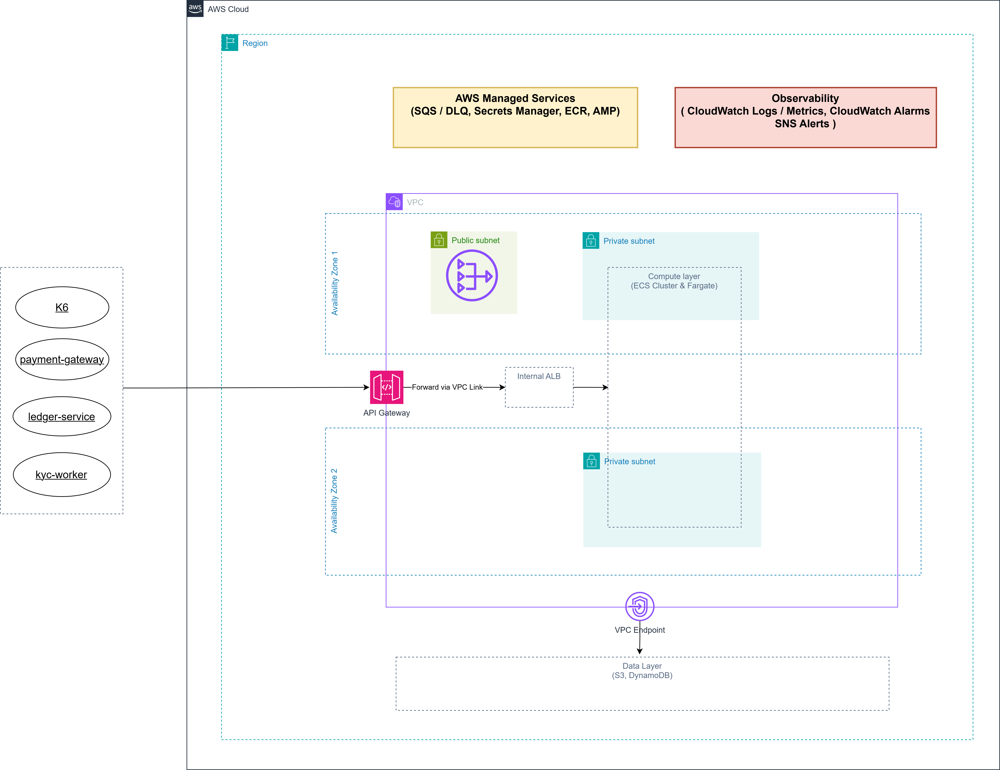
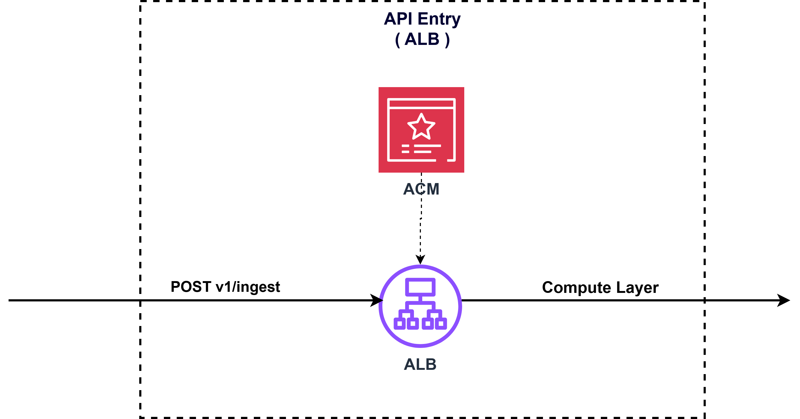
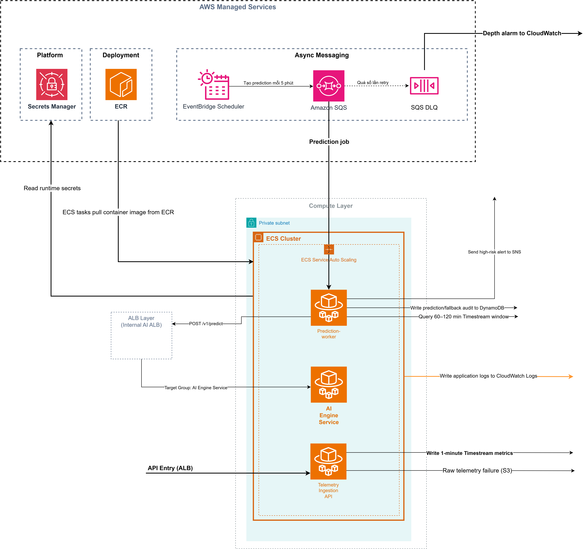
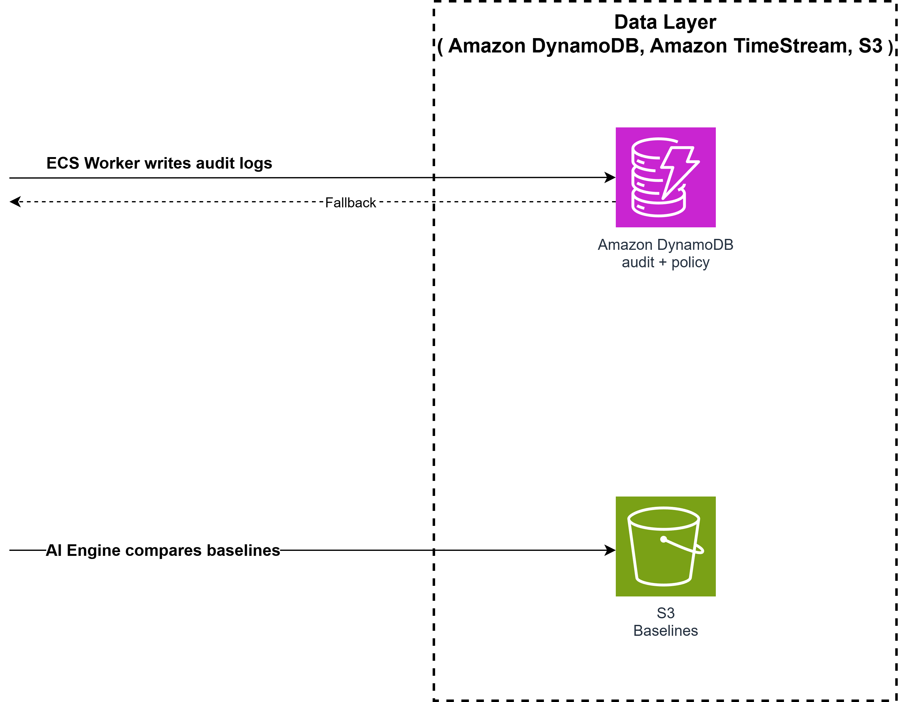
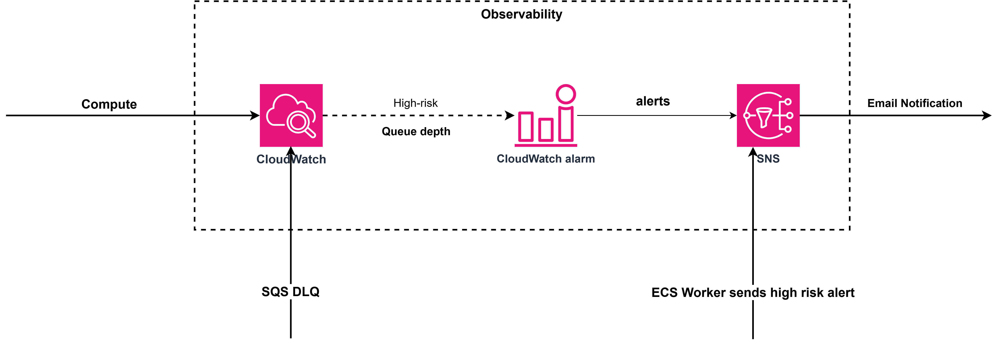

# Hạ tầng Design - Task force 4 · CDO SLO Early-Warning Control Plane

<!-- Doc owner: Nhóm CDO-04
     Status: Refined - AMP/us-east-1 accepted decision
     Date updated: 2026-06-26 -->

## 1. Architecture diagram



_Phân rã chi tiết theo block:_

| Block | Mô tả |
|---|---|
|  | API Entry |
|  | Compute & AWS Managed Services |
|  | Data Layer |
|  | Observability |

*Caption: Flow bắt đầu từ `payment-gw`, `ledger` và `fraud-detector` gửi telemetry vào API Gateway path `/v1/ingest`; k6 chỉ tạo synthetic load cho cùng ingest path. API Gateway HTTP API là public front door cho `/health`, `/v1/ingest`, `/v1/predict`; ALB là internal. Region triển khai final của CDO-04 là `us-east-1` (US East / N. Virginia), đồng bộ với default `AWS_REGION=us-east-1` trong AI Deployment Contract và vẫn giữ nguyên tính region-agnostic của AI Engine. ECS Fargate Telemetry API, Prediction Worker và **AI Engine** chạy trong private subnets của cùng ECS cluster với `assignPublicIp = DISABLED`, runtime Linux/x86. Worker gọi `POST /v1/predict` qua **Path A**: `prediction-worker` private subnet → existing NAT Gateway → public API Gateway `execute-api` endpoint với `AWS_IAM`/SigV4 → API Gateway VPC Link → internal ALB listener `:80` → AI Engine target group → AI Engine task `:8080`. ECS Service Connect được giữ làm migration rollback/fallback, không còn là primary auth path. EventBridge Scheduler, SQS, **Amazon Managed Service for Prometheus (AMP)**, DynamoDB, SNS, CloudWatch, S3, Secrets Manager và ECR là managed services. Scheduler dùng execution role có quyền `sqs:SendMessage`, không chạy trong private subnet và không cần security group hoặc NAT. Luồng prediction được tách bằng Scheduler → SQS → Worker để ingestion không bị kẹt khi AI endpoint chậm hoặc lỗi. Mỗi lần dự đoán, worker query metric evidence từ AMP bằng PromQL `query_range` cho đúng tenant/service/metric trong 120 phút gần nhất, đọc service policy, gọi AI internal `/v1/predict`, ghi audit vào DynamoDB, rồi đẩy evidence/alert qua CloudWatch/SNS. Nếu AI không phản hồi hoặc trả sai schema, worker chuyển sang static threshold fallback và vẫn ghi audit. Networking final dùng cost-optimized **1 NAT Gateway theo một AZ** cho Worker outbound tới AWS public endpoints, including API Gateway execute-api. API Gateway → ALB không dùng NAT; đoạn này dùng VPC Link. S3 và DynamoDB đi qua **Gateway VPC Endpoints** để giảm NAT data processing và giữ đường evidence/audit private. AMP write path production-ready là Telemetry API emit OTLP/app metrics tới ADOT sidecar/collector, collector thực hiện Prometheus `remote_write` tới AMP bằng SigV4. PrivateLink endpoint `com.amazonaws.us-east-1.aps-workspaces` là production hardening option. Sơ đồ hiện có chưa regenerate; text này là source of truth cho Path A.*

## 2. Component table

Giả định tính chi phí final: region `us-east-1`, 730 giờ/tháng, 2 AZ, 3 service demo, prediction mỗi 5 phút, telemetry mỗi 1 phút, app log retention 14 ngày, AI audit log retention 365 ngày, S3 raw failure buffer 7 ngày và telemetry/evidence/baseline retention tối thiểu 90 ngày. Đây là **chi phí platform** cho demo scope, không phải chi phí phân bổ chính xác theo từng tenant. Terraform v1 chỉ bắt đầu sau khi các quyết định MVP trong tài liệu này, security/deployment/cost docs và ADR-011 được chấp nhận làm source of truth.

| Component | AWS Service | Reason | Cost note |
|---|---|---|---|
| Tầng compute | ECS Fargate Linux/x86 | Chạy 2 task cho Telemetry API, 1 task cho Prediction Worker và 2 task cho AI Engine trong cùng ECS cluster. Fargate phù hợp vì không phải quản lý EC2, có task role riêng, và chạy được API, worker, AI serving theo cùng mô hình container/private subnet. | **$90.10/tháng tại `us-east-1`** = 5 task × 730h × (0.5 vCPU × $0.04048 + 1GB × $0.004445). |
| Cổng ingress public + AI restricted listener | 1× Application Load Balancer | API Gateway HTTP API là public front door cho `/health`, `/v1/ingest`, `/v1/predict`; ALB chuyển thành internal HTTP `:80`, chỉ nhận từ API Gateway VPC Link SG và forward vào ECS target groups. | **$22.27/tháng tại `us-east-1`** = existing ALB $16.43 + 1 LCU trung bình $5.84. Không thêm ALB thứ hai. |
| Kho metric TSDB | Amazon Managed Service for Prometheus (AMP) | AMP workspace lưu metric dạng Prometheus samples/labels. Terraform v1 dùng self-managed ADOT/Prometheus Collector ECS service remote-write vào AMP bằng SigV4; app-direct remote_write chỉ là fallback kỹ thuật nếu app implement protobuf/Snappy/SigV4/retry đầy đủ. Prediction Worker query PromQL `query_range` đủ 120 phút theo tenant/service/metric trước khi gọi AI. | **~$0.00/tháng ở demo scope**: 907,200 samples/month và ~21.8M query samples/month gần bằng 0 nhưng query samples vẫn billed theo usage. AMP không có fixed `db.influx.medium` instance-hour cost. |
| Audit + service policy database | DynamoDB | Audit log là dữ liệu ghi nối tiếp, cần tra cứu nhanh theo tenant/service/time; service policy chứa metric allowlist, baseline, quota và fallback threshold. DynamoDB gọn hơn RDS cho key-value access pattern này. | **$0.10/tháng**: ~26k audit write/tháng + policy read nhỏ; read và storage rất nhỏ. |
| Điều phối job | EventBridge Scheduler + SQS + 2 DLQ layers | Scheduler tạo prediction job mỗi 5 phút; Scheduler target DLQ giữ event không gửi được vào SQS; source queue DLQ giữ job worker xử lý lỗi sau retry. | **$0.05/tháng**: ~26k job/tháng, khoảng 3 SQS request/job. |
| Lưu trữ AI baseline + evidence + failure buffer | S3 + KMS | Lưu AI baseline JSON trong bucket KMS theo prefix `baselines/`, evidence/export và raw telemetry buffer khi AMP remote-write fail; không dùng làm audit DB chính. | **$0.35/tháng**: baseline/evidence/telemetry archive giữ tối thiểu 90 ngày, raw failure buffer giữ 7 ngày, request nhỏ. |
| Quan sát hệ thống | CloudWatch + SNS | Ghi app log task, custom metrics, alarm và dashboard; tách riêng AI audit log group KMS encrypted retention 365 ngày; SNS gửi alert high-risk. | **$8.00/tháng**: 1 dashboard, 10-12 alarm, log ingest/storage demo nhỏ. |
| Bảo mật / cấu hình | Secrets Manager + KMS | Lưu service name/config của AI Engine, webhook/tenant token, mã hóa DynamoDB/SQS/Logs bằng KMS, không hardcode credential. AMP write/query dùng IAM SigV4 nên không cần InfluxDB read/write/admin token. | **$3.40/tháng**: conservative secret/KMS estimate. |
| Kết nối private subnet | NAT Gateway + S3/DynamoDB Gateway Endpoints | 1 zonal NAT cho outbound AWS API traffic không đi qua Gateway Endpoint; S3/DynamoDB dùng Gateway Endpoint miễn phí hourly. AMP PrivateLink là hardening option, không phải MVP. | **$33.39/tháng tại `us-east-1`** = 1 NAT × 730h × $0.045/h + ~12GB base AWS API traffic × $0.045/GB; Worker → API Gateway Path A payload NAT charge tách ở row API Gateway. |
| Container registry | Amazon ECR | Lưu private image cho Telemetry API, Prediction Worker và AI Engine; ECS execution role pull image khi deploy/replace task. | **~$0.50/tháng** cho image demo nhỏ. |
| Worker → AI SigV4 front door | API Gateway HTTP API + VPC Link | API Gateway enforces `AWS_IAM`/SigV4 for `POST /v1/predict` and signed `/health` smoke. Worker egress to execute-api uses existing NAT. API Gateway private integration to ALB uses VPC Link, not NAT. | **~$0.17/tháng** at 25,920 AI POST calls/month: ~$0.03 HTTP API request charge + ~$0.14 NAT data for full 120m payload. |
| **Tổng chi phí** |  | Network path dùng 1 zonal NAT + S3/DynamoDB Gateway Endpoints; TSDB dùng AMP; Worker → AI dùng API Gateway HTTP API + VPC Link + same ALB restricted listener; Service Connect giữ làm rollback/fallback. | **~$158.33/tháng tại `us-east-1`** cho full always-on x86 design. Thêm 20% buffer vận hành là **~$190.00/tháng**, vẫn dưới hard budget $200. |

Cost guard:

- AWS Budget alarm tại 50%, 80%, 100% của **$200/tháng**.
- CloudWatch app log retention cố định 14 ngày; AI audit log group retention 365 ngày, KMS encrypted; S3 raw failure buffer 7 ngày, baseline/evidence archive tối thiểu 90 ngày theo lifecycle policy.
- Synthetic load chỉ bật trong test window đã lên lịch.
- PromQL query vào AMP bắt buộc filter `tenant_id`, `service_id`, metric name và range 120 phút.
- Prediction cadence cố định 5 phút cho thiết kế hiện tại; không dùng cadence 1 phút trong infra final.
- Physical topology chốt **1 API Gateway HTTP API public front door + 1 internal ALB-hour stream + 1 LCU**; Worker → AI dùng API Gateway HTTP API `AWS_IAM` → VPC Link → internal ALB `:80`. ECS Service Connect giữ làm rollback/fallback trong migration. Theo AWS docs, Service Connect không có charge riêng và Cloud Map usage trong Service Connect không tính riêng; cost guard cần theo dõi proxy sidecar CPU/memory để tránh upsize Fargate task.

## 3. Differentiation angle deep-dive

### 3.1 Why this angle?

Angle của nhóm là **SLO Early-Warning Control Plane with TSDB-backed Prediction Workflow**. Điểm khác biệt không nằm ở việc dựng thêm dashboard, mà ở việc biến telemetry thành quyết định vận hành có thể kiểm chứng và audit được.

Client đã có Grafana, CloudWatch và Datadog trial. Vấn đề là dashboard không tự đưa ra cảnh báo sớm, còn threshold tĩnh thì dễ rơi vào hai cực: quá nhạy gây alert fatigue, hoặc quá trễ nên chỉ báo khi user đã bị ảnh hưởng. Vì vậy platform tập trung vào một luồng rõ ràng:

1. nhận metric từ 3 service demo;
2. emit OTLP/app metrics tới ADOT sidecar/collector, rồi `remote_write` Prometheus samples/labels vào AMP bằng SigV4;
3. chạy prediction định kỳ mỗi 5 phút;
4. query PromQL `query_range` để dựng đủ `signal_window` 120 phút;
5. gọi AI endpoint `/v1/predict`;
6. tạo risk decision có root cause, recommendation và confidence;
7. ghi audit log cho mọi lần dự đoán;
8. gửi alert và evidence link cho SRE;
9. fallback sang static threshold nếu AI endpoint lỗi.

Dashboard chỉ là nơi xem evidence. Phần chính của CDO là control plane điều phối prediction, audit và fallback.

### 3.2 Vượt trội ở đâu (số liệu)

| Axis | My number | Competing angle estimate |
|---|---|---|
| Budget fit | **~$158.16/tháng** full always-on x86 design tại `us-east-1` với public ingest ALB + ECS Service Connect cho Worker → AI; **~$189.79** với 20% buffer vẫn dưới hard budget $200. ADOT Collector sidecar chạy cùng telemetry-api task (512/1024, không upsize), scrape `localhost:8080/metrics`. | Dashboard-only có thể rẻ hơn, nhưng không cover đủ prediction workflow, audit-per-call, fallback, evidence-link requirement và AI serving nội bộ |
| Cost / service | **~$52.72/service/tháng** thiết kế cho 3 service | EKS/self-hosted TSDB hoặc observability stack riêng dễ tăng compute + ops overhead |
| Cost / prediction cycle | 3 services × mỗi 5 phút ≈ **25,920 prediction cycles/tháng**; chi phí ≈ **$0.0061/cycle** | Dashboard-only không có prediction cycle/audit decision tương đương |
| Contract fit | AI ECS Fargate min 2/max 4, 120-minute signal window, IAM SigV4, S3 AI baseline, AI audit 365 ngày | Nếu dùng auth/window khác với AI contract thì W12 integration có thể fail dù infra chạy được ở demo local |
| Requirement coverage | Cover trực tiếp: **≥15 phút lead-time target**, per-service baseline, audit log mỗi prediction, static fallback, evidence link, encrypted stores | Dashboard-only fail pain point “không có người nhìn 24/7” |
| Early-warning cadence | **5 phút** là balanced point: đủ nhanh để còn buffer cho yêu cầu cảnh báo trước ≥15 phút, nhưng chưa tăng query/job/audit volume quá mức | 1 phút nhanh hơn nhưng tăng noise/cost; 10 phút rẻ hơn nhưng giảm buffer cảnh báo sớm |
| Công vận hành | **2-3 giờ/tuần** nhờ dùng managed services: ECS Fargate, SQS, AMP, DynamoDB | EKS hoặc self-hosted TSDB có thể **6-10 giờ/tuần** cho node, storage, upgrade, retention và incident handling |

Điểm cost của thiết kế này không phải là rẻ nhất tuyệt đối. Rẻ nhất tuyệt đối sẽ là dashboard-only hoặc vài CloudWatch alarm tĩnh, nhưng hai hướng đó không giải quyết đúng pain point client đã nêu: không có người nhìn dashboard 24/7 và threshold tĩnh dễ quá nhạy hoặc quá trễ. Vì vậy tiêu chí tối ưu là **cost-to-requirement coverage**. Sau khi chuyển sang AMP tại `us-east-1` và dùng ECS Service Connect cho luồng Worker → AI, full always-on x86 design fit hard budget $200 cả trước và sau 20% buffer với ADOT Collector sidecar colocated trong telemetry-api task (512/1024, không upsize). Dù tối ưu ở đâu, **không tắt audit/fallback**.

### 3.3 Weakness chấp nhận

- **Phức tạp hơn dashboard-only**: cần scheduler, queue, worker, TSDB, audit DB và alert path. Nhóm chấp nhận điểm này vì fallback và audit log là hard requirement.
- **CDO platform phải host thêm AI serving capacity**: ECS cluster cần AI Engine task, health check, logs, scaling rule và Service Connect config. Đổi lại, đường gọi prediction private hơn và match deployment contract.
- **AMP remote_write không phải chỉ là HTTP JSON đơn giản**: direct app remote-write cần protobuf, Snappy, SigV4, batching, retry/backoff và request-size control; thiết kế ưu tiên ADOT Collector/Prometheus Agent/customer-managed collector.
- **Label cardinality là rủi ro chính**: 50k events/sec chỉ khả thi nếu samples/event và active series được kiểm soát và AMP ingest quota đủ. Với AMP default 70,000 samples/sec, 50k events/sec × 7 samples/event = 350k samples/sec nên cần quota increase hoặc giảm event/sample ceiling; không dùng `request_id`, `trace_id`, `prediction_id`, `user_id`, raw endpoint path làm label.
- **Static fallback có false positive**: fallback chỉ dùng khi AI unavailable hoặc response không hợp lệ. Audit record luôn ghi `prediction_source = static_threshold_fallback`.

## 4. Hướng tiếp cận multi-tenant

### 4.1 Tenant model

- **Tenant ID format**: UUID v4 hoặc stable demo key được map trong service policy.
- **Header**: `X-Tenant-Id` bắt buộc cho mọi API call, nhưng không dùng header này làm nguồn xác thực duy nhất.
- **Auth rule**: tenant phải được derive/validate từ API key, JWT hoặc SigV4 principal. `X-Tenant-Id` chỉ là context header sau khi credential đã được verify.
- **Subscription tiers**: basic / pro / enterprise; ảnh hưởng quota, cadence và worker capacity.
- **Demo scope**: 1 tenant chính, 3 service tier-1: `payment-gw`, `ledger`, `fraud-detector`.

Metric tối thiểu:

```text
tenant_id
service_id
metric_type
timestamp
value
unit
```

Audit record tối thiểu:

```text
prediction_id, timestamp, tenant_id, service_id, prediction_source,
anomaly, severity, reasoning,
recommendation_action_verb, recommendation_target, recommendation_from_to, recommendation_confidence,
evidence_link, audit_id, model_version, baseline_version
```

### 4.2 AI/CDO contract

- Endpoint path chốt cho tài liệu này: `POST /v1/predict`.
- Deployment topology: AI Engine chạy như ECS Fargate service trong **cùng ECS cluster/VPC** với CDO platform, không gọi qua public URL hoặc external shared service.
- Worker gọi AI qua **ECS Service Connect service name** trong private subnets, ví dụ `http://ai-engine:8080/v1/predict` hoặc endpoint service-name tương đương do Terraform cấu hình. Nền tảng không cần Route 53/private DNS cho Luồng AI; Worker lấy service name/timeout từ Secrets Manager/SSM config.
- Auth giữa Worker và AI dùng **IAM SigV4** theo AI API Contract nhưng không cần API Gateway. Worker tạo STS signed identity proof cho `GetCallerIdentity`, gắn body hash/timestamp/nonce vào request `/v1/predict`; ECS Service Connect chỉ xử lý service discovery/load balancing, **không tự verify SigV4**. AI Engine middleware/sidecar replay proof tới STS để AWS verify signature, rồi kiểm tra ARN trả về đúng Worker task role, clock skew/replay window và trả `401/403` khi không hợp lệ. `Authorization` optional chỉ trong W11 mock test, từ W12 final phải enforce. Không dùng API key/service token làm auth chính.
- Request phải mang `X-Tenant-Id`, `Authorization` SigV4 và tenant context đã verify; `signal_window[].tenant_id` phải match với header `X-Tenant-Id`.
- **SLA latency AI contract: P99 < 500ms, throughput 100 RPS aggregate, availability 99.5%.** Worker alarm khi AI p99 > 500ms. CDO worker timeout hard limit 2 giây, sau đó fallback.
- Request body final phải chứa `signal_window` đủ **≥120 phút gần nhất** theo AI API Contract. Worker không gọi final AI endpoint nếu window ngắn hơn 120 phút.
- Trước khi gọi AI, Worker align dữ liệu thành 1-minute buckets liền mạch cho toàn bộ 120 phút; missing buckets phải forward-fill hoặc zero-fill theo metric policy.
- Retry/error handling theo contract: `400` không hợp lệ input → không retry, fallback + engineering alert; `401` → refresh/re-sign credential và retry once; `429` → exponential backoff `1s → 2s → 4s`; `503/5xx/timeout` → static threshold fallback.
- CDO lưu audit record dùng đúng tên field của AI response: `anomaly`, `severity`, `reasoning`, `recommendation.action_verb`, `recommendation.target`, `recommendation.from_to`, `recommendation.confidence`, `recommendation.evidence_link`, `audit_id`.

### 4.3 Isolation pattern

- **Data isolation**: dùng pooled model. AMP lưu `tenant_id`, `service_id`, `env`, `region` dưới dạng Prometheus labels trong shared workspace. DynamoDB dùng partition key có tenant/service để tránh query lẫn tenant.
- **Compute isolation**: basic/pro/enterprise trong capstone dùng chung ECS services với tenant-aware quota, policy và audit boundary để giữ cost dưới $200/tháng.
- **Lý do chọn pooled model**: đủ để chứng minh multi-tenant trong capstone mà không nhân đôi ALB ingress, ECS cluster, Service Connect namespace hay workspace cho từng tenant.

Tenant-aware rules:

- Mọi runtime PromQL bắt buộc include `tenant_id` và `service_id`.
- Service phải thuộc tenant trước khi ghi metric hoặc query audit.
- Tenant A không đọc được audit/evidence của tenant B.
- Không đưa PII vào metric, audit key hoặc Prometheus labels.

### 4.4 DynamoDB audit database

Access patterns:

| Access pattern | Cách query |
|---|---|
| List predictions by tenant + service/time | Query table chính theo `tenant_id` và `service_time BETWEEN` |
| List prediction decisions by status/time | Query `prediction-index` theo `prediction_status` và `prediction_timestamp` |
| Evidence lookup từ alert link | Alert chứa `prediction_id` hoặc `tenant_id/service_time` |

Terraform v1 key design:

```text
PK  = tenant_id
SK  = service_time
GSI = prediction-index
      PK: prediction_status
      SK: prediction_timestamp
```

Composite `TENANT#...` / `GSI1` / `GSI2` format là post-MVP schema option, không phải Terraform v1 hiện tại.

- Worker chỉ delete SQS message sau khi audit write thành công.
- TTL CDO decision audit: 90 ngày cho hiện tại. AI internal audit log theo AI API/Deployment Contract phải nằm trong CloudWatch Logs/S3 archive riêng, KMS encrypted, retention **365 ngày**.

### 4.5 Service policy database

Service policy được lưu tách logic với audit record trong DynamoDB để worker và Telemetry API cùng đọc một nguồn cấu hình có version. Mỗi tenant/service chỉ có một policy current; thay đổi policy phải tạo version mới để audit record truy vết được baseline version và fallback rule nào đã được dùng.

Policy tối thiểu:

```json
{
  "tenant_id": "demo-tenant-001",
  "service_id": "fraud-detector",
  "enabled_metrics": ["queue_depth", "api_latency_ms", "cpu_usage_percent"],
  "prediction_interval_minutes": 5,
  "quota_tier": "basic",
  "baseline_version": "2026-06-26-v1",
  "fallback_rules": [
    {
      "metric_type": "queue_depth",
      "operator": ">",
      "threshold": 5000,
      "duration_minutes": 10,
      "risk_level": "high",
      "recommendation": "Increase fraud-detector concurrency from 20 to 40"
    }
  ]
}
```

Baseline JSON thực tế lưu trong S3 KMS prefix `baselines/` theo AI Deployment Contract.

### 4.6 AMP data model

Phần này bổ sung cách pooled tenant model được biểu diễn trong TSDB hot path. AMP dùng Prometheus metric names, labels và PromQL, không dùng InfluxDB org/bucket/measurement/tags/fields hoặc Flux.

| Khái niệm | Giá trị hiện tại | Ghi chú |
|---|---|---|
| Workspace | AMP workspace `tf4-cdo04-telemetry` | Regional workspace tại `us-east-1`. |
| Ingest API | Prometheus `remote_write` | Preferred path: ADOT Collector/Prometheus Agent/customer-managed collector. |
| Query API | PromQL `query` / `query_range` | Worker dùng `query_range` cho window 120 phút. |
| Metric names | `api_latency_ms`, `cpu_usage_percent`, `memory_usage_percent`, `queue_depth`, ... | Metric name thay cho `metric_type` tag. |
| Labels bắt buộc | `tenant_id`, `service_id`, `env`, `region`, `service_tier` | Mọi runtime query phải filter tenant/service/time. |
| Labels theo signal | `db_type`, `queue_name`, `cache_type` | Chỉ dùng khi signal cần label theo AI Telemetry Contract. |
| Retention | AMP default 150 ngày | Vượt yêu cầu tối thiểu 90 ngày. |

Không dùng high-cardinality labels:

```text
request_id
trace_id
prediction_id
user_id
raw endpoint path with IDs
```

PromQL query pattern bắt buộc:

```promql
api_latency_ms{
  tenant_id="demo-tenant-001",
  service_id="payment-gw",
  env="prod",
  region="us-east-1"
}
```

Worker hot path dùng `query_range` với `start`, `end`, `step=60s` trên selector/raw-or-1m-rollup để dựng 1-minute buckets; không dùng `avg_over_time(...[120m])` cho AI input vì hàm đó collapse cả window thành aggregate. Aggregate PromQL chỉ dùng cho dashboard/evidence summary. Không query toàn tenant/all services trong runtime path. Dashboard/evidence query dùng window nhỏ và filter service cụ thể. Trong test, bật query stats/metadata nếu cần để kiểm soát query samples processed.

### 4.7 Tenant onboarding flow

```text
1. POST /platform/v1/tenants (tenant_name, contact, tier)
2. Verify credential mapping với tenant_id
3. Tạo service policy cho payment-gw, ledger, fraud-detector: enabled metrics, quota, baseline version, fallback rules
4. Cấu hình baseline và static fallback threshold theo từng service
5. Đăng ký metric names + allowed labels cho AMP remote_write/query
6. Gán quota và prediction cadence mặc định 5 phút; tenant không tự tăng cadence
7. Smoke test: ingest metric -> remote_write AMP -> query_range AMP -> enqueue job -> gọi worker -> ghi audit
8. Callback tenant ready, mục tiêu < 30 phút
```

### 4.8 Noisy neighbor mitigation

| Guardrail | Basic | Pro | Ghi chú |
|---|---:|---:|---|
| Telemetry requests | 300 req/min | 1000 req/min | Token bucket ở application layer |
| Metric samples | 5k samples/min | 20k samples/min | Chặn batch quá lớn |
| Payload size | 256KB/request | 512KB/request | Tránh log/query cost tăng đột biến |
| Service scope | 3 service | 5 service | Capstone chỉ cần 3 service |
| Prediction jobs | 1 job/service/5min | 1 job/service/5min | Không cho tenant tự tăng cadence |
| Lookback window | đúng 120 phút cho AI call | đúng 120 phút cho AI call | Theo AI API Contract |

Cost guard khi forecast gần $200/tháng: giữ cadence 5 phút, giảm synthetic load và log verbosity; không tắt audit/fallback.

## 5. Alternatives considered

### 5.1 Compute layer

| Phương án | Ưu điểm | Nhược điểm | Quyết định |
|---|---|---|---|
| Lambda + API Gateway | Rẻ khi traffic thấp, ít vận hành, scale tự động. | Worker query TSDB và gọi AI có thể chạy lâu; cold start làm p99 khó ổn định; không cùng container workflow với AI team. | Không chọn. |
| ECS Fargate + API Gateway + internal ALB | Chạy API, worker và AI serving bằng container, không quản lý EC2, hỗ trợ private subnet, task role, autoscaling, API Gateway public boundary và private ALB target routing. | Có fixed cost cho internal ALB/API Gateway và task chạy nền; Service Connect fallback cần CPU/memory headroom nếu bật. | ✅ **Chọn.** Đúng yêu cầu đề bài, match yêu cầu AI host trong ECS cluster và đủ production-like cho fintech workload. |
| EKS | Linh hoạt, mạnh cho platform lớn. | Quá nặng cho capstone; tăng cost và ops overhead. | Không chọn. |

Nguyên tắc triển khai Fargate:

- Task chạy private subnet, `assignPublicIp=DISABLED`, network mode `awsvpc`.
- Telemetry API, Prediction Worker và AI Engine dùng cùng ECS cluster nhưng tách ECS service, task role, security group và autoscaling policy.
- Runtime platform: Linux/x86.
- ALB ở public subnet chỉ cho telemetry ingest; Worker gọi AI bằng ECS Service Connect service name trong private subnets.
- Ingest ALB target group type `ip`; AI Engine health check dùng ECS container/service health check đúng Deployment Contract: path `/health`, port `8080`, interval 30 giây, healthy threshold 2 consecutive 200, unhealthy threshold 3 consecutive non-200.
- Terraform v1 dùng ECS rolling deployment circuit breaker cho AI Engine. ECS-native blue/green qua Service Connect là post-MVP; CodeDeploy không nằm trong Terraform v1 vì cần thêm target group/listener/test traffic design không có trong CDO design.
- Secret và config nhạy cảm đặt trong Secrets Manager hoặc SSM Parameter Store.

### 5.2 Database

| Phương án | Ưu điểm | Nhược điểm | Quyết định |
|---|---|---|---|
| RDS/Aurora | SQL mạnh, quen thuộc với transactional workload. | Audit log không cần relational join; phải quản lý connection, schema, backup và failover. | Không chọn. |
| S3-only audit log | Rẻ, giữ lịch sử lâu. | Lookup audit theo tenant/service/time chậm; khó demo near real-time evidence. | Không chọn làm audit DB chính; chỉ dùng S3 cho log/evidence export. |
| DynamoDB | Serverless, ghi append-heavy tốt, lookup nhanh theo key, KMS encryption, TTL, PITR. | Cần thiết kế partition key để tránh hot partition. | ✅ **Chọn.** Phù hợp nhất cho audit record mỗi prediction call. |

### 5.3 TSDB và luồng prediction

| Nhóm quyết định | Phương án | Ưu điểm | Nhược điểm | Quyết định |
|---|---|---|---|---|
| Metrics store | S3 metric lake | Rẻ cho dữ liệu lịch sử. | Không tối ưu query window 120 phút mỗi 5 phút. | Không chọn cho hot path; chỉ dùng archive/failure buffer. |
| Metrics store | Amazon Timestream for InfluxDB | Managed InfluxDB, query window tốt. | Fixed instance-hour cost `db.influx.medium` làm full-month estimate vượt $200. | Superseded by ADR-011. |
| Metrics store | Amazon Managed Service for Prometheus (AMP) | Serverless managed Prometheus-compatible store, IAM/SigV4, 150-day default retention, usage-based cost phù hợp demo. | Cần kiểm soát labels/cardinality; direct remote_write phức tạp nếu không dùng collector. | ✅ **Chọn** làm TSDB cho prediction và evidence. |
| Điều phối prediction | Scheduler gọi worker trực tiếp | Ít thành phần. | AI timeout có thể làm mất job hoặc block luồng xử lý. | Không chọn. |
| Điều phối prediction | EventBridge Scheduler → SQS → Worker | Có retry, DLQ, scale worker theo backlog, dễ demo failure path. | Thêm queue cần monitor. | ✅ **Chọn** cho control plane. |

## 6. Scaling strategy

| Thành phần | Sizing mặc định | Khi nào tăng | Giới hạn |
|---|---|---|---|
| Telemetry API | 2 task × 0.5 vCPU / 1GB | CPU >70%, memory >75%, ALB p99 vượt target | Max 5 task |
| Prediction Worker | 1 task × 0.5 vCPU / 1GB | Queue age >2 phút, visible messages >20 trong 5 phút, worker timeout | Max 5 task |
| AI Engine | 2 task × 0.5 vCPU / 1GB | AI p95 >350ms, AI p99 >500ms, 5xx tăng, CPU >70%, RequestCountPerTarget >80 RPS/task | Max 4 task theo AI Deployment Contract |
| Worker nâng cấp | 1 vCPU / 2GB | PromQL query + AI call thường xuyên vượt timeout hoặc memory >75% | Ưu tiên nâng worker trước API |

Quy tắc xử lý SQS:

```text
Queue type: Standard SQS
Scheduler target DLQ: separate SQS queue for EventBridge target delivery failures
Worker source DLQ: separate SQS queue for processing failures
Message retention: 4 ngày
DLQ retention: 14 ngày
Visibility timeout: 180 giây
Receive wait time: 20 giây long polling
maxReceiveCount: 5
Worker concurrency: 1-2 message/task
```

Worker flow:

```text
1. Receive message
2. Query AMP bằng PromQL query_range đủ 120 phút gần nhất
3. Align 1-minute buckets và forward-fill/zero-fill missing data theo metric policy
4. Nếu window <120 phút hoặc imputation vượt ngưỡng: static fallback, không gọi AI
5. Call AI /v1/predict bằng IAM SigV4 hoặc static fallback theo error matrix
6. Conditional write audit vào DynamoDB
7. Publish alert nếu severity/risk high
8. Delete SQS message cuối cùng
```

### 6.1 Observability triggers and evidence

Dashboard cần có các widget sau:

| Nhóm | Widget |
|---|---|
| ALB | Request count, 5xx, p99 latency |
| ECS | CPU, memory, running task count cho API và Worker |
| SQS | Visible messages, age of oldest message, DLQ depth |
| Prediction | Success count, failure count, fallback rate, AI latency |
| AI Engine | Service Connect request/error metrics, ECS health/running task count, p95 early warning, p99 SLO, 5xx, CPU/memory |
| Data stores | AMP remote-write failures, query failures/throttling, DynamoDB throttles/system errors |
| Audit | High-risk decisions gần nhất theo tenant/service |

Alarm tối thiểu:

| Alarm | Điều kiện gợi ý | Action |
|---|---|---|
| DLQ depth | `ApproximateNumberOfMessagesVisible > 0` | SNS |
| Queue age | `ApproximateAgeOfOldestMessage > 2 phút` | SNS + scale worker ngay |
| Fallback rate | fallback tăng bất thường trong 15 phút | SNS |
| AI service unhealthy | healthy/running AI task <2, ECS health check fail hoặc Service Connect error spike | SNS + rollback/redeploy AI service |
| AI latency SLA breach | AI p99 latency >500ms trong 5 phút | SNS + review AI Engine task sizing |
| Audit write failure | >0 trong 5 phút | SNS |
| AMP remote-write/query failure | >0 hoặc 429/throttle tăng | SNS + replay/fallback theo runbook |
| ALB 5xx / platform p99 latency | platform/API p99 >800ms trong 5 phút hoặc 5xx >1% | SNS + ECS deployment circuit breaker rollback nếu đang deploy |
| Budget | 50%, 80%, 100% của $200 | SNS email; subscriber must confirm email manually |
| Failure buffer age | S3 raw failure buffer object chưa replay sau >5 phút | SNS + chạy replay runbook |

Evidence link trong alert trỏ đến CloudWatch Dashboard, audit record hoặc PromQL query/runbook tương ứng. Alert failure không làm mất audit; alert có thể replay từ audit record.

### 6.2 Security and network guardrails

Security group:

| Security group | Inbound | Outbound |
|---|---|---|
| Public ALB SG | Sandbox: 80 từ explicit `allowed_ingress_cidrs`; non-sandbox/future: 443 với ACM và 80 redirect HTTPS | ECS API SG (ingest path) |
| ECS API SG | Chỉ từ ALB SG vào app port | HTTPS/443 tới AWS public service endpoints qua 1 zonal NAT; S3 failure buffer qua S3 Gateway Endpoint |
| Worker SG | Không mở inbound | HTTPS/443 tới SQS/AMP/SNS/Secrets Manager/CloudWatch/ECR control plane qua 1 zonal NAT; DynamoDB audit/policy qua DynamoDB Gateway Endpoint; app port tới AI Engine Service Connect endpoint |
| AI Engine SG | App port 8080 chỉ từ Worker/service-connect path trong private subnets; health check `/health` | HTTPS/443 tới CloudWatch/Secrets Manager/ECR control plane qua NAT; S3 baseline bucket qua S3 Gateway Endpoint |

IAM role:

| Role | Quyền chính |
|---|---|
| ECS execution role | Pull image từ ECR, ghi CloudWatch Logs, đọc secret cần inject lúc start |
| Telemetry API / collector task role | `aps:RemoteWrite` vào AMP workspace, CloudWatch metric/log, `s3:PutObject` chỉ vào failure-buffer prefix; không có quyền DynamoDB audit write |
| Worker task role | SQS receive/delete, `aps:QueryMetrics`/optional label metadata read, DynamoDB `PutItem/Query/GetItem`, SNS publish, Secrets Manager read, ký IAM SigV4 request tới AI endpoint |
| AI Engine task role | `s3:GetObject` baseline bucket prefix `baselines/`, `kms:Decrypt`, đọc model/config secret, ghi CloudWatch app logs/custom metrics và AI audit logs |
| EventBridge Scheduler execution role | Chỉ `sqs:SendMessage` vào prediction queue ARN |
| Buffer replay role (break-glass) | Đọc failure-buffer prefix, replay remote_write vào AMP; không có quyền đọc audit table hoặc secret không liên quan |

Private subnet egress guardrails:

- NAT Gateway chỉ là outbound path, không được xem là trust boundary hay service/domain firewall.
- S3 và DynamoDB đi qua Gateway VPC Endpoints với endpoint policy.
- AMP access qua NAT là MVP; PrivateLink `com.amazonaws.us-east-1.aps-workspaces` là hardening option. Nếu full no-NAT thì cần thêm STS regional endpoint và các runtime endpoints khác.
- AI endpoint đi qua API Gateway HTTP API `AWS_IAM` (NAT → execute-api → VPC Link → internal ALB `:80` → AI target group). ECS Service Connect giữ làm rollback/fallback trong migration.
- AI service name/base URL lấy từ Secrets Manager hoặc SSM Parameter Store; worker validate host/path cố định trước khi gọi.

## 7. Failure modes + recovery

| Lỗi | Cách phát hiện | Cách khôi phục | RTO | RPO |
|---|---|---|---|---|
| Một ECS API/worker task crash | ECS service event, CloudWatch alarm trên task count hoặc log lỗi | ECS tự replace task; deployment circuit breaker rollback nếu bản mới lỗi | < 60s | 0 nếu producer retry; prediction job còn trong SQS |
| Mất một AZ | Public ALB target unhealthy hoặc ECS thiếu task ở 1 AZ | Public ALB/Service Connect route sang task khỏe ở AZ còn lại; ECS chạy task thay thế ở subnet khỏe | < 5min | < 1min |
| EventBridge Scheduler missed run | Không có job mới trong >10 phút | Alarm + manual enqueue/backfill window gần nhất | < 10min | Mất tối đa 1 prediction cycle nếu không backfill |
| AI service timeout/down | Worker timeout, AI 5xx, ECS/Service Connect health/error signal, fallback-rate alarm | Chuyển sang static threshold theo service; audit ghi `prediction_source = static_threshold_fallback`; ECS rollback/redeploy AI service nếu bản mới lỗi | < 1 prediction cycle | 0, vì vẫn ghi audit fallback |
| AI response sai schema | Schema validation error | Fallback static threshold; audit `fallback_reason = ai_invalid_response` | < 1 prediction cycle | 0 |
| Tenant auth failure/spoofing | 401/403 tăng, tenant mismatch log | Reject request; không ghi metric/audit theo claimed tenant | Immediate | 0 |
| Prediction job lỗi lặp lại | SQS receive count vượt ngưỡng, DLQ depth > 0 | Retry theo redrive policy; sau `maxReceiveCount` chuyển DLQ để review payload/log | < 10min để isolate | Job lỗi nằm trong DLQ |
| AMP remote-write/query failure | Remote-write rejected/throttled, query error, worker log error | API/collector retry bounded; nếu vẫn fail thì ghi raw payload + idempotency key vào S3 failure buffer và trả `202 Accepted`; replayer backfill AMP; worker fallback nếu không đủ window | 5-15min | Gần 0 nếu S3 buffer hoặc producer retry thành công |
| DynamoDB audit throttling/unavailable | DynamoDB throttle metric, worker `PutItem` error | SDK retry/backoff; chỉ delete SQS message sau khi audit write thành công | < 5min | Gần 0 nếu message vẫn còn trong SQS |
| Secrets/KMS access denied | Task startup/runtime decrypt error | Rollback task definition/role/key policy | < 15min | Không mất data, nhưng có thể delay prediction |
| SNS/alert channel failure | SNS delivery failure hoặc không nhận confirmation khi test | Audit vẫn là source of truth; sửa subscription rồi replay alert từ audit | < 15min | 0 cho audit, alert có thể delay |
| Cost guard triggered | Budget alarm hoặc custom cost metric | Giữ cadence 5 phút, giảm synthetic load/log verbosity, không tắt audit/fallback | Same day | 0 cho core audit |

Telemetry API trả `200/201` khi AMP write path accepted. Nếu AMP remote-write vẫn fail sau bounded retry nhưng raw payload đã được lưu bền vững vào S3 failure buffer, API trả `202 Accepted` kèm request/event id để xác nhận sẽ replay; chỉ trả `5xx/429` khi cả AMP write path và S3 buffer đều thất bại. Failure buffer có alarm khi object age >5 phút và replay target trong 5-15 phút. Nếu prediction worker chạy trước khi telemetry buffered được replay, audit/evidence phải gắn cờ `evidence_status = partial_window`. Prediction worker chỉ delete SQS message sau khi audit write thành công.

## Related documents

- [`03_security_design.md`](03_security_design.md) - Network Security §4 + IAM §5 + Data Security §6 expand on infra concerns
- [`04_deployment_design.md`](04_deployment_design.md) - IaC + CI/CD + GitOps cho infra này
- [`05_cost_analysis.md`](05_cost_analysis.md) - Platform và mô hình phân bổ chi phí per-tenant dựa trên infra này
- [`08_adrs.md`](08_adrs.md) - Infra architecture decisions
