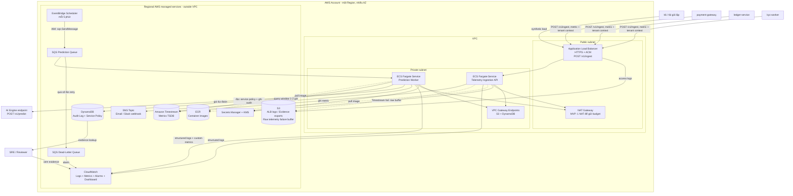

# Infrastructure Design - Task force <N> · CDO <M>

**Doc owner:** CDO-04
**Status:** Draft
**Project:** TF4 Foresight Lens  
**Angle:** Nền tảng prediction decision theo hướng TSDB-centric  
**Core:** ECS Fargate + Amazon Timestream + DynamoDB audit log
**Budget:** `$200/tháng`

## 1. Architecture diagram



_Chú thích: `payment-gateway`, `ledger-service` và `kyc-worker` gửi telemetry vào ALB; k6 chỉ tạo synthetic load cho luồng này. ALB nằm ở public subnet, còn ECS Fargate task chạy private subnet và không gán public IP. EventBridge Scheduler, SQS, Timestream, DynamoDB, SNS, CloudWatch, S3, Secrets Manager và ECR là regional managed services nên được vẽ **ngoài VPC**. Scheduler dùng execution role có quyền `sqs:SendMessage` để tạo prediction job; nó không chạy trong private subnet và không cần security group hoặc NAT. Luồng prediction được tách bằng Scheduler → SQS → Worker để ingestion không bị kẹt khi AI endpoint chậm hoặc lỗi. Mỗi lần dự đoán lấy metric từ Timestream, đọc service policy, ghi audit vào DynamoDB, rồi đẩy evidence lên CloudWatch/SNS. Nếu AI `/v1/predict` không phản hồi hoặc trả sai schema, worker chuyển sang static threshold fallback và vẫn ghi audit._

**Giả định networking cho MVP:** dùng 1 NAT Gateway để private task truy cập ECR, CloudWatch Logs, Secrets Manager, KMS, SQS và Timestream public AWS APIs. S3 và DynamoDB đi qua gateway endpoint để giảm NAT data processing. Nếu Timestream không nhận write sau bounded retry, Telemetry API ghi raw payload có idempotency key vào S3 failure buffer để replay theo runbook; S3 buffer này không thay thế TSDB hot path. AI endpoint được giả định là internal/private theo deployment contract của task force; nếu AI endpoint public, NAT hiện tại vẫn đủ đường ra nhưng cần siết egress bằng security group/NACL và allowlist domain ở application config. **Trade-off MVP:** một NAT Gateway không HA cho egress; nếu AZ chứa NAT lỗi, private task ở AZ khác có thể mất đường gọi public AWS API/AI endpoint. Production nâng lên NAT Gateway mỗi AZ hoặc interface endpoints theo từng AZ.

## 2. Component table

Giả định tính chi phí: region `us-east-1` làm baseline pricing để tính nhanh, 730 giờ/tháng, 3 service demo, prediction mỗi 5 phút, CloudWatch log retention 14 ngày, S3 raw failure buffer 7 ngày và evidence/baseline export 90 ngày. Nếu final deploy ở `ap-southeast-1` hoặc region khác, nhóm phải re-run AWS Pricing Calculator theo region đó trước submission cuối. Đây là **chi phí platform MVP** cho demo scope, không phải chi phí phân bổ chính xác theo từng tenant. Giá là estimate để defend thiết kế.

| Thành phần                        | AWS Service                                 | Lý do chọn                                                                                                                                                                                                         | Chi phí                                                                                                                        |
| --------------------------------- | ------------------------------------------- | ------------------------------------------------------------------------------------------------------------------------------------------------------------------------------------------------------------------ | ------------------------------------------------------------------------------------------------------------------------------ |
| Tầng compute                      | ECS Fargate                                 | Chạy 2 task cho Telemetry API và 1 task cho Prediction Worker. Fargate phù hợp vì không phải quản lý EC2, có task role riêng, và chạy được cả API lẫn worker theo cùng mô hình container.                          | **$54.07/tháng** = 3 task × 730h × (0.5 vCPU × $0.04048 + 1GB × $0.004445).                                                    |
| Cổng API                          | Application Load Balancer + ACM             | ALB nhận telemetry từ 3 service demo và tải synthetic từ k6, kết thúc HTTPS rồi chuyển request vào ECS service. ACM certificate không tính phí.                                                                    | **$22.27/tháng** = ALB $16.43 + 1 LCU trung bình $5.84.                                                                        |
| Kho metric TSDB                   | Amazon Timestream                           | Lưu metric theo tenant/service/time để worker query window 1-2 giờ.                                                                                                                                                | **$5.00/tháng**: hạn mức dự kiến cho ~0.65M metric/tháng, memory store ngắn, magnetic store nhỏ, query luôn có time predicate. |
| Audit + service policy database   | DynamoDB                                    | Audit log là dữ liệu ghi nối tiếp, cần tra cứu nhanh theo tenant/service/time; service policy chứa metric allowlist, baseline, quota và fallback threshold. DynamoDB gọn hơn RDS cho key-value access pattern này. | **$0.10/tháng**: ~26k audit write/tháng + policy read nhỏ; read và storage rất nhỏ, nằm trong 25GB storage miễn phí.           |
| Điều phối job                     | EventBridge Scheduler + SQS + DLQ           | Scheduler tạo prediction job mỗi 5 phút; SQS tách worker khỏi độ trễ của AI; DLQ giữ job lỗi để debug.                                                                                                             | **$0.05/tháng**: ~26k job/tháng, khoảng 3 SQS request/job; Scheduler gần như không đáng kể ở volume này.                       |
| Lưu trữ evidence + failure buffer | S3                                          | Lưu ALB access log, evidence/baseline export và raw telemetry buffer khi Timestream write fail; không dùng làm audit DB chính.                                                                                     | **$0.35/tháng**: giả định evidence/export giữ 90 ngày, raw failure buffer giữ 7 ngày, request nhỏ.                             |
| Quan sát hệ thống                 | CloudWatch + SNS                            | Ghi log task, custom metrics, alarm và dashboard; SNS gửi alert high-risk.                                                                                                                                         | **$8.00/tháng**: 1 dashboard ~$3, 10-12 alarm ~$1-2, log ingest/storage khoảng ~$3; SNS email dưới 1k notification miễn phí.   |
| Bảo mật / cấu hình                | Secrets Manager + KMS                       | Lưu secret/config của AI endpoint, mã hóa DynamoDB/SQS/Logs bằng KMS, không hardcode credential.                                                                                                                   | **$3.00/tháng**: 2 secret × $0.40 + 2 KMS key × $1 + request nhỏ.                                                              |
| Kết nối private subnet            | NAT Gateway + S3/DynamoDB Gateway Endpoints | 1 NAT Gateway cho MVP để private task pull image, ghi log, đọc secret và gọi AWS APIs; S3/DynamoDB dùng gateway endpoint miễn phí hourly.                                                                          | **$32.85/tháng** = 1 NAT × 730h × ~$0.045/h, chưa tính data processing nhỏ cho demo.                                           |
| Container registry                | Amazon ECR                                  | Lưu private image cho Telemetry API và Prediction Worker; ECS execution role pull image khi deploy/replace task.                                                                                                   | **~$0.10-$1/tháng** cho image demo nhỏ; đã nằm trong buffer vận hành 20%.                                                      |
| Bảo vệ public endpoint            | AWS WAF rate-based rule                     | Không bắt buộc để chạy MVP, nhưng nên bật nếu panel hỏi public ALB chống abuse thế nào.                                                                                                                            | **Tùy chọn +~$6/tháng**. Nếu bỏ WAF, bù bằng app token bucket và giới hạn nguồn k6.                                            |
| **Tổng baseline**                 |                                             | Không tính optional WAF.                                                                                                                                                                                           | **~$125.69/tháng**. Thêm 20% buffer vận hành là **~$150.83/tháng**, thấp hơn budget **$200/tháng**.                            |
| **Nếu bật WAF**                   |                                             | Dùng cho demo security tốt hơn.                                                                                                                                                                                    | **~$131.69/tháng**, thêm 20% buffer là **~$158.03/tháng**.                                                                     |

Cost guard:

- AWS Budget alarm tại 50%, 80%, 100% của **$200/tháng**.
- CloudWatch log retention cố định 14 ngày; S3 raw failure buffer 7 ngày, evidence/baseline export 90 ngày theo lifecycle policy.
- Synthetic load chỉ bật trong test window.
- Timestream query bắt buộc có `tenant_id`, `service_id` và time predicate.
- Không tăng prediction cadence xuống 1 phút nếu chưa có lý do test rõ ràng.

## 3. Differentiation angle deep-dive

### 3.1 Why this angle?

Angle của nhóm là **SLO Early-Warning Control Plane with TSDB-backed Prediction Workflow**. Điểm khác biệt không nằm ở việc dựng thêm dashboard, mà ở việc biến telemetry thành quyết định vận hành có thể kiểm chứng và audit được.

Client đã có Grafana, CloudWatch và Datadog trial. Vấn đề là dashboard không tự đưa ra cảnh báo sớm, còn threshold tĩnh thì dễ rơi vào hai cực: quá nhạy gây alert fatigue, hoặc quá trễ nên chỉ báo khi user đã bị ảnh hưởng. Vì vậy platform tập trung vào một luồng rõ ràng:

1. nhận metric từ 3 service demo;
2. lưu time-series metric vào Timestream;
3. chạy prediction định kỳ mỗi 5 phút;
4. gọi AI endpoint `/v1/predict`;
5. tạo risk decision có root cause, recommendation và confidence;
6. ghi audit log cho mọi lần dự đoán;
7. gửi alert và evidence link cho SRE;
8. fallback sang static threshold nếu AI endpoint lỗi.

Dashboard chỉ là nơi xem evidence. Phần chính của CDO là control plane điều phối prediction, audit và fallback.

### 3.2 Trade-off định lượng cho MVP

| Trục so sánh                 | Số liệu của nhóm                                                                   | Ước lượng của hướng khác                                                                                                             |
| ---------------------------- | ---------------------------------------------------------------------------------- | ------------------------------------------------------------------------------------------------------------------------------------ |
| Chi phí platform MVP / tháng | **~$125.69/tháng** baseline; **~$150.83/tháng** nếu thêm 20% buffer                | Dashboard/TSDB-only khoảng **$60-90/tháng** ở demo scope tương tự, rẻ hơn nhưng thiếu SQS workflow, audit DB và fallback path đầy đủ |
| Thời gian cảnh báo sớm       | Prediction mỗi **5 phút**; mục tiêu cảnh báo trước **≥15 phút**, tốt nhất 30 phút  | Static alarm thường chỉ báo khi metric đã vượt ngưỡng; dashboard thủ công phụ thuộc người trực                                       |
| Công vận hành                | **2-3 giờ/tuần** nhờ dùng managed services: ECS Fargate, SQS, Timestream, DynamoDB | EKS hoặc self-hosted TSDB có thể **6-10 giờ/tuần** cho node, storage và upgrade                                                      |
| Thời gian onboard service    | **15-30 phút/service**: khai báo metric, baseline, fallback threshold, smoke test  | Làm dashboard/alarm thủ công thường **30-60 phút/service** và dễ thiếu audit consistency                                             |

Balanced mode được chọn vì hợp với budget và yêu cầu lead time. Cadence 1 phút phát hiện nhanh hơn nhưng làm tăng Timestream query, SQS job, audit write và alert noise. Cadence 10 phút rẻ hơn nhưng không còn nhiều buffer cho yêu cầu cảnh báo trước tối thiểu 15 phút.

### 3.3 Điểm yếu chấp nhận

- **Phức tạp hơn dashboard-only**: cần scheduler, queue, worker, TSDB, audit DB và alert path. Nhóm chấp nhận điểm này vì fallback và audit log là hard requirement.
- **Phụ thuộc AI contract**: nếu AI response thiếu `root_cause` hoặc `recommendation`, warning sẽ kém giá trị. Cách giảm rủi ro là validate schema và dùng mock endpoint đúng contract khi AI chưa sẵn sàng.
- **Static fallback có false positive**: fallback chỉ dùng khi AI unavailable hoặc response invalid. Audit record luôn ghi `prediction_source = static_threshold_fallback` để SRE biết đây không phải prediction từ model.
- **Chi phí phụ thuộc kỷ luật log/query**: nếu bật debug log dài ngày hoặc query Timestream không có time predicate, chi phí sẽ tăng. Vì vậy CloudWatch log retention giữ 14 ngày, S3 lifecycle tách raw buffer 7 ngày khỏi evidence/baseline 90 ngày, và mọi query phải filter theo time window + service.

## 4. Cách tiếp cận multi-tenant

### 4.1 Mô hình tenant và auth

- **Tenant ID format**: UUID v4
- **Header**: `X-Tenant-Id` bắt buộc cho mọi API call, nhưng không dùng header này làm nguồn xác thực duy nhất.
- **Auth rule**: tenant phải được derive/validate từ API key, JWT hoặc SigV4 principal. `X-Tenant-Id` chỉ là context header sau khi credential đã được verify.
- **Subscription tiers**: basic / pro / enterprise; ảnh hưởng quota, cadence và worker capacity.
- **Demo scope**: 1 tenant chính, 3 service tier-1: `payment-gateway`, `ledger-service`, `kyc-worker`.

Metric tối thiểu:

```text
tenant_id
service_id
metric_type
timestamp
value
unit
```

Audit record tối thiểu:

```text
prediction_id, timestamp, tenant_id, service_id, prediction_source,
risk_level, confidence, root_cause, recommendation,
evidence_link, model_version, baseline_version
```

### 4.2 AI/CDO contract

- Endpoint chốt cho tài liệu này: `POST /v1/predict`.
- Worker gọi AI bằng SigV4/STS hoặc private service auth theo deployment contract của task force.
- Request phải mang tenant context đã verify, không tự tin vào tenant header từ client.
- Timeout AI: 2-5 giây.
- Retry: 1-2 lần với backoff ngắn.
- Nếu AI timeout, 5xx, 429 vượt retry, hoặc response sai schema, worker dùng static threshold fallback.
- Nếu AI contract trả field khác tên, map về schema audit của CDO:

```text
severity/anomaly       -> risk_level
suggested_action       -> recommendation
reasoning              -> root_cause
confidence             -> confidence
```

### 4.3 Mô hình cô lập

- **Data isolation**: dùng pooled model. Timestream lưu `tenant_id`, `service_id`, `env`, `region` dưới dạng dimensions. DynamoDB dùng partition key có tenant/service để tránh query lẫn tenant.
- **Compute isolation**: basic/pro dùng chung ECS service để tiết kiệm cost. Enterprise tier có thể tách worker service riêng hoặc đặt reserved min capacity riêng.
- **Lý do chọn pooled model**: đủ để chứng minh multi-tenant trong capstone mà không nhân đôi ALB, ECS cluster hay database cho từng tenant.

Tenant-aware rules:

- Mọi runtime query bắt buộc include `tenant_id`.
- Service phải thuộc tenant trước khi ghi metric hoặc query audit.
- Tenant A không đọc được audit/evidence của tenant B.
- Không đưa PII vào metric, audit key hoặc Timestream dimensions.

### 4.4 DynamoDB audit database

Access patterns:

| Access pattern                                    | Cách query                                                          |
| ------------------------------------------------- | ------------------------------------------------------------------- |
| Get prediction by `prediction_id`                 | Query GSI1 theo `PRED#<prediction_id>`                              |
| List predictions by tenant + service + time range | Query table chính theo `PK` và `SK BETWEEN`                         |
| List recent decisions by tenant                   | Query GSI2 theo tenant + time                                       |
| Evidence lookup từ alert link                     | Alert chứa `prediction_id` hoặc `tenant_id/service_id/window_start` |

Key design:

```text
PK     = TENANT#<tenant_id>#SERVICE#<service_id>
SK     = TS#<window_start>#PRED#<prediction_id>

GSI1PK = PRED#<prediction_id>
GSI1SK = TS#<window_start>

GSI2PK = TENANT#<tenant_id>
GSI2SK = TS#<window_start>#SERVICE#<service_id>
```

Idempotency:

```text
prediction_id = hash(tenant_id, service_id, window_start, model_version, baseline_version)
```

- `PutItem` dùng conditional write: `attribute_not_exists(prediction_id)`.
- Worker chỉ delete SQS message sau khi audit write thành công.
- TTL audit: 90 ngày cho MVP/final demo.
- PITR bật ở final environment.
- KMS encryption bật; task role chỉ có quyền `PutItem`, `Query`, `GetItem` trên table/index cần dùng.

### 4.5 Service policy database

Service policy được lưu tách logic với audit record trong DynamoDB để worker và Telemetry API cùng đọc một nguồn cấu hình có version. Mỗi tenant/service chỉ có một policy current; thay đổi policy phải tạo version mới để audit record truy vết được baseline và fallback rule nào đã được dùng.

Key design:

```text
PK = TENANT#<tenant_id>#SERVICE#<service_id>
SK = POLICY#CURRENT
```

Policy tối thiểu:

```json
{
  "tenant_id": "demo-tenant-001",
  "service_id": "kyc-worker",
  "enabled_metrics": [
    "sqs_queue_depth",
    "sqs_oldest_message_age_seconds",
    "latency_p95_ms"
  ],
  "prediction_interval_minutes": 5,
  "quota_tier": "basic",
  "baseline_version": "2026-06-23-v1",
  "fallback_rules": [
    {
      "metric_type": "sqs_queue_depth",
      "operator": ">",
      "threshold": 5000,
      "duration_minutes": 10,
      "risk_level": "high",
      "recommendation": "Increase kyc-worker concurrency from 20 to 40"
    }
  ]
}
```

Quyền truy cập: Telemetry API chỉ đọc `enabled_metrics` để enforce allowlist; worker đọc policy để áp baseline/fallback và ghi `baseline_version` vào audit; chỉ platform admin mới được cập nhật policy. Basic/Pro bị khóa cadence 5 phút, Enterprise chỉ được thay đổi qua approval, không qua tenant-facing API.

Baseline cadence và retrain trigger:

```text
Manual baseline train: 1 lần trước test window chính
Baseline review: weekly manual review cho từng service
Retrain / refresh trigger: FP rate >12%, catch rate <80%, service deploy làm đổi capacity profile,
traffic pattern thay đổi rõ rệt, hoặc static fallback threshold liên tục tạo false positive
ADR: ghi rõ trigger logic; infra lưu baseline_version trong service policy và audit record
```

### 4.6 Mô hình dữ liệu Timestream

Dimensions ổn định:

```text
tenant_id
service_id
env
region
service_tier
```

Không dùng high-cardinality dimensions:

```text
request_id
trace_id
prediction_id
```

Multi-measure record theo `tenant_id + service_id + timestamp`. Measure fields ví dụ:

```text
latency_p95_ms
error_rate
rds_cpu_percent
db_connection_count
queue_depth
oldest_message_age_seconds
alb_active_connection
```

Retention:

```text
Memory store: 24h cho recent prediction window
Magnetic store: 30 ngày cho evidence/demo
S3 evidence + aggregated baseline export: 90 ngày theo lifecycle
S3 raw telemetry failure buffer: 7 ngày hoặc xóa ngay sau replay thành công
```

Query pattern bắt buộc:

```sql
WHERE tenant_id = ?
  AND service_id = ?
  AND time BETWEEN ago(2h) AND now()
```

Không query toàn tenant/all services trong runtime path. Dashboard/evidence query dùng window nhỏ và filter service cụ thể.

### 4.7 Tenant onboarding flow

```text
1. POST /platform/v1/tenants (tenant_name, contact, tier)
2. Verify credential mapping với tenant_id
3. Tạo service policy cho payment-gateway, ledger-service, kyc-worker: enabled metrics, quota, baseline version, fallback rules
4. Cấu hình baseline và static fallback threshold theo từng service
5. Đăng ký metric labels/dimensions trong Timestream
6. Gán quota và prediction cadence mặc định 5 phút; tenant không tự tăng cadence
7. Smoke test: ingest metric → query TSDB → enqueue job → gọi worker → ghi audit
8. Callback tenant ready, mục tiêu < 30 phút
```

### 4.8 Noisy neighbor mitigation

| Guardrail          |              Basic |                Pro | Ghi chú                            |
| ------------------ | -----------------: | -----------------: | ---------------------------------- |
| Telemetry requests |        300 req/min |       1000 req/min | Token bucket ở application layer   |
| Metric points      |      5k points/min |     20k points/min | Chặn batch quá lớn                 |
| Payload size       |      256KB/request |      512KB/request | Tránh log/query cost tăng đột biến |
| Service scope      |          3 service |          5 service | Capstone chỉ cần 3 service         |
| Prediction jobs    | 1 job/service/5min | 1 job/service/5min | Không cho tenant tự tăng cadence   |
| Lookback window    |          tối đa 2h |          tối đa 2h | Giữ Timestream query cost ổn định  |

Cost guard khi forecast gần $200/tháng: giữ cadence 5 phút, giảm synthetic load và log verbosity; không tắt audit/fallback.

## 5. Các phương án đã cân nhắc

### 5.1 Compute layer

| Phương án            | Ưu điểm                                                                                                                      | Nhược điểm                                                                                                              | Quyết định                                                                |
| -------------------- | ---------------------------------------------------------------------------------------------------------------------------- | ----------------------------------------------------------------------------------------------------------------------- | ------------------------------------------------------------------------- |
| Lambda + API Gateway | Rẻ khi traffic thấp, ít vận hành, scale tự động.                                                                             | Worker query TSDB và gọi AI có thể chạy lâu; cold start làm p99 khó ổn định; không cùng container workflow với AI team. | Không chọn. Phù hợp ingestion đơn giản hơn là control plane có worker.    |
| ECS Fargate + ALB    | Chạy API và worker bằng container, không quản lý EC2, hỗ trợ private subnet, task role, autoscaling và health check rõ ràng. | Có fixed cost cho ALB và task chạy nền.                                                                                 | **Chọn.** Đúng yêu cầu đề bài và đủ production-like cho fintech workload. |
| EKS                  | Linh hoạt, mạnh cho platform lớn.                                                                                            | Quá nặng cho capstone; tăng cost và ops overhead.                                                                       | Không chọn. Overkill cho 3 service demo.                                  |

Nguyên tắc triển khai Fargate:

- Task chạy private subnet, `assignPublicIp=DISABLED`, network mode `awsvpc`.
- ALB ở public subnet, HTTPS bằng ACM, HTTP redirect sang HTTPS.
- Target group type `ip`, health check `/health`, grace period 60-90 giây.
- Deployment circuit breaker bật rollback, `minimumHealthyPercent=100`, `maximumPercent=200`.
- Tách `executionRoleArn` để pull image/logs/secrets và `taskRoleArn` để ứng dụng gọi Timestream, DynamoDB, SQS, SNS.
- Secret và config nhạy cảm đặt trong Secrets Manager hoặc SSM Parameter Store.

### 5.2 Database

| Phương án         | Ưu điểm                                                                             | Nhược điểm                                                                                | Quyết định                                                          |
| ----------------- | ----------------------------------------------------------------------------------- | ----------------------------------------------------------------------------------------- | ------------------------------------------------------------------- |
| RDS/Aurora        | SQL mạnh, quen thuộc với transactional workload.                                    | Audit log không cần relational join; phải quản lý connection, schema, backup và failover. | Không chọn. Nặng hơn nhu cầu audit.                                 |
| S3-only audit log | Rẻ, giữ lịch sử lâu.                                                                | Lookup audit theo tenant/service/time chậm; khó demo near real-time evidence.             | Không chọn làm audit DB chính; chỉ dùng S3 cho log/evidence export. |
| DynamoDB          | Serverless, ghi append-heavy tốt, lookup nhanh theo key, KMS encryption, TTL, PITR. | Cần thiết kế partition key để tránh hot partition.                                        | **Chọn.** Phù hợp nhất cho audit record mỗi prediction call.        |

### 5.3 TSDB và luồng prediction

| Nhóm quyết định      | Phương án                            | Ưu điểm                                                                         | Nhược điểm                                            | Quyết định                                    |
| -------------------- | ------------------------------------ | ------------------------------------------------------------------------------- | ----------------------------------------------------- | --------------------------------------------- |
| Metrics store        | S3 metric lake                       | Rẻ cho dữ liệu lịch sử.                                                         | Không tối ưu query window 1-2 giờ mỗi 5 phút.         | Không chọn cho hot path.                      |
| Metrics store        | Amazon Timestream                    | Phù hợp time-series, có memory/magnetic retention, query theo service/time tốt. | Query sai pattern có thể tăng cost.                   | **Chọn** làm TSDB cho prediction và evidence. |
| Điều phối prediction | Scheduler gọi worker trực tiếp       | Ít thành phần.                                                                  | AI timeout có thể làm mất job hoặc block luồng xử lý. | Không chọn.                                   |
| Điều phối prediction | EventBridge Scheduler → SQS → Worker | Có retry, DLQ, scale worker theo backlog, dễ demo failure path.                 | Thêm queue cần monitor.                               | **Chọn** cho control plane.                   |

## 6. Chiến lược mở rộng

| Thành phần        | Sizing mặc định         | Khi nào tăng                                                                               | Giới hạn MVP                                        |
| ----------------- | ----------------------- | ------------------------------------------------------------------------------------------ | --------------------------------------------------- |
| Telemetry API     | 2 task × 0.5 vCPU / 1GB | CPU >70%, memory >75%, ALB p99 vượt target                                                 | Max 5 task                                          |
| Prediction Worker | 1 task × 0.5 vCPU / 1GB | Queue age >2 phút, visible messages >20 trong 5 phút, backlog-per-task cao, worker timeout | Max 5 task                                          |
| Worker nâng cấp   | 1 vCPU / 2GB            | Timestream query + AI call thường xuyên vượt timeout hoặc memory >75%                      | Chỉ nâng worker trước, không nâng API nếu không cần |

Scaling triggers:

| Component                    | Trigger                                                                            | Action                             | Bounds MVP        |
| ---------------------------- | ---------------------------------------------------------------------------------- | ---------------------------------- | ----------------- |
| Telemetry API                | CPU >70%, memory >75%, hoặc ALB `RequestCountPerTarget > 200 req/min` trong 5 phút | Thêm 1 task                        | Min 2, max 5      |
| Prediction Worker - backlog  | `ApproximateNumberOfMessagesVisible > 20` trong 5 phút                             | Thêm 1 worker task                 | Min 1, max 5      |
| Prediction Worker - lag      | `ApproximateAgeOfOldestMessage > 2 phút`                                           | Scale worker ngay và gửi SNS alert | Max 5             |
| Prediction Worker - scale-in | Queue trống và CPU <30% trong 10 phút                                              | Giảm 1 worker task                 | Không dưới 1 task |

Ngoài autoscaling, theo dõi DLQ depth > 0, DynamoDB throttles, Timestream rejected records/query error và AI fallback rate tăng bất thường.

Quy tắc xử lý SQS:

```text
Queue type: Standard SQS
Message retention: 4 ngày
DLQ retention: 14 ngày
Visibility timeout: 180 giây
Receive wait time: 20 giây long polling
maxReceiveCount: 5
Worker concurrency: 1-2 message/task
```

Message body:

```text
tenant_id
service_id
window_start
window_end
baseline_version
model_version
job_id
```

Worker flow:

```text
1. Receive message
2. Query Timestream
3. Call AI hoặc static fallback
4. Conditional write audit vào DynamoDB
5. Publish alert nếu risk high
6. Delete SQS message cuối cùng
```

## 7. Quan sát hệ thống và evidence

Dashboard cần có các widget sau:

| Nhóm        | Widget                                                             |
| ----------- | ------------------------------------------------------------------ |
| ALB         | Request count, 5xx, p99 latency                                    |
| ECS         | CPU, memory, running task count cho API và Worker                  |
| SQS         | Visible messages, age of oldest message, DLQ depth                 |
| Prediction  | Success count, failure count, fallback rate, AI latency            |
| Data stores | Timestream rejected/query errors, DynamoDB throttles/system errors |
| Audit       | High-risk decisions gần nhất theo tenant/service                   |

Alarm tối thiểu:

| Alarm                       | Điều kiện gợi ý                                      | Action                                      |
| --------------------------- | ---------------------------------------------------- | ------------------------------------------- |
| DLQ depth                   | `ApproximateNumberOfMessagesVisible > 0`             | SNS                                         |
| Queue age                   | `ApproximateAgeOfOldestMessage > 2 phút`             | SNS + scale worker ngay                     |
| Fallback rate               | fallback tăng bất thường trong 15 phút               | SNS                                         |
| Audit write failure         | >0 trong 5 phút                                      | SNS                                         |
| Timestream rejected records | >0                                                   | SNS                                         |
| ALB 5xx / p99 latency       | breach theo baseline demo                            | SNS                                         |
| Budget                      | 50%, 80%, 100% của $200                              | Email/SNS                                   |
| Failure buffer age          | S3 raw failure buffer object chưa replay sau >5 phút | SNS + chạy replay runbook                   |
| Partial evidence window     | Prediction window có buffered telemetry chưa replay  | Gắn cờ evidence partial và ưu tiên backfill |

Structured log tối thiểu:

```text
tenant_id
service_id
prediction_id
job_id
trace_id
prediction_source
risk_level
ai_latency_ms
fallback_reason
```

Evidence link trong alert trỏ đến CloudWatch Dashboard, audit record hoặc query/runbook tương ứng. Alert failure không làm mất audit; alert có thể replay từ audit record.

## 8. Bảo mật và network guardrails

Security group:

| Security group | Inbound                                                   | Outbound                                                                          |
| -------------- | --------------------------------------------------------- | --------------------------------------------------------------------------------- |
| ALB SG         | 443 từ internet hoặc IP range demo; 80 chỉ redirect HTTPS | ECS API SG                                                                        |
| ECS API SG     | Chỉ từ ALB SG vào app port                                | Timestream, CloudWatch, Secrets Manager, NAT/Gateway endpoints, S3 failure buffer |
| Worker SG      | Không mở inbound                                          | SQS, Timestream, DynamoDB, SNS, Secrets Manager, AI endpoint                      |

IAM role:

| Role                                 | Quyền chính                                                                                                                                        |
| ------------------------------------ | -------------------------------------------------------------------------------------------------------------------------------------------------- |
| ECS execution role                   | Pull image từ ECR, ghi CloudWatch Logs, đọc secret cần inject lúc start                                                                            |
| Telemetry API task role              | Timestream write, CloudWatch metric/log, `s3:PutObject` chỉ vào failure-buffer prefix; không cần DynamoDB audit write nếu API không tạo prediction |
| Worker task role                     | SQS receive/delete, Timestream query, DynamoDB `PutItem/Query/GetItem` audit + service policy, SNS publish, Secrets Manager read                   |
| EventBridge Scheduler execution role | Chỉ `sqs:SendMessage` vào prediction queue ARN; không có quyền truy cập VPC resource                                                               |
| Buffer replay role (break-glass)     | Đọc failure-buffer prefix, ghi lại Timestream; không có quyền đọc audit table hoặc secret không liên quan                                          |

Public endpoint protection:

- HTTPS only, HTTP redirect sang HTTPS.
- ALB access logs bật và lưu S3.
- Failure buffer tách prefix, SSE-KMS, lifecycle 7 ngày; API task chỉ được ghi, replay role mới được đọc/replay.
- MVP có thể dùng app token bucket + giới hạn IP nguồn k6 để tiết kiệm cost.
- Nếu cần defend security tốt hơn, bật AWS WAF rate-based rule, cộng khoảng **~$6/tháng**.

## 9. Lỗi có thể xảy ra + cách khôi phục

| Lỗi                                   | Cách phát hiện                                                   | Cách khôi phục                                                                                                                                                                                                                                      | RTO                  | RPO                                                |
| ------------------------------------- | ---------------------------------------------------------------- | --------------------------------------------------------------------------------------------------------------------------------------------------------------------------------------------------------------------------------------------------- | -------------------- | -------------------------------------------------- |
| Một ECS API/worker task crash         | ECS service event, CloudWatch alarm trên task count hoặc log lỗi | ECS tự replace task; deployment circuit breaker rollback nếu bản mới lỗi                                                                                                                                                                            | < 60s                | 0 nếu producer retry; prediction job còn trong SQS |
| Mất một AZ                            | ALB target unhealthy, ECS thiếu task ở 1 AZ                      | ALB route sang AZ còn lại; ECS chạy task thay thế ở subnet khỏe                                                                                                                                                                                     | < 5min               | < 1min                                             |
| EventBridge Scheduler missed run      | Không có job mới trong >10 phút                                  | Alarm + manual enqueue/backfill window gần nhất                                                                                                                                                                                                     | < 10min              | Mất tối đa 1 prediction cycle nếu không backfill   |
| AI endpoint timeout/down              | Worker timeout, AI 5xx, fallback-rate alarm                      | Chuyển sang static threshold theo service; audit ghi `prediction_source = static_threshold_fallback`                                                                                                                                                | < 1 prediction cycle | 0, vì vẫn ghi audit fallback                       |
| AI response sai schema                | Schema validation error                                          | Fallback static threshold; audit `fallback_reason = ai_invalid_response`                                                                                                                                                                            | < 1 prediction cycle | 0                                                  |
| Tenant auth failure/spoofing          | 401/403 tăng, tenant mismatch log                                | Reject request; không ghi metric/audit theo claimed tenant                                                                                                                                                                                          | Immediate            | 0, vì request bị từ chối trước khi ghi             |
| Prediction job lỗi lặp lại            | SQS receive count vượt ngưỡng, DLQ depth > 0                     | Retry theo redrive policy; sau `maxReceiveCount` chuyển DLQ để review payload/log                                                                                                                                                                   | < 10min để isolate   | Job lỗi nằm trong DLQ                              |
| Timestream write/query failure        | Rejected records, query error, worker log error                  | API retry bounded; nếu vẫn fail thì ghi raw payload + idempotency key vào S3 failure buffer và trả `202 Accepted`; nếu S3 cũng fail thì trả 5xx/429 để producer retry. Replayer chạy theo runbook để backfill TSDB; worker retry query với backoff. | 5-15min              | Gần 0 nếu S3 buffer hoặc producer retry thành công |
| DynamoDB audit throttling/unavailable | DynamoDB throttle metric, worker `PutItem` error                 | SDK retry/backoff; chỉ delete SQS message sau khi audit write thành công                                                                                                                                                                            | < 5min               | Gần 0 nếu message vẫn còn trong SQS                |
| Secrets/KMS access denied             | Task startup/runtime decrypt error                               | Rollback task definition/role/key policy                                                                                                                                                                                                            | < 15min              | Không mất data, nhưng có thể delay prediction      |
| SNS/alert channel failure             | SNS delivery failure hoặc không nhận confirmation khi test       | Audit vẫn là source of truth; sửa subscription rồi replay alert từ audit                                                                                                                                                                            | < 15min              | 0 cho audit, alert có thể delay                    |
| Cost guard triggered                  | Budget alarm hoặc custom cost metric                             | Giữ cadence 5 phút, giảm synthetic load/log verbosity, không tắt audit/fallback                                                                                                                                                                     | Same day             | 0 cho core audit                                   |

Telemetry API trả `200/201` khi Timestream write accepted. Nếu Timestream vẫn fail sau bounded retry nhưng raw payload đã được lưu bền vững vào S3 failure buffer, API trả `202 Accepted` kèm request/event id để xác nhận sẽ replay; chỉ trả `5xx/429` khi cả Timestream và S3 buffer đều thất bại. Failure buffer có alarm khi object age >5 phút và replay target trong 5-15 phút. Nếu prediction worker chạy trước khi telemetry buffered được replay, audit/evidence phải gắn cờ `evidence_status = partial_window` để SRE biết decision dựa trên window chưa đầy đủ. Prediction worker chỉ delete SQS message sau khi audit write thành công.

## Tài liệu liên quan

- [`03_security_design.md`](03_security_design.md) - Network Security §4 + IAM §5 + Data Security §6 expand on infra concerns
- [`04_deployment_design.md`](04_deployment_design.md) - IaC + CI/CD + GitOps cho infra này
- [`05_cost_analysis.md`](05_cost_analysis.md) - Platform baseline và mô hình phân bổ chi phí per-tenant dựa trên infra này
- [`08_adrs.md`](08_adrs.md) - Infra architecture decisions
