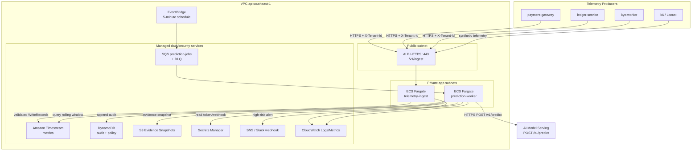

# Security Design - TF4 Foresight Lens · CDO-04

**Doc owner:** CDO-04  
**Status:** Draft  
**Project:** TF4 Foresight Lens  
**Infra source of truth:** `02_infra_design.md`  
**Angle:** SLO Early-Warning Control Plane with TSDB-backed Prediction Workflow  
**Core stack:** ALB + ECS Fargate + Amazon Timestream + SQS/DLQ + DynamoDB audit log + SNS/CloudWatch + Secrets Manager

---

## 1. Phạm vi bảo mật

Tài liệu này mô tả thiết kế bảo mật ở góc nhìn DevOps cho platform CDO-04. Platform nhận telemetry từ 3 service demo, lưu metric dạng time-series vào Amazon Timestream, tạo prediction job định kỳ, gọi AI endpoint `POST /v1/predict`, ghi audit log, gửi cảnh báo cho SRE và fallback sang static threshold khi AI serving không khả dụng.

Security design tập trung vào các phần CDO thật sự cấu hình và vận hành:

- Network boundary cho ingest service, worker, data store và AI integration.
- IAM least privilege cho ECS task và CI/CD.
- Tenant/service isolation cho telemetry và prediction evidence.
- Secrets handling cho AI token, tenant token và alert webhook.
- Encryption at rest và in transit.
- Audit logging cho mọi prediction decision.
- PII rejection và metric schema allowlist.
- Failure handling cho AI endpoint, queue, audit log và alert path.

Ngoài phạm vi capstone:

- SIEM integration đầy đủ kiểu enterprise.
- Multi-region active-active.
- Auto-remediation.
- App-level authN/authZ chuyên sâu.
- PCI/cardholder data processing.

---

## 2. Security View của kiến trúc



Nguyên tắc bảo mật chính:

> Chỉ `telemetry-ingest` được ghi metric vào Timestream. Chỉ `prediction-worker` được consume prediction job, query metric evidence, gọi AI, ghi prediction audit và gửi alert. Mọi prediction decision phải có audit record và phải được scope theo `tenant_id` + `service_id`.

---

## 3. Network Security

### 3.1 Vị trí subnet

| Component | Placement | Public access | Lý do |
|---|---|---:|---|
| ALB `/v1/ingest` | Public subnet cho demo | Có, HTTPS only | Cho phép k6/Locust và service demo gửi telemetry mà không cần VPN. |
| ECS `telemetry-ingest` | Private app subnets | Không | Chỉ nhận traffic từ ALB security group. |
| ECS `prediction-worker` | Private app subnets | Không | Poll SQS và gọi AWS services/AI endpoint bằng outbound. |
| Timestream | AWS managed | Không có public app endpoint trực tiếp | Truy cập qua IAM và AWS SDK. |
| DynamoDB audit/policy | AWS managed | Không có public app endpoint trực tiếp | Truy cập qua IAM và AWS SDK. |
| SQS/DLQ | AWS managed | Không có public app endpoint trực tiếp | Truy cập qua IAM và queue policy. |
| S3 evidence | AWS managed | Bucket private | Lưu evidence snapshot, bật encryption. |

Trong capstone, ALB có thể public vì đây là boundary có kiểm soát cho ingestion. ECS task vẫn private. Nếu sau này các producer chạy trong cùng VPC, ALB có thể đổi thành internal ALB mà không thay đổi logic chính.

### 3.2 Security Groups

| Security group | Inbound | Outbound | Gắn với |
|---|---|---|---|
| `tf4-cdo04-alb-sg` | `443` từ demo CIDR hoặc public trong demo window có kiểm soát | `8080` tới `tf4-cdo04-ingest-sg` | ALB |
| `tf4-cdo04-ingest-sg` | `8080` từ `tf4-cdo04-alb-sg` | `443` tới AWS service endpoints | ECS `telemetry-ingest` |
| `tf4-cdo04-worker-sg` | Không cần inbound cho worker loop; optional `8080` từ internal health checker | `443` tới AWS service endpoints và AI endpoint | ECS `prediction-worker` |
| `tf4-cdo04-ai-egress-sg` | N/A nếu AI endpoint external; SG-to-SG nếu cùng VPC | `443` hoặc AI port | Worker egress path |

Inbound được giới hạn theo nguyên tắc:

- Public entry point duy nhất là ALB HTTPS `/v1/ingest`.
- ECS task không có public IP.
- `prediction-worker` không cần public inbound trong normal operation.

### 3.3 TLS và request boundary

- ALB terminate HTTPS trên port `443`.
- HTTP port `80` bị disable hoặc redirect sang HTTPS.
- TLS policy target: TLS 1.2+.
- Mọi ingest request phải có header `X-Tenant-Id`.
- `telemetry-ingest` validate body `tenant_id` phải khớp với `X-Tenant-Id`.
- Payload vượt giới hạn batch size sẽ bị reject với `413`.
- Payload sai schema trả `400`, không ghi vào Timestream.

### 3.4 VPC endpoints

Để giảm phụ thuộc Internet/NAT và giảm rủi ro egress, bản production nên ưu tiên VPC endpoint cho:

| AWS service | Endpoint type | Mục đích |
|---|---|---|
| S3 | Gateway endpoint | Evidence snapshot và optional raw-event backup. |
| DynamoDB | Gateway endpoint | Audit log và service policy. |
| Secrets Manager | Interface endpoint | Lấy AI token và webhook secret. |
| CloudWatch Logs | Interface endpoint | Ghi ECS application logs. |
| ECR API + ECR Docker | Interface endpoint | Pull private container images. |
| SQS | Interface endpoint | Consume prediction jobs. |
| SNS | Interface endpoint | Publish alert. |

Trong capstone, VPC endpoints có thể triển khai theo mức độ ưu tiên và ngân sách. Nếu vẫn dùng NAT, security vẫn dựa vào IAM least privilege và việc ECS task không có public inbound.

---

## 4. IAM & Access Control

### 4.1 IAM role model

IAM của CDO-04 đi theo nguyên tắc **least privilege**: mỗi service chỉ được cấp đúng quyền cần cho nhiệm vụ của nó. Không dùng quyền broad kiểu `*:*`, không gắn `AdministratorAccess`, không dùng long-lived access key trong container.

| Role | Used by | Permissions |
|---|---|---|
| `tf4-cdo04-ingest-task-role` | ECS `telemetry-ingest` | Ghi metric hợp lệ vào Timestream bằng `timestream:WriteRecords` trên DB/table `foresight/metrics`; ghi app logs vào CloudWatch Logs; optional đọc tenant config từ Secrets Manager nếu dùng ingest token. |
| `tf4-cdo04-prediction-worker-role` | ECS `prediction-worker` | Consume prediction job từ SQS; query rolling window trong Timestream; đọc service policy từ DynamoDB; gọi AI endpoint bằng secret/token; ghi audit log vào DynamoDB; lưu evidence snapshot vào S3; publish high-risk alert qua SNS; ghi logs/metrics vào CloudWatch. |
| `tf4-cdo04-terraform-deploy-role` | Terraform/CI pipeline | Tạo/cập nhật resource trong scope platform: ECS service/task definition, ALB target group/listener rule, SQS/DLQ, Timestream table, DynamoDB table, SNS topic, CloudWatch alarms, IAM roles/policies theo module. Không có quyền ngoài project prefix `tf4-cdo04-*`. |
| `tf4-cdo04-readonly-reviewer-role` | Mentor/reviewer/Hoàng approve | Read-only để review evidence: ECS describe, CloudWatch logs read, SQS queue attributes read, Timestream sample query/read, DynamoDB audit read, S3 evidence read, SNS topic describe. Không có quyền write/delete. |
| `tf4-cdo04-task-execution-role` | ECS agent | Pull image từ private ECR và ghi container logs vào CloudWatch. Không có quyền đọc/ghi application data như Timestream, DynamoDB, S3 evidence hoặc SNS. |

### 4.2 Permission mapping theo checklist Task 18

| Permission area | Role nhận quyền | Actions cần có | Resource scope |
|---|---|---|---|
| Prediction worker role | `tf4-cdo04-prediction-worker-role` | `sqs:ReceiveMessage`, `sqs:DeleteMessage`, `sqs:GetQueueAttributes`, `timestream:Select`, `dynamodb:GetItem`, `dynamodb:PutItem`, `s3:PutObject`, `sns:Publish`, `secretsmanager:GetSecretValue`, `logs:CreateLogStream`, `logs:PutLogEvents` | Chỉ queue/table/bucket/topic/secret của CDO-04. |
| Terraform deploy role | `tf4-cdo04-terraform-deploy-role` | Các quyền create/update/delete resource hạ tầng trong scope Terraform module | Resource có prefix/tag `tf4-cdo04` và environment capstone. |
| Read-only reviewer role | `tf4-cdo04-readonly-reviewer-role` | `Describe*`, `Get*`, `List*`, `logs:StartQuery`, `logs:GetQueryResults`, `timestream:Select`, `dynamodb:GetItem`, `dynamodb:Query`, `s3:GetObject` | Read-only trên resource evidence/review của project. |
| Query Timestream | `tf4-cdo04-prediction-worker-role`, `tf4-cdo04-readonly-reviewer-role` | `timestream:Select`, optional `timestream:DescribeTable` | Database `foresight`, table `metrics`. |
| Write DynamoDB audit log | `tf4-cdo04-prediction-worker-role` | `dynamodb:PutItem`, optional `dynamodb:UpdateItem` nếu cần mark replay status | Table `foresight-audit-log` only. |
| Publish SNS alert | `tf4-cdo04-prediction-worker-role` | `sns:Publish` | Topic `tf4-cdo04-high-risk-alerts` only. |

### 4.3 Policy boundary và anti-patterns

Task role phải scope theo resource cụ thể:

- Timestream database/table: `foresight/metrics`.
- SQS queue: `prediction-jobs` và `prediction-jobs-dlq`.
- DynamoDB table: `foresight-audit-log`.
- S3 bucket/prefix: `s3://tf4-cdo04-evidence/*`.
- SNS topic: `tf4-cdo04-high-risk-alerts`.
- Secrets: `tf4-cdo04/ai-endpoint-token`, `tf4-cdo04/slack-webhook`.

Không dùng:

- `Action: "*"` + `Resource: "*"`.
- `AdministratorAccess`.
- Wildcard data-plane permission như `s3:*`, `dynamodb:*`, `sns:*`, `sqs:*`.
- Long-lived AWS access key trong container.
- Hardcode AI token hoặc webhook URL trong code.

Nếu buộc phải dùng wildcard ở một số AWS API không hỗ trợ resource-level permission, phải ghi rõ lý do trong ADR hoặc comment Terraform, và giới hạn bằng condition/tag/project prefix nếu có thể.

### 4.4 Policy sketch

Ví dụ policy intent cho `prediction-worker`:

```json
{
  "Version": "2012-10-17",
  "Statement": [
    {
      "Effect": "Allow",
      "Action": [
        "sqs:ReceiveMessage",
        "sqs:DeleteMessage",
        "sqs:GetQueueAttributes"
      ],
      "Resource": "arn:aws:sqs:ap-southeast-1:<account-id>:prediction-jobs"
    },
    {
      "Effect": "Allow",
      "Action": [
        "timestream:Select",
        "timestream:DescribeTable"
      ],
      "Resource": "arn:aws:timestream:ap-southeast-1:<account-id>:database/foresight/table/metrics"
    },
    {
      "Effect": "Allow",
      "Action": [
        "dynamodb:GetItem",
        "dynamodb:PutItem"
      ],
      "Resource": "arn:aws:dynamodb:ap-southeast-1:<account-id>:table/foresight-audit-log"
    },
    {
      "Effect": "Allow",
      "Action": "sns:Publish",
      "Resource": "arn:aws:sns:ap-southeast-1:<account-id>:tf4-cdo04-high-risk-alerts"
    },
    {
      "Effect": "Allow",
      "Action": "secretsmanager:GetSecretValue",
      "Resource": [
        "arn:aws:secretsmanager:ap-southeast-1:<account-id>:secret:tf4-cdo04/ai-endpoint-token-*",
        "arn:aws:secretsmanager:ap-southeast-1:<account-id>:secret:tf4-cdo04/slack-webhook-*"
      ]
    }
  ]
}
```

Policy trên là sketch để thể hiện scope. ARN thật sẽ được Terraform inject theo account/region/workspace.

### 4.5 Service-to-service authorization

Ingest path:

- Producers gọi ALB qua HTTPS.
- Request có `X-Tenant-Id`.
- Có thể dùng demo token qua `Authorization: Bearer <tenant-ingest-token>`.
- `telemetry-ingest` validate tenant, schema và metric allowlist trước khi ghi Timestream.

Prediction path:

- EventBridge tạo scheduled jobs.
- SQS giữ một job cho mỗi tenant/service/cycle.
- `prediction-worker` consume job bằng ECS task role.
- Worker gọi AI `POST /v1/predict` qua HTTPS, dùng token từ Secrets Manager hoặc IAM SigV4 nếu AI contract hỗ trợ.

---

## 5. Secrets Management

### 5.1 Secrets inventory

| Secret | Storage | Accessed by | Rotation |
|---|---|---|---|
| `tf4-cdo04/ai-endpoint-token` | AWS Secrets Manager | `prediction-worker` | Manual trong capstone; production target 30-90 ngày. |
| `tf4-cdo04/slack-webhook` | AWS Secrets Manager | `prediction-worker` | Manual hoặc rotate khi nghi leak. |
| `tf4-cdo04/tenant-ingest-token/<tenant>` | Secrets Manager hoặc SSM Parameter Store | `telemetry-ingest` | Manual cho demo tenants. |
| `tf4-cdo04/grafana-api-token` | Secrets Manager | `prediction-worker` nếu dùng Grafana annotation API | Manual trong capstone. |

### 5.2 Injection pattern

- ECS task definition reference secret bằng ARN qua `valueFrom`.
- App đọc secret từ environment variable hoặc Secrets Manager lúc startup.
- Secret không bake vào Docker image.
- Secret không commit lên Git.
- Log phải redact authorization header, webhook URL và bearer token.

### 5.3 Anti-leak controls

- CI nên có secret scanning bằng Gitleaks hoặc TruffleHog.
- Dockerfile không chứa credential.
- Application log không print raw request headers.
- Audit log cho AI request/response chỉ lưu input hash hoặc metadata tóm tắt nếu payload quá lớn hoặc có nguy cơ nhạy cảm.

---

## 6. Data Protection & Encryption

### 6.1 At rest

| Dữ liệu | Store | Encryption | Retention |
|---|---|---|---|
| Time-series telemetry | Amazon Timestream `foresight.metrics` | AWS-managed encryption mặc định | 7 ngày memory, 90 ngày magnetic retention. |
| Prediction audit log | DynamoDB `foresight-audit-log` | DynamoDB SSE enabled | TTL `audit_expiry` 90 ngày. |
| Evidence snapshots | S3 `tf4-cdo04-evidence` | SSE-S3 hoặc SSE-KMS | 90 ngày cho capstone evidence; optional lifecycle sang IA. |
| Prediction jobs | SQS `prediction-jobs` + DLQ | SQS SSE enabled | Queue retention theo nhu cầu replay. |
| Container images | ECR private repo | ECR encryption at rest | Chỉ giữ các build tag gần nhất. |
| Application logs | CloudWatch Logs | CloudWatch encryption | 14-30 ngày trong capstone. |
| Secrets | Secrets Manager | KMS-backed encryption | Cho tới khi rotate/delete. |

### 6.2 In transit

- Producer tới ALB: HTTPS.
- ALB tới ECS ingest: HTTP nội bộ VPC chấp nhận được cho capstone; HTTPS/mTLS là future hardening.
- ECS worker tới AI endpoint: HTTPS.
- ECS task tới AWS APIs: HTTPS qua AWS SDK.
- Grafana/Slack/SNS integrations: HTTPS.

### 6.3 KMS notes

Với capstone MVP, AWS-managed keys là chấp nhận được cho Timestream, DynamoDB, SQS, CloudWatch và Secrets Manager. Nếu còn thời gian, dùng customer-managed KMS key cho:

- S3 evidence snapshots.
- DynamoDB audit table.
- Secrets Manager secrets.

Key policy chỉ nên cho phép task roles, deploy role và review role cần thiết truy cập.

---

## 7. Tenant Isolation & Schema Controls

### 7.1 Tenant/service dimensions

Mọi telemetry và prediction record bắt buộc có:

```text
tenant_id
service_id
metric_type
timestamp
value
unit
```

Timestream dùng `tenant_id`, `service_id`, `metric_type` làm dimensions. DynamoDB audit record cũng lưu `tenant_id` và `service_id`, có GSI `tenant-service-time-index` để truy vấn evidence theo service/time.

### 7.2 Query isolation

`prediction-worker` phải query metric evidence với đầy đủ filter:

```sql
tenant_id = :tenant_id
service_id = :service_id
metric_type IN (:enabled_metrics)
time BETWEEN :start_time AND :end_time
```

Worker reject job nếu:

- thiếu `tenant_id`;
- thiếu `service_id`;
- `window_minutes` vượt policy;
- metric request không nằm trong enabled metrics của service policy.

### 7.3 Ingest allowlist

Metric được allow trong TF4 demo:

| Service | Allowed metrics |
|---|---|
| `payment-gateway` | `alb_request_count`, `alb_p95_latency_ms`, `alb_5xx_rate_percent`, `rds_cpu_percent` |
| `ledger-service` | `rds_cpu_percent`, `db_connections`, `query_latency_ms`, `transaction_error_rate` |
| `kyc-worker` | `sqs_queue_depth`, `sqs_oldest_message_age_seconds`, `worker_concurrency`, `worker_timeout_count` |

Payload có `metric_type` lạ sẽ bị reject trước khi ghi vào Timestream.

### 7.4 PII handling

Platform chỉ nhận infra metrics. Không nhận customer name, phone number, email, card number, address hoặc transaction payload.

Basic PII controls:

- Schema allowlist tại ingest.
- Reject các field như `email`, `phone`, `name`, `card_number`, `address`, `customer_id` nếu chưa được approve là anonymized.
- Redact suspicious string values trước khi log.
- Ghi số lượng rejection thành CloudWatch metric.

---

## 8. Audit Logging

### 8.1 Nội dung phải audit

Mọi prediction cycle phải tạo audit record, bao gồm cả AI prediction thành công và fallback decision.

Required audit fields:

```text
prediction_id
timestamp
tenant_id
service_id
prediction_source  ai_model | static_threshold_fallback
risk_level
confidence
root_cause
recommendation
evidence_link
ai_status_code
ai_latency_ms
model_version
baseline_version
audit_expiry
```

Nếu AI response thiếu field bắt buộc, worker ghi:

```text
prediction_source = static_threshold_fallback
fallback_reason = invalid_ai_response_schema
```

Nếu AI timeout hoặc 5xx, worker ghi:

```text
prediction_source = static_threshold_fallback
fallback_reason = ai_endpoint_timeout | ai_endpoint_5xx
```

### 8.2 Storage design

Primary audit store:

```text
Table name   : foresight-audit-log
Billing mode : PAY_PER_REQUEST
Encryption   : SSE enabled
TTL          : audit_expiry, 90-day retention

PK: prediction_id
SK: timestamp

GSI:
  tenant-service-time-index
  PK: tenant_id#service_id
  SK: timestamp
```

Optional evidence snapshot:

```text
s3://tf4-cdo04-evidence/predictions/date=YYYY-MM-DD/service_id=<service>/prediction_id=<id>.json
```

### 8.3 Audit integrity

- Audit write là điều kiện thành công của worker.
- Nếu DynamoDB write fail, worker retry với exponential backoff.
- Nếu audit write vẫn fail, job không được silently drop; job phải vào DLQ hoặc emit CloudWatch alarm mức high.
- Alert high-risk luôn reference `prediction_id` để panel/SRE trace ngược về audit evidence.

---

## 9. Container & Supply Chain Security

### 9.1 Image build controls

- Image lưu trong private ECR repositories.
- Base image nên minimal và pin version.
- CI scan image bằng Trivy hoặc tool tương đương.
- Critical vulnerabilities nên block release nếu kịp trong capstone.
- Image tag chứa Git SHA để trace lại source commit.

### 9.2 Runtime controls

- ECS task chạy non-root user nếu container image hỗ trợ.
- Ưu tiên read-only filesystem cho worker; writable temp chỉ dùng khi cần.
- Không có AWS static credential trong image hoặc environment.
- Tách ECS task execution role và application task role.
- CloudWatch logs có service name, task id, tenant/service context và correlation id.

### 9.3 Deployment review

Các thay đổi security-sensitive cần review:

- IAM policy changes.
- Security group changes.
- Public ALB exposure changes.
- Secret injection changes.
- Audit retention hoặc encryption changes.

---

## 10. Monitoring, Alerts & Incident Response

### 10.1 Security và reliability alarms

| Alarm | Signal | Response |
|---|---|---|
| Ingest schema rejection spike | CloudWatch custom metric | Inspect producer payload, block bad tenant nếu cần. |
| DLQ có message | SQS DLQ visible messages > 0 | Review failed jobs, fix schema/worker issue, replay job hợp lệ. |
| AI endpoint failures | Worker non-2xx/timeout count | Trigger fallback, notify task force, giữ audit trail. |
| Audit write failures | DynamoDB SDK errors | Retry, alarm, tránh mất prediction decision âm thầm. |
| Timestream write failures | `WriteRecords` errors | Retry, buffer raw event sang S3 nếu implemented. |
| Cost guard threshold | AWS Budget ở `$180` | Stop synthetic load, giảm prediction frequency, scale down task không quan trọng. |
| ECS unhealthy task | ECS service health | Auto-restart, kiểm tra CloudWatch logs. |

### 10.2 Incident runbook

1. Detect alarm trong CloudWatch/SNS.
2. Xác định component bị ảnh hưởng: ingest, Timestream, queue, worker, AI, audit hoặc alert.
3. Contain:
   - Bad payload: block tenant/token và reject schema.
   - AI unavailable: tiếp tục static threshold fallback.
   - Worker stuck: scale worker hoặc restart ECS service.
   - Audit failure: không gửi alert-only nếu không có audit replay path.
4. Recover:
   - Replay valid SQS/DLQ messages.
   - Re-run one-off prediction job cho service bị ảnh hưởng.
   - Verify audit record và alert evidence.
5. Nếu incident liên quan curveball capstone, document response vào `curveball-responses.md`.

---

## 11. Compliance Touchpoints

| Standard / concern | Mapping trong capstone |
|---|---|
| SOC2 logical access | IAM least privilege, tách ECS task roles, ECS tasks private. |
| SOC2 monitoring | CloudWatch alarms cho ingest, worker, SQS, audit và cost guard. |
| SOC2 change management | CI/CD deploy role, ECR image tags, Git SHA trong task definition. |
| GDPR-style data minimization | Infra metric allowlist; reject PII-like fields tại ingest. |
| GDPR-style retention | Timestream 90-day magnetic retention; DynamoDB TTL cho audit. |
| PCI-DSS | Out of scope: không nhận cardholder data hoặc transaction payload. |

---

## 12. Open Questions

- ALB nên giữ public cho demo dễ chạy, hay đưa producer vào VPC và đổi sang internal ALB?
- AI endpoint sẽ dùng bearer token, IAM SigV4, hay private security group allowlist?
- Evidence snapshot nên lưu cho mọi prediction hay chỉ high-risk prediction để kiểm soát S3 cost?
- Grafana annotation sẽ gọi qua API, hay MVP dùng CloudWatch dashboard/evidence link?
- AI sẽ trả chính xác field nào cho `model_version` và `baseline_version` trong `POST /v1/predict`?
- `tenant_id` dùng UUID v4 hay stable demo key như `demo-tenant-001`?

---

## Related documents

- [`02_infra_design.md`](02_infra_design.md) - source of truth cho architecture, component choices, scaling, failure modes và schemas.
- [`04_deployment_design.md`](04_deployment_design.md) - CI/CD, IaC, rollout, rollback và pipeline security gates.
- [`05_cost_analysis.md`](05_cost_analysis.md) - budget assumptions và cost guard behavior.
- [`07_test_eval_report.md`](07_test_eval_report.md) - security tests, multi-tenant isolation tests và failure-path evidence.
- [`08_adrs.md`](08_adrs.md) - ADRs cho ECS, Timestream, audit storage, fallback và observability choices.
