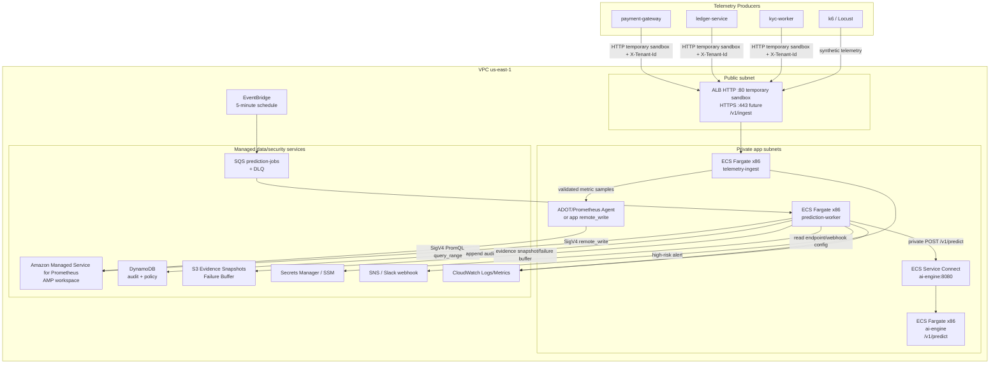

# Security Design - TF4 Foresight Lens · CDO-04

**Doc owner:** CDO-04
**Status:** Refined - AMP/us-east-1 accepted decision
**Project:** TF4 Foresight Lens
**Infra source of truth:** `02_infra_design.md`
**Angle:** SLO Early-Warning Control Plane with TSDB-backed Prediction Workflow
**Core stack:** Public ALB + API Gateway HTTP API (`AWS_IAM`) + VPC Link + ECS Fargate Linux/x86 + ECS Service Connect fallback + Amazon Managed Service for Prometheus (AMP) + SQS/DLQ + DynamoDB audit log + SNS/CloudWatch + Secrets Manager

---

## 1. Phạm vi bảo mật

Tài liệu này mô tả thiết kế bảo mật ở góc nhìn DevOps cho platform CDO-04. Platform nhận telemetry từ 3 service demo, ghi metric dạng Prometheus samples/labels vào AMP qua collector/app `remote_write`, tạo prediction job định kỳ, query PromQL `query_range`, gọi AI endpoint `POST /v1/predict`, ghi audit log, gửi cảnh báo cho SRE và fallback sang static threshold khi AI serving không khả dụng.

Security design tập trung vào các phần CDO thật sự cấu hình và vận hành:

- Network boundary cho ingest service, worker, data store và AI integration.
- IAM least privilege cho ECS task và CI/CD.
- Tenant/service isolation cho telemetry và prediction evidence.
- Secrets/config handling cho AI endpoint config, tenant ingest token và alert webhook; Worker → AI auth dùng IAM SigV4, không dùng API key/service token làm auth chính.
- AMP write/query access dùng IAM SigV4 với scoped workspace permissions; không dùng long-lived InfluxDB token.
- Encryption at rest và in transit.
- Audit logging cho mọi prediction decision.
- PII rejection, metric schema allowlist và Prometheus label cardinality guardrail.
- Failure handling cho AI endpoint, queue, audit log, AMP remote-write/query và alert path.

Ngoài phạm vi capstone:

- SIEM integration đầy đủ kiểu enterprise.
- Multi-region active-active.
- Auto-remediation.
- App-level authN/authZ chuyên sâu.
- PCI/cardholder data processing.

---

## 2. Security View của kiến trúc



Nguyên tắc bảo mật chính:

> Telemetry write path chỉ có quyền `aps:RemoteWrite` vào AMP workspace của CDO-04. Prediction Worker chỉ có quyền query metric evidence bằng AMP `aps:QueryMetrics`, consume prediction job, gọi AI, ghi prediction audit và gửi alert. Mọi prediction decision phải có audit record và phải được scope theo `tenant_id` + `service_id`.

---

## 3. Network Security

### 3.1 Vị trí subnet

| Component | Placement | Public access | Lý do |
|---|---|---:|---|
| ALB `/v1/ingest` | Public subnet cho demo | Có, HTTP temporary sandbox; HTTPS/ACM future | Cho phép k6/Locust và service demo gửi telemetry mà không cần VPN. |
| ECS `telemetry-ingest` | Private app subnets | Không | Chỉ nhận traffic từ ALB security group. |
| Collector / remote_write path | Private app subnets hoặc sidecar | Không | Gửi Prometheus samples tới AMP bằng SigV4. |
| ECS `prediction-worker` | Private app subnets | Không | Poll SQS, query AMP, gọi AI qua ECS Service Connect và ghi audit. |
| ECS `ai-engine` | Private app subnets | Không | Chỉ nhận `/v1/predict` từ internal ALB `:80` via target group; Service Connect direct path giữ tạm làm rollback/fallback. |
| AMP workspace | AWS managed regional service | Không có public app endpoint trực tiếp | Truy cập qua AWS API endpoint bằng IAM/SigV4; MVP qua NAT, hardening qua PrivateLink. |
| DynamoDB audit/policy | AWS managed | Không có public app endpoint trực tiếp | Truy cập qua IAM và AWS SDK. |
| SQS/DLQ | AWS managed | Không có public app endpoint trực tiếp | Truy cập qua IAM và queue policy. |
| S3 evidence | AWS managed | Bucket private | Lưu evidence snapshot/failure buffer, bật encryption. |

Trong capstone, ALB public chỉ là boundary có kiểm soát cho ingestion. ECS task vẫn private. Nếu sau này các producer chạy trong cùng VPC, public ingest boundary có thể được thay bằng private ingress pattern mà không thay đổi logic chính của Worker → AI Service Connect path.

### 3.2 Security Groups

| Security group | Inbound | Outbound | Gắn với |
|---|---|---|---|
| `tf4-cdo04-alb-sg` | Sandbox: `80` từ explicit `allowed_ingress_cidrs`; non-sandbox/future: `443` với ACM và 80->443 redirect; không có giá trị mặc định mở `0.0.0.0/0` | `8080` tới `tf4-cdo04-ingest-sg` | Public ALB |
| `tf4-cdo04-ingest-sg` | `8080` từ `tf4-cdo04-alb-sg` | `443` tới AWS service endpoints / collector path | ECS `telemetry-ingest` |
| `tf4-cdo04-worker-sg` | Không cần inbound cho worker loop | `443` tới AWS service endpoints; app port tới AI Engine Service Connect endpoint `/v1/predict` | ECS `prediction-worker` |
| `tf4-cdo04-ai-engine-sg` | App port từ `tf4-cdo04-worker-sg`/Service Connect path; container health check `/health` | `443` tới CloudWatch/Secrets/ECR/S3 qua NAT hoặc VPC endpoints | ECS `ai-engine` |

Inbound được giới hạn theo nguyên tắc:

- Public entry point duy nhất là ALB `/v1/ingest`; sandbox dùng HTTP tạm, non-sandbox/future dùng HTTPS với ACM.
- ECS task không có public IP.
- `prediction-worker` không cần public inbound trong normal operation.

### 3.3 TLS và request boundary

- Sandbox hiện cho phép HTTP trên port `80` để đưa hệ thống chạy trước.
- Non-sandbox/future hardening dùng ACM và ALB terminate HTTPS trên port `443`.
- Khi HTTPS bật, HTTP port `80` redirect sang HTTPS.
- TLS policy target: TLS 1.2+.
- Mọi ingest request phải có header `X-Tenant-Id`.
- `telemetry-ingest` validate body `tenant_id` phải khớp với `X-Tenant-Id`.
- Payload vượt giới hạn batch size sẽ bị reject với `413`.
- Payload sai schema trả `400`, không ghi sample vào AMP write path.
- AMP API access luôn qua HTTPS + IAM SigV4.

### 3.4 VPC endpoints

MVP dùng 1 NAT Gateway + S3/DynamoDB Gateway Endpoints. Production/private-only hardening có thể bổ sung:

| AWS service | Endpoint type | Mục đích |
|---|---|---|
| S3 | Gateway endpoint | Evidence snapshot và raw-event backup. |
| DynamoDB | Gateway endpoint | Audit log và service policy. |
| AMP data plane | Interface endpoint `com.amazonaws.us-east-1.aps-workspaces` | Future hardening cho private remote_write/query/query_range tới AMP; MVP có thể đi HTTPS qua NAT với IAM/SigV4. |
| AMP control plane | Interface endpoint `com.amazonaws.us-east-1.aps` | Future hardening cho private workspace management nếu cần. |
| STS | Interface endpoint + regional STS | Future hardening khi SigV4 clients/collector chạy private-only không qua NAT; STS vẫn được dùng để verify Worker -> AI identity proof. |
| Secrets Manager | Interface endpoint | Lấy AI endpoint config, tenant ingest token và webhook secret. |
| CloudWatch Logs | Interface endpoint | Ghi ECS application logs. |
| ECR API + ECR Docker | Interface endpoint | Pull private container images. |
| SQS | Interface endpoint | Consume prediction jobs nếu bỏ NAT. |
| SNS | Interface endpoint | Publish alert nếu bỏ NAT. |
| AI model serving | ECS Service Connect trong VPC | Prediction Worker gọi `POST /v1/predict`; không cần public internet hoặc PrivateLink cho Luồng AI. |

Trong capstone, nếu vẫn dùng NAT, security vẫn dựa vào IAM least privilege, TLS và ECS task không có public inbound.

---

## 4. IAM & Access Control

### 4.1 IAM role model

IAM của CDO-04 đi theo nguyên tắc **least privilege**: mỗi service chỉ được cấp đúng quyền cần cho nhiệm vụ của nó. Không dùng quyền broad kiểu `*:*`, không gắn `AdministratorAccess`, không dùng long-lived access key trong container.

AMP data-plane access dùng IAM/SigV4. Không còn InfluxDB write/read/admin tokens trong Secrets Manager. Nếu dùng AWS managed policy trong demo (`AmazonPrometheusRemoteWriteAccess`, `AmazonPrometheusQueryAccess`), production vẫn nên thu hẹp bằng workspace ARN và project tags nếu provider/API cho phép.

| Role | Used by | Permissions |
|---|---|---|
| `tf4-cdo04-ingest-task-role` hoặc collector task role | ECS `telemetry-ingest` / collector | `aps:RemoteWrite` vào AMP workspace, optional custom app metrics, optional `s3:PutObject` vào failure-buffer prefix; không có quyền đọc audit DB. CloudWatch `awslogs` permissions thuộc ECS execution role. |
| `tf4-cdo04-prediction-worker-role` | ECS `prediction-worker` | Consume prediction job từ SQS; `aps:QueryMetrics` và optional `aps:GetLabels/GetSeries/GetMetricMetadata`; đọc service policy từ DynamoDB; ký IAM SigV4 request tới AI endpoint; ghi audit log vào DynamoDB; lưu evidence snapshot vào S3; publish high-risk alert qua SNS; ghi logs/metrics vào CloudWatch. |
| `tf4-cdo04-terraform-deploy-role` | Terraform/CI pipeline | Tạo/cập nhật resource trong scope platform: ECS service/task definition, API Gateway route/VPC Link/internal ALB target group/listener rule, Service Connect namespace/config, SQS/DLQ, AMP workspace/policy, DynamoDB table, SNS topic, CloudWatch alarms, IAM roles/policies theo module. Không có quyền ngoài project prefix `tf4-cdo04-*`. |
| `tf4-cdo04-readonly-reviewer-role` | Mentor/reviewer/Hoàng approve | Read-only để review evidence: ECS describe, CloudWatch logs read, SQS queue attributes read, DynamoDB audit read, S3 evidence read, SNS topic describe, AMP query read-only nếu được cấp. |
| `tf4-cdo04-task-execution-role` | ECS agent | Pull image từ private ECR, ghi container logs qua `awslogs`, và đọc Secrets Manager/SSM values được inject lúc task start. Không có quyền đọc/ghi application data như DynamoDB, S3 evidence hoặc SNS. |

### 4.2 Permission mapping theo checklist Task 18

| Permission area | Role nhận quyền | Actions cần có | Resource scope |
|---|---|---|---|
| Telemetry/collector write role | `tf4-cdo04-ingest-task-role` hoặc collector role | `aps:RemoteWrite`, optional app-level custom metric actions, optional `s3:PutObject`, `kms:Decrypt/GenerateDataKey` | AMP workspace ARN, failure-buffer prefix, project KMS key. `logs:CreateLogStream`/`logs:PutLogEvents` for `awslogs` stay on ECS execution role. |
| Prediction worker role | `tf4-cdo04-prediction-worker-role` | `sqs:ReceiveMessage`, `sqs:DeleteMessage`, `sqs:GetQueueAttributes`, `aps:QueryMetrics`, optional `aps:GetLabels/GetSeries/GetMetricMetadata`, `dynamodb:GetItem`, `dynamodb:PutItem`, `s3:PutObject`, `sns:Publish`, `secretsmanager:GetSecretValue`, `ssm:GetParameter`, `kms:Decrypt`, `kms:GenerateDataKey` | Chỉ queue/table/bucket/topic/secret/parameter/KMS key/AMP workspace của CDO-04. `awslogs` permissions stay on ECS execution role. |
| Terraform deploy role | `tf4-cdo04-terraform-deploy-role` | Các quyền create/update/delete resource hạ tầng trong scope Terraform module | Resource có prefix/tag `tf4-cdo04` và environment capstone. |
| Read-only reviewer role | `tf4-cdo04-readonly-reviewer-role` | `Describe*`, `Get*`, `List*`, `logs:StartQuery`, `logs:GetQueryResults`, `dynamodb:GetItem`, `dynamodb:Query`, `s3:GetObject`, optional `aps:QueryMetrics` | Read-only trên resource evidence/review của project. |
| Write DynamoDB audit log | `tf4-cdo04-prediction-worker-role` | `dynamodb:PutItem`, optional `dynamodb:UpdateItem` nếu cần mark replay status | Table `foresight-audit-log` only. |
| Publish SNS alert | `tf4-cdo04-prediction-worker-role` | `sns:Publish` | Topic `tf4-cdo04-high-risk-alerts` only. |

### 4.3 Policy boundary và anti-patterns

Task role phải scope theo resource cụ thể:

- AMP workspace: `aps:RemoteWrite` chỉ cho telemetry/collector role; `aps:QueryMetrics` chỉ cho worker/reviewer role.
- SQS queue: `prediction-jobs` và `prediction-jobs-dlq`.
- DynamoDB table: `foresight-audit-log` và service policy table.
- S3 bucket/prefix: `s3://tf4-cdo04-evidence/*` và failure-buffer prefix.
- SNS topic: `tf4-cdo04-high-risk-alerts`.
- Secrets/config: `tf4-cdo04/ai-engine-endpoint-config`, `tf4-cdo04/slack-webhook`, tenant ingest token; AI auth chính là IAM SigV4 bằng Worker task role.
- KMS key nếu dùng CMK: `arn:aws:kms:us-east-1:<account-id>:key/tf4-cdo04-*`.

Không dùng:

- `Action: "*"` + `Resource: "*"`.
- `AdministratorAccess`.
- Wildcard data-plane permission như `s3:*`, `dynamodb:*`, `sns:*`, `sqs:*`, `aps:*`.
- Long-lived AWS access key trong container.
- Hardcode AI endpoint config, SigV4 credential, tenant token hoặc webhook URL trong code.
- High-cardinality Prometheus labels chứa PII hoặc identifiers.

### 4.4 Policy sketch

Ví dụ policy intent cho `prediction-worker` sau khi chuyển sang AMP:

```json
{
  "Version": "2012-10-17",
  "Statement": [
    { "Effect": "Allow", "Action": ["sqs:ReceiveMessage", "sqs:DeleteMessage", "sqs:GetQueueAttributes"], "Resource": "arn:aws:sqs:us-east-1:<account-id>:prediction-jobs" },
    { "Effect": "Allow", "Action": ["aps:QueryMetrics", "aps:GetLabels", "aps:GetSeries", "aps:GetMetricMetadata"], "Resource": "arn:aws:aps:us-east-1:<account-id>:workspace/<workspace-id>" },
    { "Effect": "Allow", "Action": ["dynamodb:GetItem", "dynamodb:PutItem"], "Resource": "arn:aws:dynamodb:us-east-1:<account-id>:table/foresight-audit-log" },
    { "Effect": "Allow", "Action": "sns:Publish", "Resource": "arn:aws:sns:us-east-1:<account-id>:tf4-cdo04-high-risk-alerts" },
    { "Effect": "Allow", "Action": "secretsmanager:GetSecretValue", "Resource": [
      "arn:aws:secretsmanager:us-east-1:<account-id>:secret:tf4-cdo04/ai-engine-endpoint-config-*",
      "arn:aws:secretsmanager:us-east-1:<account-id>:secret:tf4-cdo04/slack-webhook-*"
    ]},
    { "Effect": "Allow", "Action": ["kms:Decrypt", "kms:GenerateDataKey"], "Resource": "arn:aws:kms:us-east-1:<account-id>:key/tf4-cdo04-*" }
  ]
}
```

Policy trên là sketch để thể hiện scope. ARN thật sẽ được Terraform inject theo account/region/workspace.

### 4.5 Xác thực/ủy quyền giữa các service

> **Path A update (2026-07-01)**: Worker → AI auth hiện enforce tại API Gateway HTTP API bằng `AWS_IAM`/SigV4. Worker private subnet đi ra public `execute-api` endpoint bằng NAT Gateway hiện có. API Gateway đi vào VPC bằng VPC Link tới internal ALB listener `:80`. ALB listener `:80` chỉ cho VPC Link SG; không còn internet-facing ALB path. ECS Service Connect chỉ giữ làm rollback/fallback migration path.

Luồng ingest:

- Producer gọi ALB qua HTTP trong sandbox tạm; non-sandbox/future dùng HTTPS với ACM.
- ALB security group chỉ cho phép `allowed_ingress_cidrs` đã khai báo rõ.
- Request có `X-Tenant-Id`; header này là ngữ cảnh, không phải nguồn xác thực.
- MVP dùng demo tenant bearer token qua `Authorization: Bearer <tenant-ingest-token>` và lưu trong Secrets Manager.
- `telemetry-ingest` validate tenant, schema, PII denylist và metric allowlist trước khi emit OTLP/app metrics tới ADOT sidecar/collector; collector thực hiện Prometheus `remote_write` tới AMP bằng SigV4.

Luồng prediction:

- EventBridge tạo job theo lịch.
- SQS giữ một job cho mỗi tenant/service/cycle.
- `prediction-worker` consume job bằng ECS task role.
- Worker query AMP bằng IAM/SigV4, build đủ `signal_window` 120 phút, rồi gọi AI `POST /v1/predict` qua API Gateway HTTP API. Worker request được ký SigV4 service `execute-api` và task role chỉ có `execute-api:Invoke` cho `POST /v1/predict`.
- API Gateway HTTP API enforce `AWS_IAM`; unsigned request trả `403`. API Gateway dùng VPC Link vào internal ALB listener `:80`, listener này chỉ nhận source từ VPC Link SG. Không dùng API key/service token làm auth chính.

### 4.6 API Gateway HTTP API trade-offs

API Gateway HTTP API được chọn làm SigV4 enforcement point vì ALB không hỗ trợ `AWS_IAM` natively. Các trade-off đã chấp nhận:

| Capability | HTTP API | REST API / WAF |
|---|---|---|
| **IAM SigV4 auth** | Yes, `AWS_IAM` on routes | Yes |
| **WAF integration** | No (HTTP API không hỗ trợ WAF) | Yes |
| **Resource policies** | No (HTTP API không có resource policy) | Yes |
| **VPC Link** | Yes, private integration | Yes |
| **Cost** | Lower ($1/M requests) | Higher |
| **Custom domain** | ACM certificate, Name.com DNS CNAME | ACM certificate |

**HTTP API không hỗ trợ WAF**: API Gateway HTTP API không có integration với AWS WAF. Mitigation: chỉ route `/v1/predict` được expose qua HTTP API và enforce `AWS_IAM`; public telemetry path `/v1/ingest` và `/health` đi qua ALB `:443` với `allowed_ingress_cidrs` khai báo rõ. `/v1/predict` không được route trên ALB public `:443`. Nếu cần WAF protection trong production, phải migrate `/v1/predict` lên REST API Gateway hoặc dùng CloudFront + WAF trước API Gateway.

**HTTP API không hỗ trợ resource policies**: API Gateway HTTP API không có resource-based policy. Mitigation: enforce `AWS_IAM` trên route, giới hạn Worker task role chỉ có `execute-api:Invoke` cho method `POST` và path `/v1/predict` trên HTTP API ARN cụ thể.

### 4.7 DNS and ACM (Name.com)

- **Domain registrar**: Name.com (`xbrain26hackathon269.software` cho sandbox).
- **ACM certificate**: DNS-validated public certificate cho `xbrain26hackathon269.software` và wildcard `*.xbrain26hackathon269.software`. Certificate được request trong `us-east-1` và retained for future API Gateway custom domain; not attached to internal ALB.
- **DNS record**: CNAME record trên Name.com trỏ `xbrain26hackathon269.software` đến ALB DNS name. Validation CNAME cho ACM certificate được tạo thủ công trên Name.com console.
- **Renewal**: ACM tự động renew certificate miễn là DNS CNAME validation record vẫn tồn tại. Name.com không có Route 53 automated DNS provisioning, nên DNS record và ACM validation được quản lý thủ công ngoài Terraform.
- **API Gateway custom domain**: Hiện tại API Gateway HTTP API sử dụng default `execute-api` endpoint. Custom domain cho API Gateway (ví dụ `api.xbrain26hackathon269.software`) với ACM certificate là hardening option, không thuộc MVP.

---

## 5. Quản lý secrets

### 5.1 Danh sách secrets/config

| Secret/config | Nơi lưu | Service đọc | Rotation |
|---|---|---|---|
| `tf4-cdo04/<env>/ai-engine-endpoint-config` | SSM Parameter Store | `prediction-worker` | Cấu hình không nhạy cảm: Service Connect service name/base URL, host allowlist và timeout config; không chứa API key vì AI auth dùng IAM SigV4. Route 53/private DNS không nằm trong MVP. |
| `tf4-cdo04/<env>/alert-email` | Terraform variable / SNS subscription | Observability module | địa chỉ SNS email; người nhận phải xác nhận subscription thủ công. |
| `tf4-cdo04/<env>/tenant-ingest-token` | Terraform `random_password` -> Secrets Manager secret version + ECS `secrets` injection | `telemetry-ingest` / Telemetry API | Implemented demo path: Terraform generates token, stores it in Secrets Manager, and exposes sensitive output for k6. Token is stored in Terraform state by explicit project choice. ECS injects value as `TENANT_INGEST_TOKEN`; `/v1/ingest` requires `Authorization: Bearer <token>` when configured. Rotation means taint/replace secret version or rotate manually, then force new ECS deployment. |
| `tf4-cdo04/<env>/slack-webhook-url` | Secrets Manager | Future alert sender | Không thuộc MVP; ưu tiên SNS email. Secret container exists but is not wired to compute until a real Slack sender consumes it. |
| `tf4-cdo04/<env>/ai-sigv4-config` | Secrets Manager | Future Worker -> AI auth verifier | Future hardening only. Current Worker -> AI auth remains IAM SigV4 intent; AI app-side verifier remains SYS-09 caveat. |

AMP không cần `influxdb/write-token`, `influxdb/read-token` hoặc `influxdb/admin-token`. AMP write/query dùng IAM/SigV4.

### 5.2 Pattern injection

- ECS task definition reference secret bằng ARN qua `valueFrom` khi cần.
- App đọc secret từ environment variable hoặc Secrets Manager lúc startup. Secret được ECS inject không tự refresh sau rotation; cần force new ECS deployment hoặc app fetch trực tiếp lúc runtime nếu cần cập nhật ngay.
- Secret không bake vào Docker image.
- Secret không commit lên Git.
- Log phải redact authorization header, SigV4 credential scope/signature, webhook URL và tenant ingest token.

### 5.3 Anti-leak controls

- CI nên có secret scanning bằng Gitleaks hoặc TruffleHog.
- Dockerfile không chứa credential.
- Application log không print raw request headers.
- Audit log cho AI request/response chỉ lưu input hash hoặc metadata tóm tắt nếu payload quá lớn hoặc có nguy cơ nhạy cảm.

---

## 6. Data Protection & Encryption

### 6.1 At rest

| Dữ liệu | Store | Encryption | Retention |
|---|---|---|---|
| Time-series telemetry | AMP workspace | AWS-managed/service encryption for managed service | Default 150 ngày; đáp ứng yêu cầu tối thiểu 90 ngày. |
| CDO decision audit log | DynamoDB `tf4-cdo04-<env>-audit` | DynamoDB SSE enabled | TTL `expires_at_epoch` 90 ngày; DynamoDB TTL is async and can take days, so it is retention/cost control, not exact deletion. |
| AI internal audit logs | CloudWatch Logs/S3 archive riêng | KMS encrypted | 365 ngày theo AI API/Deployment Contract. |
| Evidence snapshots + AI baseline JSON | S3 `tf4-cdo04-evidence` / baseline bucket prefix `baselines/` | SSE-S3 hoặc SSE-KMS | Evidence/AI baseline tối thiểu 90 ngày; raw failure buffer 7 ngày hoặc xóa sau replay. |
| Prediction jobs | SQS `prediction-jobs` + DLQ | SQS SSE enabled | Queue retention theo nhu cầu replay. |
| Container images | ECR private repo | ECR encryption at rest | Chỉ giữ các build tag gần nhất. |
| Application logs | CloudWatch Logs | CloudWatch encryption | 14-30 ngày trong capstone. |
| Secrets | Secrets Manager | KMS-backed encryption | Cho tới khi rotate/delete. |

### 6.2 In transit

- Producer tới ALB: HTTP tạm trong sandbox; HTTPS với ACM là future/non-sandbox hardening.
- ALB tới ECS ingest: HTTP nội bộ VPC chấp nhận được cho capstone; HTTPS/mTLS là future hardening.
- ECS/ADOT collector tới AMP: HTTPS + IAM SigV4 `remote_write`.
- ECS worker tới AI endpoint: private Service Connect path; HTTPS/mTLS is future hardening, while W12 final request authorization is enforced by AI Engine STS signed identity proof middleware/sidecar.
- ECS task tới AWS APIs: HTTPS qua AWS SDK.
- Grafana/Slack/SNS integrations: HTTPS.

### 6.3 KMS notes

Với capstone MVP, AWS-managed keys hoặc service-managed encryption là chấp nhận được cho AMP, DynamoDB, SQS, CloudWatch và Secrets Manager. Nếu còn thời gian, dùng customer-managed KMS key cho:

- S3 evidence snapshots.
- DynamoDB audit table.
- Secrets Manager secrets.

Key policy chỉ nên cho phép task roles, deploy role và review role cần thiết truy cập.

---

## 7. Tenant Isolation & Schema Controls

### 7.1 Tenant/service dimensions

Mọi telemetry và prediction record bắt buộc có:

```text
tenant_id
service_id
metric_type / metric name
timestamp
value
unit
```

AMP dùng `tenant_id`, `service_id`, `env`, `region`, `service_tier` làm bounded labels. Metric type được biểu diễn bằng metric name như `api_latency_ms` hoặc `queue_depth`. DynamoDB audit record dùng primary key tenant/service/time và GSI tra cứu prediction; không dùng `prediction_id` làm primary key.

### 7.2 Query isolation

`prediction-worker` phải query metric evidence bằng PromQL `query_range` với đầy đủ filter. Hot path dùng selector/raw-or-1m-rollup với `step=60s`; aggregate như `avg_over_time(...[120m])` chỉ dành cho dashboard/evidence summary, không dùng để build AI `signal_window`:

```promql
api_latency_ms{
  tenant_id="demo-tenant-001",
  service_id="payment-gateway",
  env="prod",
  region="us-east-1"
}
```

Worker reject job nếu:

- thiếu `tenant_id`;
- thiếu `service_id`;
- `window_minutes` vượt policy;
- metric request không nằm trong enabled metrics của service policy;
- PromQL selector không scope tenant/service/metric/time window.

### 7.3 Ingest allowlist

Metric allowlist cho AI contract:

| Signal | Required labels |
|---|---|
| `cpu_usage_percent` | `tenant_id`, `service_id`, `region` |
| `memory_usage_percent` | `tenant_id`, `service_id`, `region` |
| `active_connections` | `tenant_id`, `service_id`, `region` |
| `db_connection_pool_pct` | `tenant_id`, `service_id`, `region`, `db_type` |
| `queue_depth` | `tenant_id`, `service_id`, `region`, `queue_name` |
| `cache_hit_rate_pct` | `tenant_id`, `service_id`, `region`, `cache_type` |
| `api_latency_ms` | `tenant_id`, `service_id`, `region` |

`error_rate` và `oldest_message_age_seconds` có thể lưu cho dashboard/fallback nội bộ, nhưng không được xem là required AI signals nếu chưa nằm trong AI Telemetry Contract. Payload có metric lạ sẽ bị reject trước khi ghi vào AMP hoặc không được đưa vào `signal_window` gửi AI.

### 7.4 PII and cardinality handling

Platform chỉ nhận infra metrics. Không nhận customer name, phone number, email, card number, address hoặc transaction payload.

Basic PII/cardinality controls:

- Schema allowlist tại ingest.
- Reject các field như `email`, `phone`, `name`, `card_number`, `address`, `customer_id` nếu chưa được approve là anonymized.
- Không dùng `request_id`, `trace_id`, `prediction_id`, `user_id`, raw endpoint path hoặc arbitrary error message làm Prometheus label.
- Redact suspicious string values trước khi log.
- Ghi số lượng rejection thành CloudWatch metric.

---

## 8. Audit Logging

### 8.1 Nội dung phải audit

Mọi prediction cycle phải tạo audit record, bao gồm cả AI prediction thành công và fallback decision.

Required CDO decision-audit fields:

```text
prediction_id
timestamp
tenant_id
service_id
prediction_source  ai_model | static_threshold_fallback
anomaly
severity
reasoning
recommendation.action_verb
recommendation.target
recommendation.from_to
recommendation.confidence
recommendation.evidence_link
audit_id
ai_status_code
ai_latency_ms
deployment_version
baseline_version
expires_at_epoch
```

Nếu alert/runbook cần `risk_level` hoặc `root_cause`, CDO derive từ `severity` và `reasoning`; không yêu cầu AI trả thêm field ngoài contract.

### 8.2 Storage design

Primary audit store:

```text
Table name   : tf4-cdo04-<env>-audit
Billing mode : PAY_PER_REQUEST
Encryption   : SSE enabled
TTL          : expires_at_epoch, 90-day retention eligibility

PK: tenant_id
SK: service_time

GSI prediction-index:
  PK: prediction_status
  SK: prediction_timestamp

Composite TENANT#/GSI1/GSI2 schema là post-MVP option; Terraform v1 dùng schema ở trên để khớp mock E2E và IAM scope hiện tại.
```

Optional evidence snapshot:

```text
s3://tf4-cdo04-evidence/predictions/date=YYYY-MM-DD/service_id=<service>/prediction_id=<id>.json
```

### 8.3 Audit integrity

- Audit write là điều kiện thành công của worker.
- Nếu DynamoDB write fail, worker retry với exponential backoff.
- Nếu audit write vẫn fail, job không được silently drop; job phải vào DLQ hoặc emit CloudWatch alarm mức high.
- Alert high-risk luôn reference `prediction_id` để panel/SRE trace ngược về audit evidence.

---

## 9. Container & Supply Chain Security

### 9.1 Image build controls

- Image lưu trong private ECR repositories.
- Base image nên minimal và pin version.
- CI scan image bằng Trivy hoặc tool tương đương.
- Critical vulnerabilities nên block release nếu kịp trong capstone.
- Image tag chứa Git SHA để trace lại source commit.
- ECR Lifecycle Policy phải được bật để kiểm soát chi phí lưu trữ.

### 9.2 Runtime controls

- ECS task chạy non-root user nếu container image hỗ trợ.
- Ưu tiên read-only filesystem cho worker; writable temp chỉ dùng khi cần.
- Không có AWS static credential trong image hoặc environment.
- Tách ECS task execution role và application task role.
- CloudWatch logs có service name, task id, tenant/service context và correlation id.

### 9.3 Deployment review

Các thay đổi security-sensitive cần review:

- IAM policy changes.
- Security group changes.
- Public ALB exposure changes.
- Secret injection changes.
- Audit retention hoặc encryption changes.
- AMP workspace policy / remote_write/query permission changes.

---

## 10. Monitoring, Alerts & Incident Response

### 10.1 Security và reliability alarms

| Alarm | Signal | Response |
|---|---|---|
| Ingest schema rejection spike | CloudWatch custom metric | Inspect producer payload, block bad tenant nếu cần. |
| DLQ có message | SQS DLQ visible messages > 0 | Review failed jobs, fix schema/worker issue, replay job hợp lệ. |
| AI endpoint failures | Worker non-2xx/timeout count | Trigger fallback, notify task force, giữ audit trail. |
| Audit write failures | DynamoDB SDK errors | Retry, alarm, tránh mất prediction decision âm thầm. |
| AMP remote-write failures | Remote write rejected/throttled/error count | Retry, buffer raw event sang S3 nếu implemented. |
| AMP query failures/throttling | Worker PromQL query error/429/timeout | Retry bounded; fallback if signal window cannot be built. |
| AMP cardinality/cost risk | Active series/query samples spike | Stop bad producer, enforce label allowlist, review query scope. |
| Cost guard threshold | AWS Budget ở `$160/$200` | Stop synthetic load, giữ prediction cadence 5 phút, không tắt audit/fallback. |
| ECS unhealthy task | ECS service health | Auto-restart, kiểm tra CloudWatch logs. |

### 10.2 Incident runbook

1. Detect alarm trong CloudWatch/SNS.
2. Xác định component bị ảnh hưởng: ingest, AMP, queue, worker, AI, audit hoặc alert.
3. Contain:
   - Bad payload/labels: block tenant/token và reject schema.
   - AI unavailable: tiếp tục static threshold fallback.
   - AMP remote-write fail: buffer raw event sang S3 và replay sau.
   - Worker stuck: scale worker hoặc restart ECS service.
   - Audit failure: không gửi alert-only nếu không có audit replay path.
4. Recover:
   - Replay valid SQS/DLQ messages.
   - Replay valid failure-buffer telemetry into AMP.
   - Re-run one-off prediction job cho service bị ảnh hưởng.
   - Verify audit record và alert evidence.
5. Nếu incident liên quan curveball capstone, document response vào `curveball-responses.md`.

---

## 11. Compliance Touchpoints

| Standard / concern | Mapping trong capstone |
|---|---|
| SOC2 logical access | IAM least privilege, tách ECS task roles, ECS tasks private. |
| SOC2 monitoring | CloudWatch alarms cho ingest, worker, SQS, audit và cost guard. |
| SOC2 change management | CI/CD deploy role, ECR image tags, Git SHA trong task definition. |
| GDPR-style data minimization | Infra metric allowlist; reject PII-like fields and high-cardinality labels tại ingest. |
| GDPR-style retention | AMP default 150-day telemetry retention; DynamoDB TTL cho audit. |
| PCI-DSS | Ngoài phạm vi: không nhận cardholder data hoặc transaction payload. |

---

## 12. Quyết định security đã chốt cho Terraform v1

- Public ingest ALB phải dùng `allowed_ingress_cidrs` khai báo rõ; không có giá trị mặc định mở và không dùng WAF trong MVP.
- S3 evidence snapshot object chỉ lưu cho high-risk, fallback hoặc các trường hợp failure/replay; DynamoDB audit row được ghi cho mọi prediction.
- MVP chỉ dùng CloudWatch dashboard/audit/evidence links; Grafana annotation API không thuộc Terraform v1.
- Demo tenant ID default là key ổn định `demo-tenant-001`; format tenant production có thể chuyển sang UUID v4 sau mà không cần đổi Terraform resources.

Các điểm contract đã resolve và được xem là cố định:

- Worker → AI auth dùng IAM SigV4; W11 mock có thể optional `Authorization`, W12 final enforce.
- Các field trong AI response dùng đúng contract (`anomaly`, `severity`, `reasoning`, `recommendation.*`, `audit_id`); CDO derive `risk_level`/`root_cause` nếu cần wording cho alert.
- `deployment_version` là request context do Worker gửi từ ECS image digest; `baseline_version` thuộc CDO service policy/audit context, không yêu cầu AI trả thêm ngoài response contract.
- AMP dùng IAM/SigV4, không dùng InfluxDB token rotation.

---

## Related documents

- [`02_infra_design.md`](02_infra_design.md) - source of truth cho architecture, component choices, scaling, failure modes và schemas.
- [`04_deployment_design.md`](04_deployment_design.md) - CI/CD, IaC, rollout, rollback và pipeline security gates.
- [`05_cost_analysis.md`](05_cost_analysis.md) - budget assumptions và cost guard behavior.
- [`07_test_eval_report.md`](07_test_eval_report.md) - security tests, multi-tenant isolation tests và failure-path evidence.
- [`08_adrs.md`](08_adrs.md) - ADRs cho ECS, AMP, audit storage, fallback và observability choices.
