# CDO-W12-020 — S3 Failure Buffer System Architecture

Tài liệu này chi tiết thiết kế hệ thống, cơ chế hoạt động, cấu hình IAM, CloudWatch Alarm và chiến lược Replay cho S3 Failure Buffer trong dự án TF4 Foresight Lens.

---

## 1. Mục tiêu và Lý do thiết kế

Khi gửi dữ liệu telemetry đồng bộ hoặc bất đồng bộ tới Amazon Managed Service for Prometheus (AMP) gặp lỗi mạng, quá tải (throttling), hoặc AMP tạm thời không khả dụng (transient failure):
- Hệ thống cần thực hiện cơ chế **Bounded Retry** với Exponential Backoff & Jitter để tự khắc phục lỗi tạm thời.
- Nếu sau toàn bộ số lần thử lại (bounded retry) vẫn thất bại, payload telemetry cần được ghi nhận và lưu trữ an toàn vào **S3 Failure Buffer** thay vì bị hủy bỏ, bảo toàn 100% dữ liệu.
- Việc ghi buffer vào S3 giúp API trả về mã phản hồi HTTP `202 Accepted` với thông tin chi tiết về mã sự kiện (`event_id`) và khóa trùng lặp (`idempotency_key`), cho phép client theo dõi trạng thái.

---

## 2. Luồng xử lý dữ liệu (Flow Diagram)

```mermaid
sequenceDiagram
    autonumber
    Client->>Telemetry API: POST /v1/ingest (Payload)
    Telemetry API->>Telemetry API: Schema & PII Validation
    Telemetry API->>Telemetry API: Generate Idempotency Key & Event ID
    Telemetry API->>Local Storage: Store JSONL record
    Telemetry API->>AMP Delivery Adapter: deliver()
    alt AMP Success (Attempt 1-3)
        AMP Delivery Adapter-->>Telemetry API: success: true
        Telemetry API-->>Client: HTTP 201 Created (Accepted)
    else AMP Failure (All Retries Exhausted)
        AMP Delivery Adapter-->>Telemetry API: success: false
        Telemetry API->>S3 Failure Buffer: write() to S3 partition
        alt S3 Success
            S3 Failure Buffer-->>Telemetry API: object_key
            Telemetry API-->>Client: HTTP 202 Accepted (Buffered)
        else S3 Failure
            S3 Failure Buffer-->>Telemetry API: exception / error
            Telemetry API-->>Client: HTTP 503 Service Unavailable (Both Failed)
        end
    end
```



---

## 3. Cơ chế Bounded Retry (Thử lại giới hạn)

Cấu hình mặc định:
- `AMP_DELIVERY_MAX_RETRIES=3`
- `AMP_DELIVERY_RETRY_BASE_DELAY_MS=500`
- `AMP_DELIVERY_RETRY_MAX_DELAY_MS=5000`

### Logic Jitter & Exponential Backoff:
- Khoảng thời gian trễ trước mỗi lần thử lại tiếp theo được tính theo công thức:
  $$Delay = \min(MaxDelay, BaseDelay \times 2^{(Attempt - 1)})$$
- Áp dụng Random Jitter dao động từ 50% đến 100% khoảng thời gian trên nhằm giảm thiểu xung đột tài nguyên và hiện tượng Thundering Herd.
- Lọc các mã lỗi Client (ví dụ: HTTP 400 Bad Request, PII Validation Fail) để **bỏ qua việc retry** vì các lỗi này là vĩnh viễn (non-transient). Chỉ thực hiện thử lại với các lỗi 5xx, Network Timeout, hoặc 429 Throttling.

---

## 4. Thiết kế Khóa Idempotency (Idempotency Key)

Khóa Idempotency được sinh ra hoàn toàn **deterministic (xác định)** từ các trường dữ liệu ổn định của payload telemetry nhằm tránh trùng lặp bản ghi khi gửi lại.

### Thuật toán:
1. Trích xuất các trường: `tenant_id`, `service_id`, `metric_type`, `ts`, `value`.
2. Lấy danh sách `labels` và sắp xếp (sort) theo alphabet của khóa (key) để đảm bảo thứ tự khai báo nhãn không ảnh hưởng đến hash kết quả.
3. Chuyển đổi sang chuỗi JSON chuẩn hóa (canonical string) với `sort_keys=True`.
4. Tính mã băm SHA-256 trên chuỗi canonical và trả về hex digest (độ dài 64 ký tự).

---

## 5. Cấu trúc lưu trữ S3 Failure Buffer

### Định dạng Object Key (Phân vùng theo Hive style):
```text
telemetry-failures/
  tenant_id=<tenant_id>/
  service_id=<service_id>/
  metric_type=<metric_type>/
  date=<YYYY-MM-DD>/
  idempotency_key=<sha256_hash>.json
```

### Định dạng Object Body (Nội dung JSON):
```json
{
  "event_id": "evt_38370bd22d1e",
  "request_id": "cdo-w12-020-demo-001",
  "correlation_id": "cdo-w12-020-demo-001",
  "idempotency_key": "4c8f58b...",
  "failed_at": "2026-06-29T10:45:00Z",
  "failure_reason": "amp_delivery_failed_after_retry",
  "retry_count": 3,
  "source": "telemetry-api",
  "payload": {
    "ts": "2026-06-29T10:44:00Z",
    "tenant_id": "demo-tenant-001",
    "service_id": "payment-gateway",
    "metric_type": "api_latency_ms",
    "value": 450.5,
    "labels": {
      "region": "us-east-1"
    }
  }
}
```

---

## 6. IAM Security Policy

Bảo mật truy cập S3 tối giản (Least Privilege), chỉ cho phép `PutObject` cho API, và cho phép `GetObject`, `DeleteObject`, `ListBucket` cho tiến trình Replay Worker:

Xem file cấu hình chi tiết tại: [infra/iam/s3-failure-buffer-policy.json](file:///d:/XBrain%20x%20AWS%20Accelerator%20Internship%20Program/PHASE%20-%20II/tf4-cdo04-repo/infra/iam/s3-failure-buffer-policy.json)

---

## 7. Thiết kế CloudWatch Alarm & Giám sát (Oldest Object Age)

Để phát hiện sớm việc hệ thống Replay bị tắc nghẽn hoặc ngừng hoạt động, chúng tôi giám sát tuổi của file lỗi lâu nhất trong S3:

1. **EventBridge Rule:** Định kỳ kích hoạt Lambda function kiểm tra mỗi 1 phút.
   - Cấu hình: [infra/eventbridge/failure-buffer-age-check-rule.json](file:///d:/XBrain%20x%20AWS%20Accelerator%20Internship%20Program/PHASE%20-%20II/tf4-cdo04-repo/infra/eventbridge/failure-buffer-age-check-rule.json)
2. **Lambda checker:** Quét bucket, tìm file có `LastModified` xa nhất, tính khoảng cách thời gian so với hiện tại và đẩy metric lên CloudWatch custom metric `FailureBufferOldestObjectAgeSeconds`.
   - Cấu hình: [infra/lambda/failure_buffer_age_checker.py](file:///d:/XBrain%20x%20AWS%20Accelerator%20Internship%20Program/PHASE%20-%20II/tf4-cdo04-repo/infra/lambda/failure_buffer_age_checker.py)
3. **CloudWatch Alarm:** Kích hoạt cảnh báo (Alarm) khi giá trị metric vượt quá **300 giây (5 phút)**.
   - Cấu hình: [infra/cloudwatch/failure-buffer-object-age-alarm.json](file:///d:/XBrain%20x%20AWS%20Accelerator%20Internship%20Program/PHASE%20-%20II/tf4-cdo04-repo/infra/cloudwatch/failure-buffer-object-age-alarm.json)

---

## 8. Hướng dẫn chạy kiểm thử local

Để kiểm tra toàn bộ 112 unit tests:
```bash
$env:PYTHONPATH="src"
python -m pytest -v
```

Để chạy tích hợp kiểm tra cụ thể luồng S3 buffer & retry:
```bash
python -m pytest src/telemetry_api/tests/telemetry_api/test_s3_failure_buffer.py -vv
```
