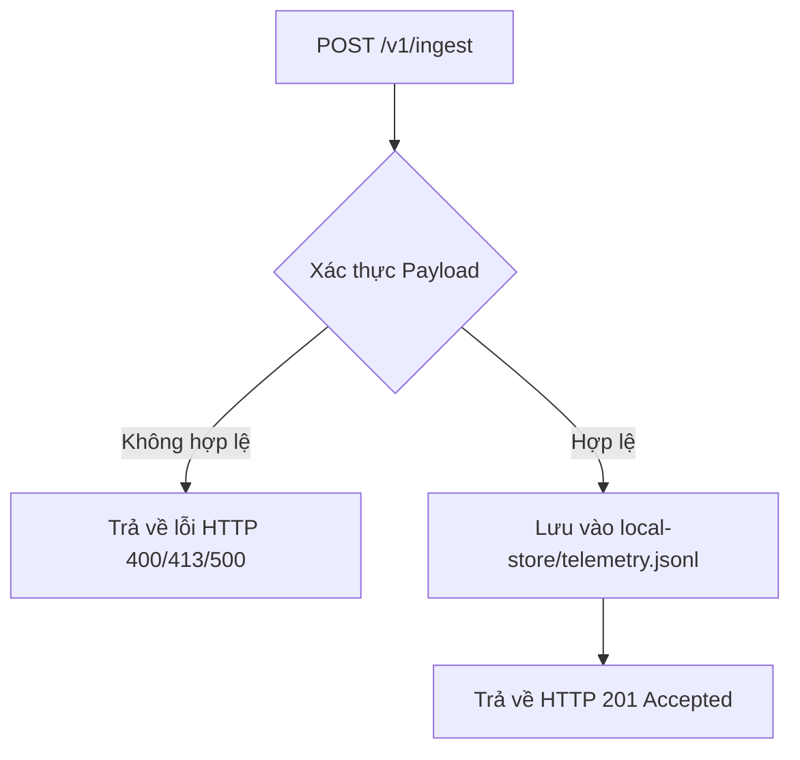

# Local Store - Kho lưu trữ dữ liệu cục bộ tạm thời

`local-store` là thư mục chứa dữ liệu local tạm thời phục vụ cho endpoint `/v1/ingest`.

---

## 1. Vai trò của `local-store`

Trong giai đoạn phát triển ban đầu hoặc khi chưa tích hợp hạ tầng AWS thực tế (AMP/S3/DynamoDB), ứng dụng Telemetry API sẽ lưu toàn bộ dữ liệu telemetry hợp lệ vào file local dưới dạng JSON Lines (JSONL):

```text
local-store/telemetry.jsonl
```

### Quy trình xử lý dữ liệu:


---

## 2. Ví dụ luồng dữ liệu

### Payload Client gửi lên:
```json
{
  "ts": "2026-06-25T10:30:00Z",
  "tenant_id": "demo-tenant-001",
  "service_id": "payment-gateway",
  "metric_type": "api_latency_ms",
  "value": 450.5,
  "labels": {
    "region": "us-east-1"
  }
}
```

### Dữ liệu lưu trong `local-store/telemetry.jsonl` sau khi được API chấp nhận:
```json
{
  "correlation_id": "local-test-001",
  "received_at": "2026-06-28T10:00:00.000000Z",
  "ts": "2026-06-25T10:30:00Z",
  "tenant_id": "demo-tenant-001",
  "service_id": "payment-gateway",
  "metric_type": "api_latency_ms",
  "value": 450.5,
  "labels": {
    "region": "us-east-1"
  },
  "ingest_source": "local_api"
}
```

---

## 3. Mục đích chính
1. **Mô phỏng Storage**: Đóng vai trò là bản giả lập storage của AWS ở local.
2. **Kiểm thử cục bộ**: Giúp chạy và kiểm tra (Unit Test/Manual Test) luồng nhận dữ liệu của `/v1/ingest` mà không cần tài khoản AWS.
3. **Chuẩn bị dữ liệu**: Làm nguồn dữ liệu cho Worker đọc và xử lý tiếp theo.
4. **Tính độc lập (Local-first)**: Giữ cấu trúc thiết kế độc lập, dễ dàng chuyển đổi adapter lưu trữ sau này.

---

## 4. Kế hoạch tích hợp AWS trong tương lai

Khi chuyển sang môi trường AWS thực tế, adapter lưu trữ cục bộ sẽ được thay thế bằng các dịch vụ AWS tương ứng mà không làm thay đổi logic nghiệp vụ cốt lõi:

| Môi trường Local (`local-store`) | Dịch vụ AWS thực tế |
| :--- | :--- |
| `telemetry.jsonl` | Amazon Managed Service for Prometheus (AMP) / Amazon S3 |
| Ghi nhận lỗi cục bộ | Amazon CloudWatch Logs |
| Local Audit | Amazon DynamoDB Audit Logs |

### Hướng chuyển đổi Adapter:
```text
LocalJsonlAdapter (Hiện tại) ──> AmpRemoteWriteAdapter (Tương lai)
```
