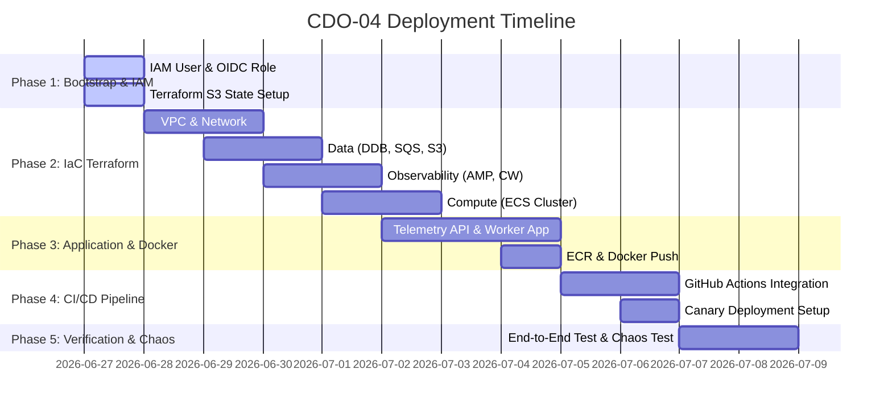

# Master Implementation Plan - CDO-04 Platform Inception

Tài liệu này phác thảo kế hoạch tổng thể (Master Plan) để triển khai toàn bộ hệ thống CDO-04 từ con số 0 (greenfield deployment) dựa trên thiết kế cuối cùng đã thống nhất (us-east-1, AMP, ECS Service Connect). Kế hoạch được thiết kế riêng cho Tech Lead để điều phối, chia task và quản trị bảo mật hệ thống.

---

## 1. AWS Bootstrap & IAM Setup (Bảo mật & Cấp quyền)

Giai đoạn này chuẩn bị môi trường AWS và thiết lập các vai trò bảo mật (IAM) cần thiết để bắt đầu code IaC và CI/CD.

### 1.1 Thiết lập Tài khoản Admin của Tech Lead
*   **Mục tiêu**: Tạo 1 IAM User/Role dành riêng cho Tech Lead có quyền Admin để cấu hình ban đầu.
*   **Thực thi**:
    *   Tạo IAM User: `cdo04-techlead` trên AWS Console.
    *   Gán policy: `AdministratorAccess` (hoặc `PowerUserAccess` kết hợp thêm quyền quản lý IAM/S3/DynamoDB).
    *   Bật Multi-Factor Authentication (MFA) bắt buộc.
    *   Tạo Access Key hoặc cấu hình AWS CLI locally trên máy của Tech Lead bằng profile `cdo04-techlead`.

### 1.2 Thiết lập S3 Backend cho Terraform State
*   **Mục tiêu**: Tạo bucket S3 để lưu trữ tệp trạng thái (state file) của Terraform trên đám mây một cách an toàn.
*   **Cấu hình**:
    *   Tên bucket: `tf4-cdo04-tfstate` (hoặc tên duy nhất tương đương).
    *   Bật **S3 Bucket Versioning** (Bắt buộc để khôi phục state khi lỗi).
    *   Bật **S3 Default Encryption** (Sử dụng AWS KMS hoặc SSE-S3).
    *   Bật **Public Access Block** (Chặn hoàn toàn truy cập công khai).

### 1.3 Thiết lập OIDC Provider & GitHub Deployer Role (Không dùng Static Keys trong CI/CD)
*   **Mục tiêu**: Cho phép GitHub Actions tương tác an toàn với tài khoản AWS để deploy mà không cần lưu trữ static Access Key/Secret Key trong GitHub Secrets.
*   **Các bước thực hiện**:
    1.  **Tạo Identity Provider (IdP) trên AWS IAM**:
        *   Provider URL: `https://token.actions.githubusercontent.com`
        *   Audience: `sts.amazonaws.com`
    2.  **Tạo IAM Role cho GitHub Actions**:
        *   Tên Role: `GitHubActionsWorkflowRole`
        *   **Trust Policy**: Chỉ cho phép repo GitHub của nhóm (`dragoncoil2609/tf4-cdo04-repo`) assume role này qua OIDC token:
            ```json
            {
              "Version": "2012-10-17",
              "Statement": [
                {
                  "Effect": "Allow",
                  "Principal": {
                    "Federated": "arn:aws:iam::<ACCOUNT_ID>:oidc-provider/token.actions.githubusercontent.com"
                  },
                  "Action": "sts:AssumeRoleWithWebIdentity",
                  "Condition": {
                    "StringEquals": {
                      "token.actions.githubusercontent.com:aud": "sts.amazonaws.us-east-1"
                    },
                    "StringLike": {
                      "token.actions.githubusercontent.com:repo": "dragoncoil2609/tf4-cdo04-repo:*"
                    }
                  }
                }
              ]
            }
            ```
    3.  **Gán IAM Policies cho Role**:
        *   Gán các quyền tối thiểu cần thiết để tạo hạ tầng (EC2, ECS, S3, DynamoDB, SQS, KMS, Secrets Manager, CloudWatch, SNS, AMP).

---

## 2. Phân rã Giai đoạn triển khai (Phần việc cần làm)



### 📈 Phase 1: IaC Development (Terraform Skeleton)
Chúng ta sẽ viết mã IaC dạng module hóa trong thư mục `/infra`.
*   **Task 1.1: Module Networking**:
    *   Tạo VPC (`10.0.0.0/16`), 2 Public Subnets, 4 Private Subnets (tách biệt Private App và Private Data) trải rộng trên 2 AZs.
    *   Tạo 1 public Application Load Balancer (ALB) và 1 zonal NAT Gateway.
    *   Tạo các Gateway VPC Endpoints cho S3 và DynamoDB.
*   **Task 1.2: Module Observability & TSDB**:
    *   Tạo Amazon Managed Service for Prometheus (AMP) Workspace.
    *   Tạo CloudWatch Log Groups cho ứng dụng (Telemetry API, Worker, AI Engine).
    *   Tạo SNS Topic và các CloudWatch Alarms phục vụ giám sát chi phí/lỗi.
*   **Task 1.3: Module Data**:
    *   Tạo bảng DynamoDB (`cdo04-audit-logs`) sử dụng On-Demand capacity và bảng cấu hình service policy.
    *   Tạo hàng đợi SQS Standard (`cdo04-prediction-jobs`) cùng hàng đợi Dead Letter Queue (DLQ).
    *   Tạo S3 Bucket lưu trữ baseline và evidence data.
    *   Tạo các khóa mã hóa KMS CMKs cho dữ liệu tĩnh.
*   **Task 1.4: Module Compute**:
    *   Khởi tạo cụm ECS Cluster.
    *   Thiết lập mạng lưới **ECS Service Connect** với namespace `cdo-services`.
    *   Định nghĩa Task Definitions cho 3 services:
        1.  `telemetry-api` (ECS Fargate Task - ARM64 hoặc x86).
        2.  `prediction-worker` (ECS Fargate Task - ARM64 hoặc x86).
        3.  `ai-engine` (chạy FastAPI + NumPy, tích hợp Service Connect endpoint).

### 💻 Phase 2: Application Code & Containerization
Viết mã nguồn ứng dụng trong thư mục `/src`.
*   **Task 2.1: Telemetry Ingest API**:
    *   Xây dựng API nhận telemetry qua giao thức HTTPS.
    *   Validate dữ liệu đầu vào và thực hiện ghi (remote-write) dữ liệu metric vào AMP sử dụng thư viện thích hợp (ví dụ ADOT/Prometheus Agent hoặc Python client tự băm payload protobuf).
    *   Xử lý ghi tạm (S3 failure buffer) khi AMP bị mất kết nối.
*   **Task 2.2: Prediction Worker**:
    *   Đọc và xử lý prediction job định kỳ từ SQS.
    *   Truy vấn lookback window 120 phút từ AMP qua ngôn ngữ PromQL.
    *   Gửi request dự đoán `/v1/predict` tới `ai-engine` thông qua ECS Service Connect DNS.
    *   Ghi audit log vào DynamoDB và gửi cảnh báo qua SNS/CloudWatch khi phát hiện rủi ro.
*   **Task 2.3: Viết Dockerfiles**:
    *   Đóng gói API và Worker thành các Docker images tối ưu dung lượng và bảo mật (non-root user).
    *   Tạo ECR repositories để chứa các images này.

### 🚀 Phase 3: CI/CD Pipeline Integration (GitHub Actions)
Thiết lập quy trình tự động hóa tích hợp và triển khai.
*   **Task 3.1: Viết Workflow GitHub Actions**:
    *   Tạo workflow CI tự động chạy kiểm tra cú pháp IaC (`terraform validate`), quét lỗi bảo mật (`Trivy` & `Gitleaks`), build Docker image và chạy unit test.
    *   Tích hợp OIDC Authentication để tự động assume role `GitHubActionsWorkflowRole` của AWS.
*   **Task 3.2: Tích hợp AWS CodeDeploy**:
    *   Cấu hình deploy Canary (chuyển traffic dần 10% -> 50% -> 100%) cho `telemetry-api` thông qua CodeDeploy và ALB.

---

## 3. Phân chia Task gợi ý cho Thành viên Nhóm

Dựa trên cấu trúc phân công chéo (Peer Review Matrix) đã thống nhất:

| Thành viên | Vai trò chính | Task đề xuất | Reviewer được chỉ định |
|---|---|---|---|
| **Vinh** | IaC / Infrastructure | Phát triển hạ tầng nền tảng Terraform Foundation, VPC, Networking scaffolding (`CPOA-36`) | **Hoàng** |
| **An** | IaC / Infrastructure | Thiết lập ECS Services, Task Definitions cho API/Worker/AI và Service Connect (`CPOA-45`) | **Hoàng** |
| **Tín** | Application / API | Xây dựng Telemetry Ingest API FastAPI, telemetry validation, SigV4 Remote-Write AMP (`CPOA-52`) | **An** |
| **Hoàng** | App / Worker & CI/CD | Xây dựng Prediction Worker (`CPOA-60`) và thiết lập GitHub Actions CI/CD workflows (`CPOA-78`) | **An** |
| **Tuấn** | App / Fallback & Design | Xây dựng Fallback Engine (`CPOA-71`) và hoàn thiện thuyết minh thiết kế kiến trúc (`CPOA-11`) | **Vinh** |
| **Ninh** | Observability & Testing | Cấu hình CloudWatch dashboards/alarms, viết kịch bản load test k6 và chaos scenarios (`CPOA-88`) | **An** |
| **Huy** | Cost & Operations | Quản lý AWS Budgets, theo dõi chi phí thực tế và tối ưu hóa chính sách lưu trữ (`CPOA-98`) | **Hoàng** |


---

## 4. Kế hoạch chi tiết từng Task nhỏ cho từng người

Dưới đây là mô tả chi tiết công việc kỹ thuật cho từng thành viên để Tech Lead nắm được tiến độ và tiêu chuẩn kỹ thuật (Quality Gates).

### 4.1 Vinh (IaC / Infrastructure) - Nhóm Hạ tầng Core
*   **Task V1: Thiết lập Mạng VPC Skeleton**
    *   Viết code Terraform khởi tạo VPC (`10.0.0.0/16`) trong thư mục `/infra`.
    *   Tạo 2 Public Subnets (cho ALB và NAT Gateway), 4 Private Subnets (2 cho App ECS, 2 cho Database/Endpoints) tại region `us-east-1` trải rộng trên 2 AZs.
    *   Cấu hình Route Tables, Internet Gateway và Route đi internet qua NAT Gateway của các Private subnets.
    *   *Tiêu chuẩn*: Đảm bảo các subnets app không thể truy cập trực tiếp từ internet.
*   **Task V2: Setup S3 & DynamoDB Gateway Endpoints**
    *   Tạo Gateway VPC Endpoints cho S3 và DynamoDB.
    *   Gắn các endpoint này vào bảng định tuyến (Route Tables) của Private subnets.
    *   *Tiêu chuẩn*: Traffic đi S3 và DynamoDB phải đi qua mạng nội bộ của AWS (miễn phí), không được đi qua NAT Gateway (tốn $0.045/GB).
*   **Task V3: Thiết lập Prometheus Workspace (AMP)**
    *   Khởi tạo dịch vụ Amazon Managed Service for Prometheus (`aws_aps_workspace`).
    *   Thiết lập các Rule và Alert manager (nếu cần) thông qua Prometheus config.
    *   *Tiêu chuẩn*: AMP Workspace ARN phải được xuất ra (output) để cấu hình cho ECS tasks.
*   **Task V4: Cấu hình remote state S3 & locking**
    *   Thiết lập cấu hình `backend.tf` sử dụng S3 bucket state và bật tính năng native state locking (`use_lockfile = true` của Terraform v1.10+).

### 4.2 An (IaC & Worker App) - Nhóm Hạ tầng & Logic điều phối
*   **Task A1: Thiết lập ECS Fargate & Service Connect**
    *   Viết Terraform tạo ECS Cluster `cdo04-cluster`.
    *   Cấu hình **ECS Service Connect** Namespace (`cdo-services`) để hỗ trợ Service Discovery nội bộ.
    *   Viết Service và Task Definition cho `telemetry-api`, `prediction-worker`, và `ai-engine`. Định nghĩa CPU/RAM (`0.5 vCPU / 1GB RAM`) và cấu hình container sidecar Envoy proxy.
    *   *Tiêu chuẩn*: Toàn bộ ECS task chạy trong Private App subnets, `assign_public_ip` đặt là `DISABLED`.
*   **Task A2: Setup Public ALB & Security Routing**
    *   Viết Terraform tạo Application Load Balancer công khai.
    *   Tạo Target Group và Listener port 443 trỏ vào `telemetry-api`.
    *   Thiết lập Security Groups: ALB nhận port 443 từ internet; `telemetry-api` chỉ nhận port 8080 từ Security Group của ALB.
*   **Task A3: Khởi tạo Storage & Queue**
    *   Tạo SQS Queue `cdo04-prediction-jobs` (visibility timeout 180s) và Dead Letter Queue (DLQ) có `maxReceiveCount = 5`.
    *   Tạo bảng DynamoDB `cdo04-audit-logs` (Partition Key: `prediction_id`, Sort Key: `timestamp`) ở chế độ On-demand.
    *   Tạo bảng `cdo04-service-policies` để lưu danh sách metric được phép và ngưỡng fallback tĩnh.
    *   Tạo S3 bucket cho evidence snapshots và cấu hình mã hóa KMS.
*   **Task A4: Xây dựng mã nguồn Prediction Worker (Python)**
    *   Viết file `src/prediction_worker/main.py` đọc tin nhắn từ SQS.
    *   Thực hiện truy vấn dữ liệu metric lịch sử 120 phút từ AMP qua PromQL API.
    *   Gọi request dự đoán tới endpoint của `ai-engine` thông qua tên miền Service Connect nội bộ.
    *   Ghi audit log vào DynamoDB và đẩy alert ra SNS.
    *   *Logic quan trọng*: Nếu AI Engine lỗi/timeout, kích hoạt **Fail-Open Fallback** để tự động kiểm tra bằng static threshold và ghi audit log với nhãn `prediction_source = static_threshold_fallback`.

### 4.3 Tín (Application / API) - Nhóm Mã nguồn API
*   **Task T1: Xây dựng API Nhận Telemetry (FastAPI)**
    *   Viết ứng dụng API sử dụng FastAPI trong thư mục `src/telemetry_api/main.py`.
    *   Tạo endpoint `POST /v1/ingest` để nhận dữ liệu từ các monitored services.
    *   Thiết lập schema validation (dùng Pydantic) để lọc bỏ PII và kiểm tra tính hợp lệ của metric payload.
    *   *Tiêu chuẩn*: Từ chối các request không có header `X-Tenant-Id` hoặc chứa các metric nằm ngoài whitelist.
*   **Task T2: Tích hợp Ghi dữ liệu vào AMP (Remote Write)**
    *   Viết module kết nối và gửi dữ liệu metric sang AMP workspace ingest API.
    *   Sử dụng Snappy để nén payload và mã hóa protobuf chuẩn Prometheus Remote Write.
    *   Áp dụng thư viện ký **AWS SigV4** (`requests-aws4auth`) để AWS xác thực quyền ghi của ECS task.
*   **Task T3: Xử lý Ghi tạm (S3 Failure Buffer)**
    *   Viết logic bắt lỗi (exception handling): Nếu API ghi vào AMP thất bại sau 3 lần retry, hệ thống tự động ghi raw payload kèm theo một `idempotency key` vào S3 bucket `s3://cdo04-failure-buffer/tenant_id=tnt-xxx/`.
*   **Task T4: Đóng gói Container**
    *   Viết `Dockerfile` dạng multi-stage để tối ưu kích thước image.
    *   Chạy ứng dụng dưới quyền user không phải root (`appuser`) để đảm bảo bảo mật.

### 4.4 Hoàng (CI/CD / Deployment) - Nhóm Tự động hóa
*   **Task H1: Xây dựng GitHub Actions CI Pipeline**
    *   Viết file cấu hình `.github/workflows/deploy.yml`.
    *   Cấu hình tích hợp OIDC: sử dụng `aws-actions/configure-aws-credentials` để assume role `GitHubActionsWorkflowRole` thông qua JWT token ngắn hạn.
    *   Thiết lập các Quality Gates: chạy kiểm tra Terraform cú pháp (`fmt -check`, `validate`), quét lỗ hổng ảnh Docker (`Trivy`), quét lộ lọt mật khẩu (`Gitleaks`), chạy Unit test python.
*   **Task H2: Cấu hình CD Pipeline & Canary Deployment**
    *   Tạo cấu hình AWS CodeDeploy cho ECS Fargate.
    *   Thiết lập cơ chế Canary Deployment: chuyển traffic dần dần (10% trong 5 phút -> 50% trong 5 phút -> 100% hoàn tất).
    *   Cấu hình rollback tự động: Nếu CloudWatch Alarm báo lỗi 5xx tăng >1% hoặc latency >800ms trong quá trình deploy, CodeDeploy lập tức hủy bỏ và rollback về Task Definition cũ.

### 4.5 Ninh (Observability & Testing) - Nhóm Giám sát & Đánh giá
*   **Task N1: Cấu hình CloudWatch Metrics, Alarms & Dashboard**
    *   Tạo CloudWatch Alarm giám sát:
        *   Tỷ lệ lỗi 5xx của Ingest API > 1%.
        *   Độ trễ p99 của API > 800ms.
        *   Số lượng tin nhắn trong SQS DLQ > 0.
        *   Tỷ lệ kích hoạt fallback của Worker > 5%.
    *   Xây dựng CloudWatch Dashboard trực quan hóa các chỉ số trên và hiển thị link evidence.
*   **Task N2: Viết kịch bản Load Test & Chaos Testing (k6)**
    *   Viết file load test `tests/load_test.js` giả lập lượng tải 2800 RPS thông thường và 9000 RPS đỉnh điểm.
    *   Giả lập 4 kịch bản lỗi:
        1.  *Gradual Drift*: Tăng dần metric CPU ảo để kiểm tra khả năng phát hiện drift của AI.
        2.  *Sudden Spike*: Gửi đột biến latency lớn để xem hệ thống cảnh báo sớm trong vòng 15 phút.
        3.  *Slow Leak*: Rò rỉ memory liên tục trong 2 tiếng để kiểm chứng thuật toán.
        4.  *AI Down*: Ngắt kết nối AI để test tính năng static fallback của Worker.

### 4.6 Huy (Cost & Operations) - Nhóm Vận hành & Chi phí
*   **Task Hu1: Thiết lập AWS Budgets & SNS Alerts**
    *   Tạo tài nguyên AWS Budget giới hạn ở mức $200/tháng.
    *   Cấu hình SNS topic gửi cảnh báo email khẩn cấp đến đội ngũ SRE tại các ngưỡng thực tế 70% ($140), 90% ($180), và 100% ($200).
*   **Task Hu2: Kiểm toán chi phí & Cấu hình Retention Policy**
    *   Cấu hình chính sách lưu trữ log (Log Retention) của CloudWatch Logs cố định tối đa 14 ngày (không để vô hạn gây phình chi phí).
    *   Thiết lập S3 Lifecycle rules: raw failure buffer tự động xóa sau 7 ngày, evidence data chuyển sang Glacier lưu trữ sau 90 ngày.
    *   Theo dõi thực tế hóa đơn hàng ngày trên AWS Cost Explorer để thu thập dữ liệu và điền báo cáo chi phí thực tế cho Pack #2.

### 4.7 Tuấn (Infrastructure Design) - Nhóm Kiến trúc & Kiểm soát Thiết kế
*   **Task Td1: Hoàn thiện Thuyết minh Thiết kế Kiến trúc (`02_infra_design.md`)**
    *   Thuyết minh chi tiết các network flows, trust boundaries, traffic model và component details phù hợp với region `us-east-1`, AMP và ECS Service Connect.
*   **Task Td2: Soạn thảo và Quản lý các Quyết định Kiến trúc (ADRs)**
    *   Cập nhật hồ sơ ADR trong `08_adrs.md`, hoàn thiện lập luận bảo vệ cho **ADR-011** (AMP & us-east-1) để sẵn sàng giải trình trước Panel của Mentor.
*   **Task Td3: Đối soát và Thẩm định Thiết kế (IaC Validation)**
    *   Chạy bảng kiểm soát **[drawio-arch-checklist.md](file:///d:/Phase2_Xbrain/final/tf4-cdo04-repo/docs/misc/drawio-arch-checklist.md)** để đối chiếu biểu đồ draw.io của mình vẽ với code Terraform của Vinh và An, đảm bảo đồng bộ 100% giữa tài liệu vẽ và code thực tế.
    *   Tham gia review code Terraform để đóng góp ý kiến về mặt kiến trúc.

---


## 5. Kế hoạch xác thực (Verification Plan)

Sau khi hoàn tất triển khai, Tech Lead sẽ giám sát quá trình chạy thử nghiệm để chứng minh các chỉ số SLO/SLA:
1.  **Test Kịch bản 1: Hoạt động bình thường**: Chạy telemetry ingestion ổn định cho 3 services, kiểm tra dữ liệu nạp thành công vào AMP và ghi nhận audit log đầy đủ.
2.  **Test Kịch bản 2: Sudden Spike / Capacity Exhaustion**: Chạy load test giả làm tăng đột biến traffic bằng k6, kiểm tra tính năng tự động scale-up các ECS task của Telemetry API và xem cảnh báo sớm có được phát hiện trước 15 phút hay không.
3.  **Test Kịch bản 3: AI Engine failure**: Chặn kết nối tới AI Engine, kiểm tra xem Prediction Worker có tự động kích hoạt chế độ dự phòng static threshold fallback và tiếp tục ghi audit hay không.
