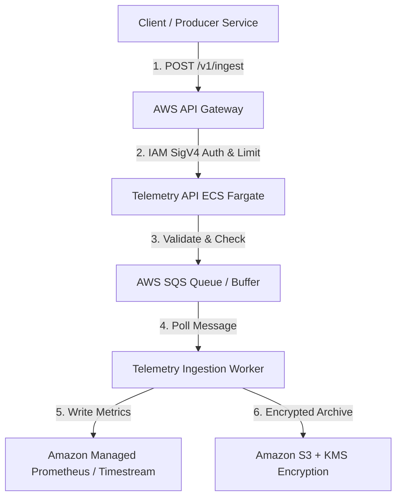

# Tài liệu Kiến trúc Telemetry API & Định hướng Tích hợp AWS

Tài liệu này giải thích cấu trúc mã nguồn hiện tại của dự án Telemetry API và vạch ra lộ trình tích hợp hạ tầng dịch vụ đám mây AWS khi hạ tầng sẵn sàng.

---

## 1. Giải thích Cấu trúc mã nguồn hiện tại

Dự án áp dụng mô hình thiết kế phân lớp (**Layered/Clean Architecture**), giúp tách biệt logic nghiệp vụ khỏi các adapter lưu trữ bên ngoài:

```text
src/telemetry_api/
├── main.py                # Điểm khởi chạy FastAPI, cấu hình Middleware & Exception Handlers
├── requirements.txt       # Định nghĩa các thư viện phụ thuộc (FastAPI, Pydantic, etc.)
├── core/                  # Cấu hình hệ thống, logging và các class lỗi (Custom Errors)
│   ├── config.py
│   ├── errors.py
│   └── logging.py
├── middleware/            # Bộ lọc tiền xử lý HTTP Request (kích thước, tracing ID)
│   ├── correlation_id.py
│   └── payload_size_limit.py
├── schemas/               # Định nghĩa cấu trúc dữ liệu đầu vào và đầu ra qua Pydantic
│   └── telemetry.py
├── validators/            # Các quy tắc validation cụ thể (bảo mật PII, lọc High-cardinality)
│   └── labels.py
├── routes/                # Tầng tiếp nhận HTTP Request từ Client
│   └── ingest.py
├── services/              # Tầng xử lý logic nghiệp vụ chính (Business Logic)
│   └── ingest_service.py
├── adapters/              # Giao tiếp với hạ tầng lưu trữ (Storage Backend)
│   ├── base.py
│   ├── local_jsonl_adapter.py  # Ghi log cục bộ dạng file JSONL phục vụ local-first
│   └── amp_adapter_stub.py      # Stub giả lập tích hợp với Amazon Managed Prometheus
└── tests/                 # Mã nguồn kiểm thử tự động
    └── telemetry_api/
        ├── test_ingest_api.py
        └── test_local_jsonl_adapter.py
```

### Các thành phần chính và luồng xử lý (Data Flow):
1. **Middleware (`payload_size_limit.py`)**: Kiểm tra kích thước gói tin gửi lên. Nếu vượt quá giới hạn cấu hình (ví dụ: `MAX_INGEST_PAYLOAD_BYTES`), server lập tức ngắt kết nối và trả về HTTP `413 Payload Too Large` để tránh quá tải RAM.
2. **Middleware (`correlation_id.py`)**: Trích xuất hoặc sinh mã `X-Correlation-Id` (UUID) để trace toàn bộ hành trình xử lý gói tin trong log.
3. **Route (`routes/ingest.py`)**: Tiếp nhận request `POST /v1/ingest`, kiểm tra tính toàn vẹn của JSON và đảm bảo có đủ 5 trường bắt buộc.
4. **Service (`services/ingest_service.py`)**: Thực hiện kiểm tra bảo mật chéo. Giá trị header xác thực `X-Tenant-Id` bắt buộc phải khớp với thuộc tính `tenant_id` nằm trong phần thân (body) của dữ liệu. Nếu khớp, nó sẽ tạo một `TelemetryRecord` và gọi Adapter để lưu trữ.
5. **Adapter (`adapters/local_jsonl_adapter.py`)**: Ghi dữ liệu nối tiếp vào file cục bộ `local-store/telemetry.jsonl` (cách tiếp cận local-first do chưa có hạ tầng AWS thực tế).

---

## 2. Định hướng tích hợp khi có hạ tầng AWS (AWS Integration Roadmap)

Khi hạ tầng AWS được CDO/Terraform thiết lập hoàn chỉnh, ứng dụng sẽ chuyển đổi từ chế độ local sang môi trường cloud Production theo lộ trình sau:



### Chi tiết các bước chuyển đổi hạ tầng:

### A. Thay thế bộ lưu trữ (Storage Backend Integration)
* **Hiện tại (Local-first):** Lưu file JSONL thông qua `LocalJsonlTelemetryAdapter`.
* **Khi có AWS:** 
  - Kích hoạt cấu hình `TELEMETRY_STORAGE_BACKEND=amp` để kích hoạt `AmpTelemetryAdapter`.
  - Adapter này sẽ gửi các metrics qua giao thức **Prometheus remote_write** trực tiếp vào **Amazon Managed Service for Prometheus (AMP)** hoặc **Amazon Timestream** để lưu trữ cơ sở dữ liệu chuỗi thời gian (Time-series Database).

### B. Tách biệt Ingest API và Worker để chịu tải lớn (Asynchronous Ingestion)
* **Mục tiêu:** Đáp ứng Volume SLA 50,000 events/sec peak mà không làm sập API.
* **Tích hợp AWS SQS:** 
  - API nhận `POST /v1/ingest` chỉ làm nhiệm vụ cực kỳ nhẹ là validate cấu trúc và đẩy nhanh dữ liệu vào một **AWS SQS Queue** rồi trả về HTTP `202 Accepted` ngay cho client.
  - Một nhóm các **Telemetry Workers** (triển khai trên AWS ECS Fargate) sẽ chạy ngầm, liên tục poll dữ liệu từ SQS Queue và thực hiện việc ghi khối lượng lớn vào Prometheus/Timestream (Batch Write).

### C. Nâng cấp Bảo mật và Xác thực (Authentication & Compliance)
* **IAM SigV4 Integration:** Thay thế việc kiểm tra header thủ công bằng cơ chế xác thực **AWS Signature Version 4 (SigV4)** thông qua AWS API Gateway. Client bắt buộc phải ký request bằng IAM Credentials hợp lệ.
* **Multi-tenant Isolation:** Sử dụng **AWS STS Session Tags** với giá trị `tenant_id` để phân tách quyền truy cập tài nguyên giữa các Tenant khác nhau trên AWS, tránh rò rỉ dữ liệu chéo.
* **Ghi bằng chứng mã hóa (Security Audit):**
  - Mọi dữ liệu telemetry lưu trên Amazon Timestream/Prometheus và lưu trữ dự phòng ở Amazon S3 đều phải được cấu hình mã hóa ở chế độ Rest bằng khóa **AWS KMS** quản lý riêng của Tenant.
  - Thiết lập vòng đời lưu trữ (S3 Lifecycle Policy) tối thiểu là 90 ngày cho dữ liệu nóng và tự động lưu trữ dài hạn (Glacier) theo chuẩn PCI-DSS/SOC2.
